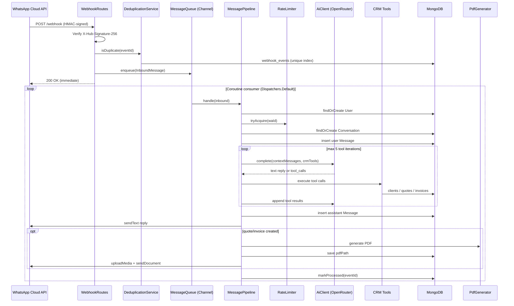
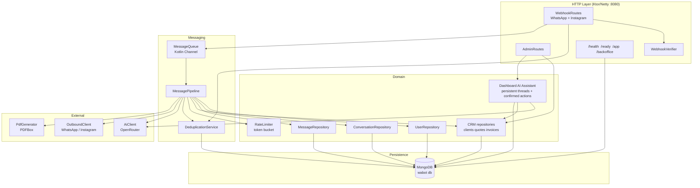

# Architecture

Multi-channel AI operations bot for a construction firm, built on Ktor 3.x (Netty), backed by MongoDB, calling OpenRouter for LLM inference and CRM tool calling. A tenant can bind WhatsApp and Instagram DM accounts to the same agent; the pipeline stays shared and channel-specific behavior is isolated at ingress and egress.

## Request Flow



## Component Map



## Package Boundaries

| Package | Responsibility |
|---|---|
| `webhook/` | HTTP edge: HMAC signature verification, GET challenge + POST routing |
| `messaging/` | `MessageQueue` (Channel), `MessagePipeline` orchestrator, `DeduplicationService` |
| `conversation/` | `User`, `Conversation`, `Message` repositories + domain models |
| `crm/` | Client, quote, invoice models/repositories, CRM tool executor, PDF generation (`PdfGenerator` branded via per-tenant `DocumentTemplate`, including optional A4 `layout` blocks from the dashboard studio) |
| `bookings/` | Bookable services, weekly availability, appointments, slot engine, booking tools |
| `admin/` | Internal admin REST endpoints and static admin panel routing |
| `ai/` | OpenRouter client — retry + primary/fallback model + tool-call parsing |
| `channel/` | `OutboundClient` interface and per-channel capability flags used by the pipeline |
| `instagram/` | Instagram DM Graph API outbound adapter plus post/comment inbox (webhook ingest, Graph list/reply) |
| `whatsapp/` | Outbound Graph API client for text, media upload, and document send |
| `ratelimit/` | In-memory token bucket (per-hour + per-day per user) |
| `persistence/` | MongoDB wiring, index creation at startup |
| `config/` | `AppConfig` (env/HOCON), `RuntimeConfig` + Mongo `platform_settings` overrides |
| `shared/` | `Clock`, `Ids`, `Result`/`AppError` sealed classes |
| `plugins/` | Ktor plugins: Monitoring, Serialization, StatusPages |

## Tenant Module Access

`Tenant.enabledModules` is the only tenant-level dashboard capability control. The canonical
catalog lives in `DashboardModules`:

- Always enabled and not admin-disableable: `overview`, `conversations`, `contacts`, `settings`.
- Admin-selectable: `persona`, `clients`, `quotes`, `invoices`, `catalog`, `ai-assistant`, `bookings`, `instagram`.

The server sanitizes explicit selections against this catalog and force-adds the always-on
modules. A missing Mongo `enabledModules` field maps to `null`, which preserves legacy behavior by
enabling the full catalog. Legacy Mongo `agentType` fields are ignored by the tenant mapper and do
not require a data migration.

`GET /app/api/me` returns the effective module list for navigation, but navigation is not the
security boundary. Every dashboard module route and tenant-scoped admin CRM route checks the same
effective module list and returns `403 Forbidden` when its module is disabled.

### Bookings

Optional `bookings` module: weekly availability, bookable services, conflict-checked appointments.
Instants are stored in UTC; wall times use `Tenant.timezone` (IANA, default `Europe/Lisbon`).
Surfaces: `/app/api/bookings/*`, admin mirror `/admin/api/tenants/{slug}/bookings/*`, WhatsApp
`BookingTools` (only when the module is enabled), and dashboard assistant tools mapped to `bookings`.

### Instagram

Optional `instagram` module: a comment work queue for the connected Instagram professional account.
DMs stay in Conversations; this surface is public posts and comments. Incoming `comments` webhooks
are stored in Mongo (`instagram.media`, `instagram.comments`) and never enter `MessagePipeline`.
The dashboard lists unreplied comments, recent media, and can reply via
`POST /{comment-id}/replies` on `graph.instagram.com`. OAuth now requests
`instagram_business_manage_comments` in addition to basic + messages; existing bindings must
reconnect before comments work. App Review for that permission is a separate submission from DMs.

## MongoDB Collections

| Collection | Purpose | Key Index |
|---|---|---|
| `users` | User profiles, status (ACTIVE/BLOCKED) | unique on `waId` |
| `conversations` | One conversation per user, tracks summary + token totals | unique on `userId` |
| `messages` | Full message history (user + assistant turns) | `conversationId`, `createdAt` |
| `webhook_events` | Deduplication log — eventId + status | unique on `eventId` |
| `crm.clients` | Client records created from WhatsApp/admin workflows | unique on `phone` |
| `crm.quotes` | Quote records, line items, totals, PDF path | unique on `number` |
| `crm.invoices` | Invoice records, status/due dates, PDF path | unique on `number` |
| `crm.sequences` | Atomic quote/invoice numbering counters | unique on `name` |
| `dashboard_assistant_threads` | Persistent AI Assistant conversations scoped to tenant and dashboard user | `tenantId`, `ownerKey`, `updatedAt` |
| `dashboard_assistant_messages` | User/assistant turns and pending confirmed-action payloads | `tenantId`, `ownerKey`, `threadId`, `createdAt`; unique sparse `action.id` |
| `bookings.services` | Bookable services (name, duration, active) | `tenantId`, `active` |
| `bookings.availability` | Weekly availability windows in tenant local time | `tenantId`, `dayOfWeek` |
| `bookings.appointments` | Bookings with UTC start/end and status | `tenantId`, `startAt` |
| `instagram.media` | Cached Instagram posts for the comments inbox | unique `(tenantId, mediaId)` |
| `instagram.comments` | Comments on connected-account media | unique `(tenantId, commentId)` |
| `platform_settings` | Global runtime config overrides (singleton `_id: "global"`) | `_id` |

## Dashboard AI Assistant

The optional `ai-assistant` module uses the same `AiClient` plus CRM/`BookingTools` implementations as the
messaging pipeline, but applies the signed-in tenant's enabled modules as a second capability filter.
Read tools execute during the chat turn. Write tool calls are persisted as `PENDING` actions and are
not executed until the owning dashboard user confirms the exact payload shown in the UI. Confirmation
atomically claims the action before execution, preventing duplicate writes from repeated requests.

Threads and messages are scoped by both `tenantId` and an owner key derived from the dashboard user,
so users cannot open or confirm another user's assistant actions. Every assistant endpoint is also
protected by dashboard JWT authentication and the normal server-side module gate.

## Context Building

`MessagePipeline.buildContext()` assembles the LLM prompt in order:
1. System prompt (`SystemPrompts.CRM_V1`)
2. Conversation summary (if any) wrapped in `<previous_context>`
3. Last 10 persisted messages (user + assistant)
4. Current user message

When CRM tools are enabled, the pipeline passes JSON Schema tool definitions to OpenRouter. Tool results are appended as `tool` messages until the model returns a final text response or the five-iteration cap is reached.

## Key Design Decisions

- **Async decoupling** — webhook POST returns 200 immediately; processing happens in a `SupervisorJob` coroutine scope consuming the `Channel`. Backpressure is handled by `Channel.UNLIMITED` (bounded capacity can be set via `MessageQueue(capacity=N)`).
- **Channel adapters at the edges** — webhook ingress normalizes WhatsApp and Instagram payloads into `InboundMessage`; the consumer selects an `OutboundClient` from the tenant's channel binding before calling the shared `MessagePipeline`.
- **Per-channel participant identity** — `users`, `conversations`, and `messages` store `channel` plus the existing `waId` external participant id. Uniqueness is `(tenantId, channel, waId)`, so WhatsApp and Instagram sender ids cannot collide.
- **Shared web design system** — `/app` (tenant dashboard) and `/backoffice` (operator) load the same stylesheet from `src/main/resources/admin/style.css` (`/admin/style.css`). `/admin` and `/admin/` redirect to `/backoffice/`; the `/admin/{asset}` route still serves the shared CSS, theme, catalogs, and i18n. Agents must follow [`design-system/`](../design-system/README.md) when changing these UIs. The website widget (`widget.css`, `tbl-` prefix) and legal pages are separate and must not share that stylesheet.
- **Tenant dashboard work surface** — `/app` Home is a work queue plus setup checklist. Conversations is a split inbox (`lastPreview` / `waiting` on `GET /app/api/conversations`). Quotes can be marked sent/accepted or converted with `POST /app/api/crm/quotes/{id}/invoice`. Clients update via `PATCH /app/api/crm/clients/{id}`.
- **At-least-once delivery guard** — `DeduplicationService` uses a MongoDB unique index on `eventId`; duplicate inserts throw and the event is skipped before enqueue.
- **LLM fallback** — `AiClient` tries `primaryModel` first; on error it retries with `fallbackModel`.
- **Tool execution boundary** — the LLM can request CRM operations, but `CrmTools` maps tool names to explicit repository calls and returns structured JSON results.
- **PDF storage** — generated quote/invoice PDFs are written under `app.pdf.storagePath`, then uploaded to WhatsApp as documents and linked from the tenant dashboard and operator APIs.
- **Config via HOCON** — `application.conf` reads `${?ENV_VAR}` overrides; required keys are validated at startup with a clear error.
- **Hot platform settings** — bootstrap-critical keys (Mongo URI, listen port) stay env-only. Operational and secret settings can be overridden in Mongo `platform_settings` and applied through `RuntimeConfig` without rebuild; operators manage them in `/backoffice` (secrets masked, reveal on demand).

## Infrastructure

```
GitHub Actions (merge to main) → GHCR image
                                      ↓
thebotslab.eu → websites-thebots Caddy (TLS) → whatsapp-bot app :8080
                                                    ↓
                                               MongoDB :27017
```

- **Dev**: `docker compose up` starts app + mongo:7 + mongo-express (:8081)
- **Prod**: `docker-compose.prod.yml` — app + mongo on the VPS. Public TLS stays on the existing `websites-thebots` Caddy container (`web_proxy` network). `/admin`, `/app`, and `/backoffice` are static resources inside the app image, not separate services.
- **CI/CD**: [`.github/workflows/deploy.yml`](../.github/workflows/deploy.yml) tests, publishes `ghcr.io/rfm-9300/whatsapp-bot`, and SSHs `scripts/remote-deploy.sh`. Mobile stays on [`.github/workflows/mobile-ci.yml`](../.github/workflows/mobile-ci.yml) (no store deploy). See [DEPLOYMENT_RUNBOOK.md](../DEPLOYMENT_RUNBOOK.md).
- **Image**: multi-stage Dockerfile → fat JAR at `build/libs/app.jar`, distroless-style runtime

## Mobile Frontend Foundation

The `mobile/` directory is an independent Kotlin Multiplatform build that consumes the tenant
dashboard HTTP API. It deliberately remains separate from the server's Gradle build so the mobile
toolchain can evolve independently of the Ktor runtime.

The build is modularized nowinandroid-style. Dependency direction: `androidApp`/`iosApp` →
`shared` → `feature:*` → `core:*`. Features never depend on each other; `core` modules only point
downward.

- `mobile/build-logic` hosts Gradle convention plugins (`edubot.kmp.library`,
  `edubot.kmp.compose.library`) that apply the shared KMP + Android library + Compose setup.
- `mobile/core/*` holds the downward-only shared modules: `model` (dashboard DTOs), `network`
  (`DashboardApi` + Ktor client), `common` (`TokenStore`, `VoiceInput`, `SessionError`),
  `localization` (en/pt/es catalogs), `ui` (theme + shared Compose components), and `testing`
  (fakes for `commonTest`).
- `mobile/feature/*` holds one module per screen (`auth`, `overview`, `inbox`, `contacts`,
  `assistant`, `crm`, `persona`, `settings`). Each stateful feature pairs a stateless composable
  with an androidx.lifecycle `ViewModel` (KMP) exposing an immutable `StateFlow<UiState>`; screens
  obtain it via keyed `viewModel(factory)` calls and take narrow state (token, tenant, strings)
  instead of the session state machine.
- `mobile/shared` is the app shell: `DashboardApp`, the `DashboardSessionViewModel` state
  machine, and root navigation. `DashboardApp` also provides a fallback `ViewModelStoreOwner` for
  iOS (Android uses the activity-scoped owner). The module is also the iOS umbrella, exporting all
  core/feature modules as the static `EduBotShared` framework (bundle ID `com.rfm.edubot.shared`)
  for the Xcode host app.
- `mobile/androidApp` is the thin Android entry point (`com.rfm.edubot`) and persists the dashboard
  access token using Android Keystore-backed encrypted preferences.
- The app supports tenant login, secure token restoration, dynamic module navigation from
  `GET /app/api/me`, overview, inbox with operator replies, contacts with block/unblock, the AI
  assistant with voice input, CRM, persona, and settings — all on the tenant-scoped API contract.
