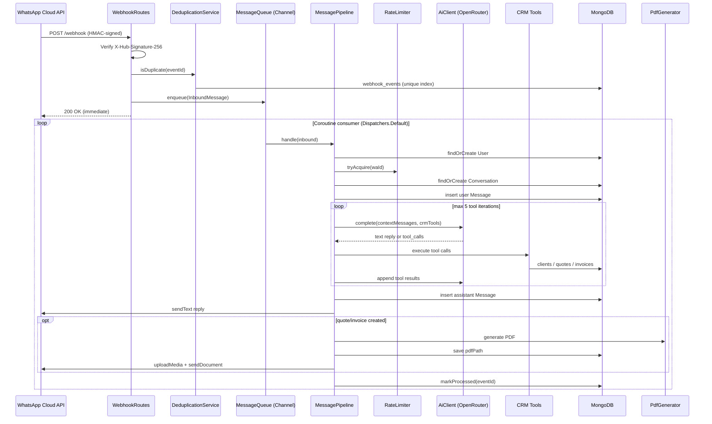
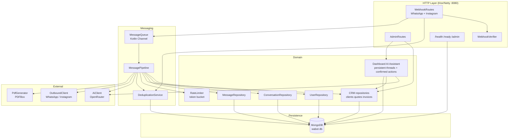

# Architecture

Multi-channel AI operations bot for a construction firm, built on Ktor 3.x (Netty), backed by MongoDB, calling OpenRouter for LLM inference and CRM tool calling. A tenant can bind WhatsApp and Instagram DM accounts to the same agent; the pipeline stays shared and channel-specific behavior is isolated at ingress and egress.

## Request Flow



## Component Map



## Package Boundaries

| Package | Responsibility |
|---|---|
| `webhook/` | HTTP edge: HMAC signature verification, GET challenge + POST routing |
| `messaging/` | `MessageQueue` (Channel), `MessagePipeline` orchestrator, `DeduplicationService` |
| `conversation/` | `User`, `Conversation`, `Message` repositories + domain models |
| `crm/` | Client, quote, invoice models/repositories, CRM tool executor, PDF generation |
| `admin/` | Internal admin REST endpoints and static admin panel routing |
| `ai/` | OpenRouter client — retry + primary/fallback model + tool-call parsing |
| `channel/` | `OutboundClient` interface and per-channel capability flags used by the pipeline |
| `instagram/` | Instagram DM Graph API outbound adapter |
| `whatsapp/` | Outbound Graph API client for text, media upload, and document send |
| `ratelimit/` | In-memory token bucket (per-hour + per-day per user) |
| `persistence/` | MongoDB wiring, index creation at startup |
| `shared/` | `Clock`, `Ids`, `Result`/`AppError` sealed classes |
| `plugins/` | Ktor plugins: Monitoring, Serialization, StatusPages |

## Tenant Module Access

`Tenant.enabledModules` is the only tenant-level dashboard capability control. The canonical
catalog lives in `DashboardModules`:

- Always enabled and not admin-disableable: `overview`, `conversations`, `contacts`, `settings`.
- Admin-selectable: `persona`, `clients`, `quotes`, `invoices`, `catalog`, `ai-assistant`.

The server sanitizes explicit selections against this catalog and force-adds the always-on
modules. A missing Mongo `enabledModules` field maps to `null`, which preserves legacy behavior by
enabling the full catalog. Legacy Mongo `agentType` fields are ignored by the tenant mapper and do
not require a data migration.

`GET /app/api/me` returns the effective module list for navigation, but navigation is not the
security boundary. Every dashboard module route and tenant-scoped admin CRM route checks the same
effective module list and returns `403 Forbidden` when its module is disabled.

## MongoDB Collections

| Collection | Purpose | Key Index |
|---|---|---|
| `users` | User profiles, status (ACTIVE/BLOCKED) | unique on `waId` |
| `conversations` | One conversation per user, tracks summary + token totals | unique on `userId` |
| `messages` | Full message history (user + assistant turns) | `conversationId`, `createdAt` |
| `webhook_events` | Deduplication log — eventId + status | unique on `eventId` |
| `crm.clients` | Client records created from WhatsApp/admin workflows | unique on `phone` |
| `crm.quotes` | Quote records, line items, totals, PDF path | unique on `number` |
| `crm.invoices` | Invoice records, status/due dates, PDF path | unique on `number` |
| `crm.sequences` | Atomic quote/invoice numbering counters | unique on `name` |
| `dashboard_assistant_threads` | Persistent AI Assistant conversations scoped to tenant and dashboard user | `tenantId`, `ownerKey`, `updatedAt` |
| `dashboard_assistant_messages` | User/assistant turns and pending confirmed-action payloads | `tenantId`, `ownerKey`, `threadId`, `createdAt`; unique sparse `action.id` |

## Dashboard AI Assistant

The optional `ai-assistant` module uses the same `AiClient` and `CrmTools` implementations as the
messaging pipeline, but applies the signed-in tenant's enabled modules as a second capability filter.
Read tools execute during the chat turn. Write tool calls are persisted as `PENDING` actions and are
not executed until the owning dashboard user confirms the exact payload shown in the UI. Confirmation
atomically claims the action before execution, preventing duplicate writes from repeated requests.

Threads and messages are scoped by both `tenantId` and an owner key derived from the dashboard user,
so users cannot open or confirm another user's assistant actions. Every assistant endpoint is also
protected by dashboard JWT authentication and the normal server-side module gate.

## Context Building

`MessagePipeline.buildContext()` assembles the LLM prompt in order:
1. System prompt (`SystemPrompts.CRM_V1`)
2. Conversation summary (if any) wrapped in `<previous_context>`
3. Last 10 persisted messages (user + assistant)
4. Current user message

When CRM tools are enabled, the pipeline passes JSON Schema tool definitions to OpenRouter. Tool results are appended as `tool` messages until the model returns a final text response or the five-iteration cap is reached.

## Key Design Decisions

- **Async decoupling** — webhook POST returns 200 immediately; processing happens in a `SupervisorJob` coroutine scope consuming the `Channel`. Backpressure is handled by `Channel.UNLIMITED` (bounded capacity can be set via `MessageQueue(capacity=N)`).
- **Channel adapters at the edges** — webhook ingress normalizes WhatsApp and Instagram payloads into `InboundMessage`; the consumer selects an `OutboundClient` from the tenant's channel binding before calling the shared `MessagePipeline`.
- **Per-channel participant identity** — `users`, `conversations`, and `messages` store `channel` plus the existing `waId` external participant id. Uniqueness is `(tenantId, channel, waId)`, so WhatsApp and Instagram sender ids cannot collide.
- **Shared web design system** — `/admin`, `/app`, and `/backoffice` all load the same static stylesheet from `src/main/resources/admin/style.css` (`/admin/style.css`). The stylesheet centralizes the dark-first thebots.lab tokens, component classes, and auth card styles so the three HTML surfaces stay visually consistent without route-specific CSS.
- **At-least-once delivery guard** — `DeduplicationService` uses a MongoDB unique index on `eventId`; duplicate inserts throw and the event is skipped before enqueue.
- **LLM fallback** — `AiClient` tries `primaryModel` first; on error it retries with `fallbackModel`.
- **Tool execution boundary** — the LLM can request CRM operations, but `CrmTools` maps tool names to explicit repository calls and returns structured JSON results.
- **PDF storage** — generated quote/invoice PDFs are written under `app.pdf.storagePath`, then uploaded to WhatsApp as documents and linked from admin APIs.
- **Config via HOCON** — `application.conf` reads `${?ENV_VAR}` overrides; required keys are validated at startup with a clear error.

## Infrastructure

```
cloudflared tunnel → Caddy (TLS) → Ktor :8080
                                         ↓
                                    MongoDB :27017
```

- **Dev**: `docker compose up` starts app + mongo:7 + mongo-express (:8081)
- **Prod**: `docker-compose.prod.yml` — app + mongo + Caddy reverse proxy with TLS
- **Image**: multi-stage Dockerfile → fat JAR at `build/libs/app.jar`, distroless-style runtime

## Mobile Frontend Foundation

The `mobile/` directory is an independent Kotlin Multiplatform build that consumes the tenant
dashboard HTTP API. It deliberately remains separate from the server's Gradle build so the mobile
toolchain can evolve independently of the Ktor runtime.

- `mobile/shared` is a KMP library targeting Android, iOS devices, and iOS simulators. It owns
  Compose Multiplatform UI, dashboard DTOs, Ktor networking, session state, and shared tests.
- `mobile/androidApp` is the thin Android entry point (`com.rfm.edubot`) and persists the dashboard
  access token using Android Keystore-backed encrypted preferences.
- The shared iOS target exports a static `EduBotShared` framework with bundle ID
  `com.rfm.edubot.shared`, ready for an Xcode host app.
- The first executable slice supports tenant login, secure Android token restoration, dynamic
  module navigation from `GET /app/api/me`, and the overview endpoint. Further feature modules
  build on the same tenant-scoped API contract.
