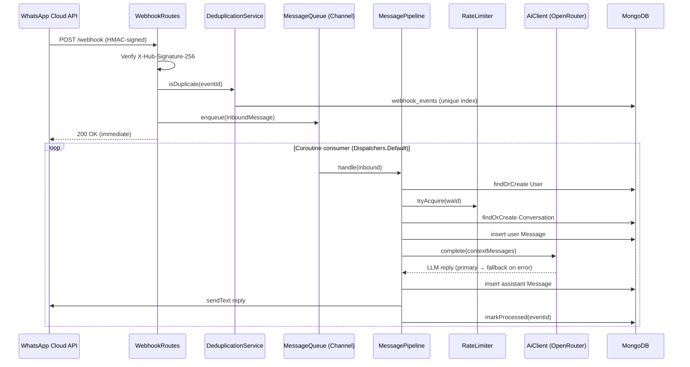
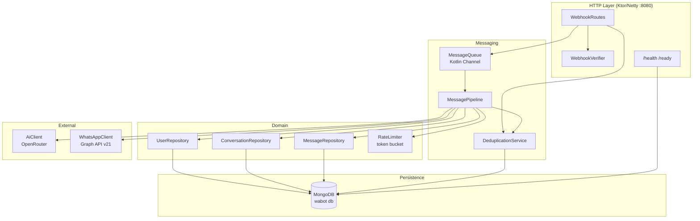

# Architecture

WhatsApp AI educational bot built on Ktor 3.x (Netty), backed by MongoDB, calling OpenRouter for LLM inference.

## Request Flow



## Component Map



## Package Boundaries

| Package | Responsibility |
|---|---|
| `webhook/` | HTTP edge: HMAC signature verification, GET challenge + POST routing |
| `messaging/` | `MessageQueue` (Channel), `MessagePipeline` orchestrator, `DeduplicationService` |
| `conversation/` | `User`, `Conversation`, `Message` repositories + domain models |
| `ai/` | OpenRouter client — retry + primary/fallback model |
| `whatsapp/` | Outbound Graph API client |
| `ratelimit/` | In-memory token bucket (per-hour + per-day per user) |
| `persistence/` | MongoDB wiring, index creation at startup |
| `shared/` | `Clock`, `Ids`, `Result`/`AppError` sealed classes |
| `plugins/` | Ktor plugins: Monitoring, Serialization, StatusPages |

## MongoDB Collections

| Collection | Purpose | Key Index |
|---|---|---|
| `users` | User profiles, status (ACTIVE/BLOCKED) | unique on `waId` |
| `conversations` | One conversation per user, tracks summary + token totals | unique on `userId` |
| `messages` | Full message history (user + assistant turns) | `conversationId`, `createdAt` |
| `webhook_events` | Deduplication log — eventId + status | unique on `eventId` |

## Context Building

`MessagePipeline.buildContext()` assembles the LLM prompt in order:
1. System prompt (`SystemPrompts.V1`)
2. Conversation summary (if any) wrapped in `<previous_context>`
3. Last 10 persisted messages (user + assistant)
4. Current user message

## Key Design Decisions

- **Async decoupling** — webhook POST returns 200 immediately; processing happens in a `SupervisorJob` coroutine scope consuming the `Channel`. Backpressure is handled by `Channel.UNLIMITED` (bounded capacity can be set via `MessageQueue(capacity=N)`).
- **At-least-once delivery guard** — `DeduplicationService` uses a MongoDB unique index on `eventId`; duplicate inserts throw and the event is skipped before enqueue.
- **LLM fallback** — `AiClient` tries `primaryModel` first; on error it retries with `fallbackModel`.
- **Config via HOCON** — `application.conf` reads `${?ENV_VAR}` overrides; required keys are validated at startup with a clear error.

## Infrastructure

```
cloudflared tunnel → Caddy (TLS) → Ktor :8080
                                         ↓
                                    MongoDB :27017
```

- **Dev**: `docker compose up` starts app + mongo:7 + mongo-express (:8081)
- **Prod**: `docker-compose.prod.yml` — app + mongo + Caddy reverse proxy with TLS
- **Image**: multi-stage Dockerfile → fat JAR at `build/libs/app.jar`, distroless-style runtime
