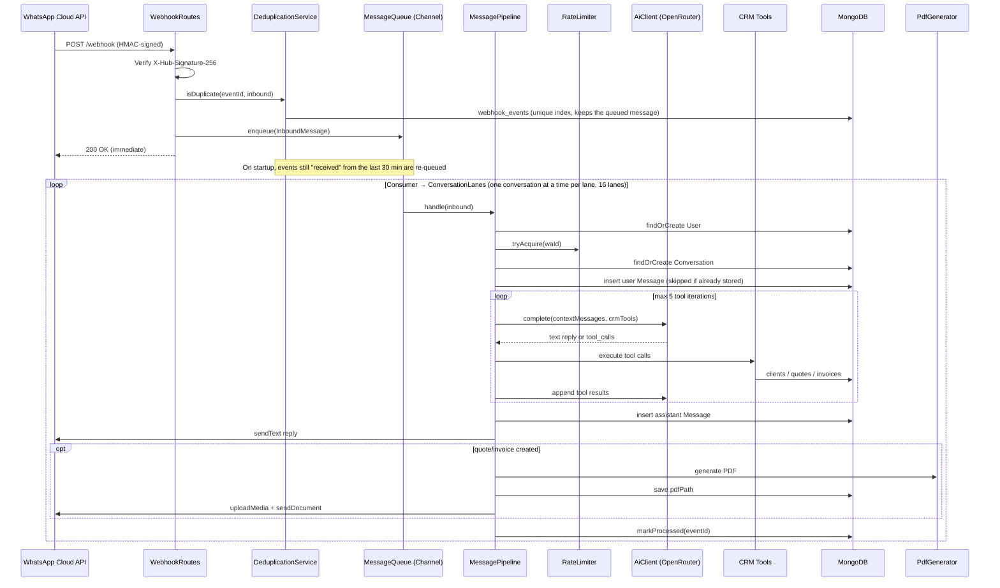
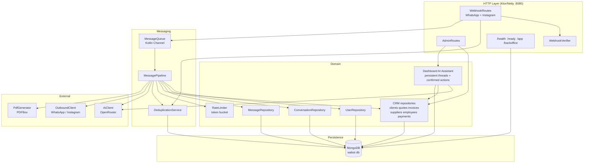
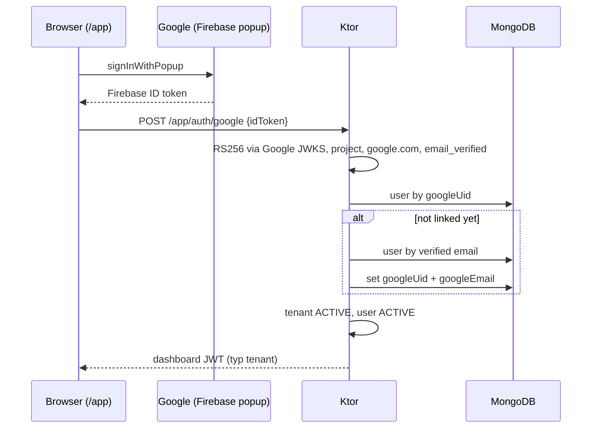
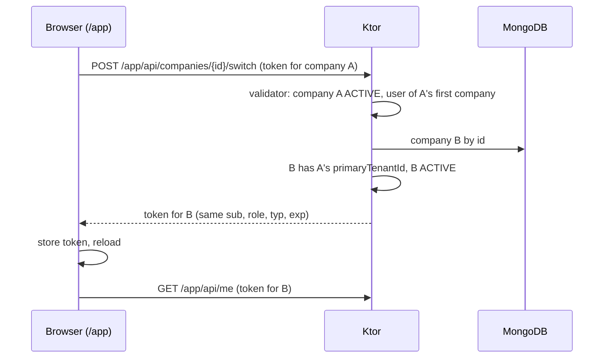
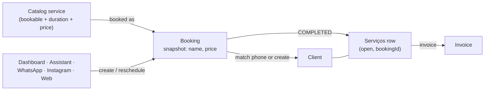
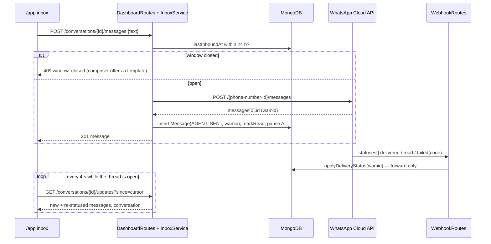

# Architecture

Multi-channel AI operations bot for a construction firm, built on Ktor 3.x (Netty), backed by MongoDB, calling OpenRouter for LLM inference and CRM tool calling. A tenant can bind WhatsApp and Instagram DM accounts to the same agent; the pipeline stays shared and channel-specific behavior is isolated at ingress and egress.

## Request Flow


```mermaid
sequenceDiagram
    participant WA as WhatsApp Cloud API
    participant W as WebhookRoutes
    participant D as DeduplicationService
    participant Q as MessageQueue (Channel)
    participant P as MessagePipeline
    participant R as RateLimiter
    participant AI as AiClient (OpenRouter)
    participant CRM as CRM Tools
    participant DB as MongoDB
    participant PDF as PdfGenerator

    WA->>W: POST /webhook (HMAC-signed)
    W->>W: Verify X-Hub-Signature-256
    W->>D: isDuplicate(eventId, inbound)
    D->>DB: webhook_events (unique index, keeps the queued message)
    W->>Q: enqueue(InboundMessage)
    W-->>WA: 200 OK (immediate)
    Note over D,Q: On startup, events still "received" from the last 30 min are re-queued

    loop Consumer → ConversationLanes (one conversation at a time per lane, 16 lanes)
        Q->>P: handle(inbound)
        P->>DB: findOrCreate User
        P->>R: tryAcquire(waId)
        P->>DB: findOrCreate Conversation
        P->>DB: insert user Message (skipped if already stored)
        loop max 5 tool iterations
            P->>AI: complete(contextMessages, crmTools)
            AI-->>P: text reply or tool_calls
            P->>CRM: execute tool calls
            CRM->>DB: clients / quotes / invoices
            P->>AI: append tool results
        end
        P->>DB: insert assistant Message
        P->>WA: sendText reply
        opt quote/invoice created
            P->>PDF: generate PDF
            P->>DB: save pdfPath
            P->>WA: uploadMedia + sendDocument
        end
        P->>DB: markProcessed(eventId)
    end
```

## Component Map


```mermaid
graph TD
    subgraph HTTP["HTTP Layer (Ktor/Netty :8080)"]
        WR[WebhookRoutes<br/>WhatsApp + Instagram]
        AR[AdminRoutes]
        WV[WebhookVerifier]
        Health["/health  /ready  /app  /backoffice"]
    end

    subgraph Messaging
        MQ[MessageQueue<br/>Kotlin Channel]
        MP[MessagePipeline]
        DS[DeduplicationService]
    end

    subgraph Domain
        UR[UserRepository]
        CR[ConversationRepository]
        MR[MessageRepository]
        CRM[CRM repositories<br/>clients quotes invoices<br/>suppliers employees payments]
        RL[RateLimiter<br/>token bucket]
        DA[Dashboard AI Assistant<br/>persistent threads + confirmed actions]
    end

    subgraph External
        AI[AiClient<br/>OpenRouter]
        OC[OutboundClient<br/>WhatsApp / Instagram]
        PDF[PdfGenerator<br/>PDFBox]
    end

    subgraph Persistence
        Mongo[(MongoDB<br/>wabot db)]
    end

    WR --> WV
    WR --> DS
    WR --> MQ
    MQ --> MP
    MP --> UR & CR & MR & CRM & RL & DS
    MP --> AI
    MP --> OC
    MP --> PDF
    AR --> CRM
    AR --> DA
    DA --> AI & CRM & Mongo
    UR & CR & MR & CRM & DS --> Mongo
    Health --> Mongo
```

## Package Boundaries

| Package | Responsibility |
|---|---|
| `webhook/` | HTTP edge: HMAC signature verification, GET challenge + POST routing |
| `messaging/` | `MessageQueue` (Channel), `MessagePipeline` orchestrator, `DeduplicationService` |
| `conversation/` | `User`, `Conversation`, `Message` repositories + domain models |
| `crm/` | Client, quote, invoice, supplier, payment models/repositories, CRM tool executor, PDF generation (`PdfGenerator` branded via per-tenant `DocumentTemplate`, including optional A4 `layout` blocks from the dashboard studio) |
| `bookings/` | Appointments on catalog services, opening hours, slot engine, CRM links (clients, Serviços billing), booking tools, legacy `bookings.services` migration |
| `admin/` | Internal admin REST endpoints and static admin panel routing |
| `ai/` | OpenRouter client — retry + primary/fallback model + tool-call parsing |
| `channel/` | `OutboundClient` interface and per-channel capability flags used by the pipeline |
| `instagram/` | Instagram DM Graph API outbound adapter plus post/comment inbox (webhook ingest, Graph list/reply) |
| `whatsapp/` | Outbound Graph API client for text, media upload, and document send |
| `ratelimit/` | In-memory token bucket (per-hour + per-day per user) |
| `persistence/` | MongoDB wiring, index creation at startup |
| `config/` | `AppConfig` (env/HOCON), `RuntimeConfig` + Mongo `platform_settings` overrides |
| `shared/` | `Clock`, `Ids`, `Result`/`AppError` sealed classes |
| `plugins/` | Ktor plugins: Monitoring, Serialization, StatusPages |

## Tenant Module Access

`Tenant.enabledModules` is the only tenant-level dashboard capability control. The canonical
catalog lives in `DashboardModules`:

- Always enabled and not admin-disableable: `overview` (the dashboard landing page, and the
  fallback view when nothing else is enabled).
- Admin-selectable: `conversations`, `contacts`, `settings`, `persona`, `clients`, `services`,
  `quotes`, `invoices`, `suppliers`, `employees`, `payments`, `catalog`, `ai-assistant`, `bookings`, `instagram`.
  Enabling `clients` also enables `services` so existing CRM tenants get the work ledger.
  Enabling `payments` also enables `suppliers` so outgoing bills always have a vendor directory.

The product is no longer WhatsApp-first: messaging, contacts and settings are opt-in like every
other module, so a tenant can be provisioned CRM-only.

The server sanitizes explicit selections against this catalog and force-adds the always-on
modules. A missing Mongo `enabledModules` field maps to `null`, which preserves legacy behavior by
enabling the full catalog. Legacy Mongo `agentType` fields are ignored by the tenant mapper and do
not require a data migration.

`GET /app/api/me` returns the effective module list for navigation, but navigation is not the
security boundary. Every dashboard module route and tenant-scoped admin CRM route checks the same
effective module list and returns `403 Forbidden` when its module is disabled.

Before any module check, the `dashboard` JWT validator (`dashboard/DashboardAccess.kt`) loads the
token's tenant and user and returns `401` unless the tenant is `ACTIVE` and the user exists, belongs
to that tenant's first company (see Companies below), and is `ACTIVE`. Operator impersonation tokens also open `SUSPENDED` tenants (for
support) but never `DELETED` ones. This covers every route under `authenticate("dashboard")`, so
suspending a tenant or disabling a user takes effect on the next request rather than at token expiry.
Login refuses inactive accounts with `403`.

### Tenant sign-in

Dashboard users (`dashboard_users`) sign in with a password, with Google, or with Google only
(`dashboard/DashboardAccountRoutes.kt`). Google uses the backoffice's Firebase project and
`FirebaseIdTokenVerifier`, without the operator allowlist: `identify` accepts any verified Google
account, and the server decides which user it is. A linked account is found by its Firebase uid
(`googleUid`, partial unique index, so a Google account belongs to one user at most). The first time,
the user whose email equals the verified Google email is chosen and linked automatically. A user
already linked to another Google account is refused (`other_google_account`), so an email match can't
take it over. `POST /app/auth/login` answers a Google-only user exactly like a wrong password.


```mermaid
sequenceDiagram
    participant B as Browser (/app)
    participant G as Google (Firebase popup)
    participant S as Ktor
    participant M as MongoDB
    B->>G: signInWithPopup
    G-->>B: Firebase ID token
    B->>S: POST /app/auth/google {idToken}
    S->>S: RS256 via Google JWKS, project, google.com, email_verified
    S->>M: user by googleUid
    alt not linked yet
        S->>M: user by verified email
        S->>M: set googleUid + googleEmail
    end
    S->>S: tenant ACTIVE, user ACTIVE
    S-->>B: dashboard JWT (typ tenant)
```

Each user manages their own sign-in from the account drawer (`/app/api/account`, tenant users only;
an operator opening the dashboard gets `403 no_user_account`). Linking, unlinking and changing the
password need the current password. Turning the password off (`password/disable`) or setting one
again from Google-only needs a Google sign-in to the linked account from the last 5 minutes: that
proves the Google account works before it becomes the only way in. New passwords need 8 characters
and at most 72 bytes (BCrypt). The mobile app still signs in with a password only.

### Companies

A tenant can hold several companies with separate data. Each company is its own `Tenant` document,
so every existing `tenantId` scope (clients, invoices, conversations, channels, persona, modules,
document template, token budget) is per company, with no change to the data layer. The tenant's
first company is the one without `parentTenantId`; the others point at it. `Tenant.primaryTenantId`
is the first company's id for all of them.

- **Limit.** Only the backoffice sets `maxCompanies` (1 to 20, first company included) on the first
  company. Administrators (and operators opening the dashboard) add companies from Settings →
  Companies (`POST /app/api/companies`, `409 company_limit` past the limit, `403 not_allowed` for
  members, gated by the `settings` module). A new company starts empty, without channels, and
  copies the first company's modules, rate limits, token budget, model, locale and timezone. The
  limit check runs under an in-process per-tenant lock (single app instance, like bookings).
- **Users.** `dashboard_users.tenantId` always points at the first company, and the access policy
  lets a user open every company whose `primaryTenantId` equals it. The backoffice's user endpoints
  resolve any company's slug to its first company.
- **Sign-in and switching.** Sign-in (password or Google) always opens the first company. The sidebar
  company name opens a switcher when `/app/api/me` lists more than one company;
  `POST /app/api/companies/{id}/switch` answers a token for the other company with the same subject,
  role, type and expiry, so switching never extends a session. The browser stores it and reloads,
  so nothing the previous company loaded stays in memory.
- **Lifecycle.** Suspending, activating or deleting the first company in the backoffice does the
  same to its other (non-deleted) companies; changing an extra company changes only that one.
  Deleting any tenant is a soft delete that stamps `deletedAt`, one instant for a first company and
  the companies deleted with it (deleting again changes nothing). `POST /admin/api/tenants/{slug}/restore`
  brings a deleted tenant back as active, and a first company brings back only the companies that
  share its `deletedAt`, so one deleted on its own earlier stays deleted. A company can't come back
  while its first company is deleted (`409 parent_deleted`) or has no free slot (`409 company_limit`).
  Suspend and activate refuse deleted tenants (`409 tenant_deleted`), and creating a tenant with a
  slug another tenant holds, deleted ones included, answers `409 slug_taken` with that tenant's
  status. The backoffice lists deleted tenants only under its Deleted chip.


```mermaid
sequenceDiagram
    participant B as Browser (/app)
    participant S as Ktor
    participant M as MongoDB
    B->>S: POST /app/api/companies/{id}/switch (token for company A)
    S->>S: validator: company A ACTIVE, user of A's first company
    S->>M: company B by id
    S->>S: B has A's primaryTenantId, B ACTIVE
    S-->>B: token for B (same sub, role, typ, exp)
    B->>B: store token, reload
    B->>S: GET /app/api/me (token for B)
```

### Services

Optional `services` module (also on whenever `clients` is on): client-attached work in
`crm.client_services`. Managers record priced rows on a client, cancel or delete rows that are not yet invoiced, and group open rows into one
invoice via `POST /app/api/crm/services/invoice`. Invoiced rows stay attached to that invoice. Delete is `DELETE /app/api/crm/services/{id}` (409 when the row is invoiced). Cancel is `PATCH /app/api/crm/services/{id}` with `status: CANCELLED`. The Services table filters by client
(client-side; `GET /app/api/crm/services?clientId=` is also available). Completing a booking adds an
open row here (see Bookings); such rows carry `bookingId`.

### Suppliers and payments

Optional `suppliers` directory (`crm.suppliers`, numbers `FOR-nnn`) and optional `payments`
module (`crm.payments`, numbers `PAG-nnn`). Payments are outgoing bills attached to a supplier or an employee:
line items, due date, and PENDING/PAID/OVERDUE/CANCELLED — the inverse of client invoices, without
PDF in v1. Enabling `payments` also enables `suppliers`. Surfaces: `/app/api/crm/suppliers`,
`/app/api/crm/payments`, Home snapshots, and an attention queue for overdue / due-soon payables.

A payment can also name the client it was spent on (`clientId`, optional): set it on
`POST /app/api/crm/payments`, change or clear it with `PATCH /app/api/crm/payments/{id}/client`,
and list a client's with `GET /app/api/crm/payments?clientId=`. The client record's Financeiro tab
weighs those payments against the client's invoices (received, spent, net), and the Financeiro page
filters by client the same way. Payments recorded before this link count for no client until someone
links them.

### Employees

Optional `employees` module (`crm.employees`, numbers `COL-nnn`): people on the team (name, phone, role). It is not turned on with `payments`. A payment attaches to exactly one payee: `supplierId` or `employeeId`. Paying an employee requires the `employees` module. Surfaces: `/app/api/crm/employees`, `POST /app/api/crm/payments` with `employeeId`, and a Home snapshot.

### Removing clients, suppliers and employees

`DELETE /app/api/crm/{clients|suppliers|employees}/{id}` deletes the record only when no document
refers to it: quotes, invoices, Serviços rows, bookings or linked payments for a client, payments
for a supplier or employee. Otherwise it answers `409 in_use` and the record can only be archived
(`POST …/{id}/archive`, undone by `POST …/{id}/restore`), so those documents keep their name and
their PDFs keep generating (`crm/DirectoryRecords.kt`).

An archived record (`archivedAt`) is left out of the list endpoints (`?archived=1` lists only the
archived ones), and so out of every picker, the AI's `search_clients`, and the Home totals. It is
still found by id (documents, record drawer) and by phone: it keeps its phone number (unique per
tenant), the client form warns about it, and a booking or the AI's `create_client` with that phone
restores the client instead of failing on the duplicate.

### Bookings

Optional `bookings` module: weekly opening hours, conflict-checked appointments, and the CRM links
below. Instants are stored in UTC; wall times use `Tenant.timezone` (IANA, default `Europe/Lisbon`).
Surfaces: `/app/api/bookings/*`, admin mirror `/admin/api/tenants/{slug}/bookings/*`, WhatsApp
`BookingTools` (only when the module is enabled), and dashboard assistant tools mapped to `bookings`.

- **Services are catalog services.** A `crm.standard_items` row of type `service` is bookable when
  `bookable = true` and `durationMinutes >= 5`. `GET/POST /bookings/services` read and write those
  catalog rows (`BookableServiceRepository`); there is no separate booking-services list. The old
  `bookings.services` collection is legacy: `BookingCatalogMigration` runs at startup, moves each
  row into its tenant's catalog (onto a same-named service when one exists), repoints appointments
  and Serviços rows, and stamps the legacy row with `catalogItemId`. Nothing is deleted.
- **A booking snapshots** the catalog item id (`catalogItemId`), `serviceName` and `priceCents`,
  so history survives catalog edits. Rows written before the migration are read through a fallback.
- **Clients.** With `clients` on, every booking gets a `clientId`: a chosen client, a client whose
  phone matches (formatting ignored, last 9 digits), or a new client.
- **Billing.** Marking a booking `COMPLETED` creates (or reopens) one open `crm.client_services` row
  for its client at the booking price, linked both ways (`bookingId` / `clientServiceId`). Moving it
  away from `COMPLETED` cancels that row unless it was already invoiced.
- **Rules** (`BookingScheduler`, serialized per tenant by an in-process lock — single instance):
  `PENDING`/`CONFIRMED`/`COMPLETED` hold their slot, `CANCELLED`/`NO_SHOW` free it; reactivating a
  freed booking re-checks overlaps; rescheduling keeps the booking's own length. Customer sources
  (`WHATSAPP`, `INSTAGRAM`, `WEB`) must be in the future and inside the opening hours; staff sources
  (`DASHBOARD`, `ADMIN`, `ASSISTANT`) may override both. Errors return stable `{error}` codes
  (`conflict`, `outside_hours`, `in_past`, `service_not_bookable`, `contact_required`, …).
- **Conversations.** The pipeline passes the chat's customer to the tools (`BookingCallContext`):
  source = channel, and on WhatsApp the customer's phone, so `create_booking` needs no contact
  details for someone booking for themselves. `reschedule_booking` moves an appointment.


```mermaid
flowchart LR
    CAT["Catalog service\n(bookable + duration + price)"] -->|booked as| BK["Booking\nsnapshot: name, price"]
    CH["Dashboard · Assistant ·\nWhatsApp · Instagram · Web"] -->|create / reschedule| BK
    BK -->|match phone or create| CL["Client"]
    BK -->|COMPLETED| SV["Serviços row\n(open, bookingId)"]
    SV -->|invoice| INV["Invoice"]
    CL --- SV
```

### Instagram

Optional `instagram` module: a comment work queue for the connected Instagram professional account.
DMs stay in Conversations; this surface is public posts and comments. Incoming `comments` webhooks
are stored in Mongo (`instagram.media`, `instagram.comments`) and never enter `MessagePipeline`.
The dashboard lists unreplied comments, recent media, and can reply via
`POST /{comment-id}/replies` on `graph.instagram.com`. OAuth now requests
`instagram_business_manage_comments` in addition to basic + messages; existing bindings must
reconnect before comments work. App Review for that permission is a separate submission from DMs.

### Conversations inbox

`/app` → Conversations is where a person reads and answers customers (WhatsApp, Instagram DMs;
website chat is read-only). `InboxService` (`dashboard/`) holds the rules; the routes are thin.

- **Who wrote it.** Outbound messages carry `author` (`AI` from `MessagePipeline`, `AGENT` from the
  dashboard) plus the agent's user id and email. Rows stored before this have no author and show as AI.
- **Human takeover.** An agent reply (text or template) sets `autoReplyEnabled = false` with
  `autoReplyPausedBy`/`autoReplyPausedAt`, so the AI stops answering that customer until someone
  presses Resume. Paused conversations still store inbound messages (the pipeline's paused branch).
- **24-hour window.** WhatsApp allows free-form replies only for 24 hours after the customer's last
  message. The pipeline records `lastInboundAt` (and increments `unreadCount`) when it stores a new
  customer message; `InboxService` refuses free-form text after the window (`409 window_closed`, before
  calling Meta), and the list exposes `windowExpiresAt`. Conversations stored before `lastInboundAt`
  existed fall back to their newest customer message.
- **Templates.** `GET /app/api/whatsapp/templates` lists the WABA's approved templates (needs the
  binding's `wabaId` from Embedded Signup; cached 60 s). Templates whose send needs input the dashboard
  doesn't collect (media header, dynamic button, one-time code) are listed as not sendable. Templates
  work outside the window: `POST …/conversations/{id}/template`, and `POST /app/api/conversations/start`
  opens a conversation with a new number. That one sends first and only then creates the contact, using
  the WhatsApp id Meta resolved the number to (`contacts[0].wa_id`), so the customer's reply lands in
  the same conversation.
- **Delivery ticks.** Sends keep Meta's message id (`waMessageId`) and start as `SENT`. WhatsApp
  status webhooks (`delivered`, `read`, `failed` + error code) update the row through
  `DeliveryStatusRecorder`; a status only moves forward and `FAILED` sticks, because webhooks arrive late,
  twice or out of order. Meta often accepts an out-of-window text and fails it later with `131047`, so
  the tick, not the send call, is the truth. AI replies keep no id and show no ticks, except that a
  reply the send call refuses is stored as `FAILED` with Meta's error and shows as not delivered.
- **Errors.** Meta's error codes map to dashboard keys in `WhatsAppErrors.key` (`inboxErr_<key>` in the
  catalogs); the API answers `{ error, detail }`, where `detail` is Meta's own text for unknown codes.
- **Template management.** Settings → WhatsApp templates lists every template with Meta's review status
  (`GET /app/api/whatsapp/templates?all=1`; the send picker only gets approved ones), creates them
  (`POST /app/api/whatsapp/templates`, validated by `TemplateDraft.problem()` before Meta sees it: name
  format, positional variables in order and not at the edges, one example per variable, header/footer
  ≤ 60 characters, ≤ 3 quick replies) and deletes one language version (`DELETE …/templates/{name}?id=`).
  Creating or deleting clears the 60 s template cache.
- **Customer media and replies.** `WhatsAppInbound.toInbound` turns quick-reply taps, list/button
  replies, shared locations (name, address, map link) and contacts into text the AI reads. Photos,
  voice notes, videos, documents and stickers carry an `InboundMedia` through the queue (and the replay
  document) and are stored as media messages without an automatic reply, so they show as waiting; the
  AI context marks them as "[The customer sent a photo you cannot open …]". The dashboard fetches them
  through `GET …/conversations/{id}/media/{messageId}`, which resolves Meta's 5-minute download URL with
  the tenant's token (20 MB cap; Meta keeps media 30 days). The page shows them from blob URLs because an
  `` can't send the bearer token, and only JPEG/PNG/WebP/GIF, audio and video render inline.
- **Live updates.** No socket: the open thread polls `GET …/conversations/{id}/updates?since=<cursor>`
  every 4 s (messages created or re-statused since the cursor, plus the conversation), the list every
  15 s; both pause while the browser tab is hidden. The cursor is server time taken before the query,
  minus 5 s, and the client merges by id.


```mermaid
sequenceDiagram
    participant UI as /app inbox
    participant API as DashboardRoutes + InboxService
    participant DB as MongoDB
    participant WA as WhatsApp Cloud API
    participant W as WebhookRoutes

    UI->>API: POST /conversations/{id}/messages {text}
    API->>DB: lastInboundAt within 24 h?
    alt window closed
        API-->>UI: 409 window_closed (composer offers a template)
    else open
        API->>WA: POST /{phone-number-id}/messages
        WA-->>API: messages[0].id (wamid)
        API->>DB: insert Message(AGENT, SENT, wamid), markRead, pause AI
        API-->>UI: 201 message
    end
    WA->>W: statuses[] delivered / read / failed(code)
    W->>DB: applyDeliveryStatus(wamid) — forward only
    loop every 4 s while the thread is open
        UI->>API: GET /conversations/{id}/updates?since=cursor
        API-->>UI: new + re-statused messages, conversation
    end
```

## MongoDB Collections

| Collection | Purpose | Key Index |
|---|---|---|
| `users` | User profiles, status (ACTIVE/BLOCKED) | unique on `waId` |
| `conversations` | One conversation per user: summary, token totals, `autoReplyEnabled` (+ who paused it), `lastInboundAt`, `unreadCount` | unique on `userId` |
| `messages` | Full message history (user + assistant turns, text, templates and customer media by Meta media id); outbound rows carry `author`, `waMessageId`, delivery `status`/`statusAt` and Meta's error | `conversationId`, `createdAt`; unique partial `(tenantId, waMessageId)` |
| `webhook_events` | Deduplication log — eventId + status, plus the queued `InboundMessage` for text messages | unique on `eventId`; TTL 7 days on `receivedAt` |
| `crm.clients` | Client records created from WhatsApp/admin workflows | unique on `phone` |
| `crm.quotes` | Quote records, line items, totals, PDF path | unique on `number` |
| `crm.invoices` | Invoice records, status/due dates, PDF path | unique on `number` |
| `crm.client_services` | Client-attached work; open rows can be billed together; `bookingId` when made by completing a booking | `tenantId+clientId+status`; partial `tenantId+bookingId` |
| `crm.suppliers` | Vendor directory the tenant pays | unique `(tenantId, phone)` and `(tenantId, number)` |
| `crm.employees` | Team directory (colaboradores) for a later payments payee | unique `(tenantId, phone)` and `(tenantId, number)` |
| `crm.payments` | Outgoing bills attached to a supplier or an employee | unique `(tenantId, number)`; `tenantId+supplierId`; `tenantId+employeeId`; `status+dueDate` |
| `crm.sequences` | Atomic quote/invoice/supplier/employee/payment numbering counters | unique on `name` |
| `dashboard_assistant_threads` | Persistent AI Assistant conversations scoped to tenant and dashboard user | `tenantId`, `ownerKey`, `updatedAt` |
| `dashboard_assistant_messages` | User/assistant turns and pending confirmed-action payloads | `tenantId`, `ownerKey`, `threadId`, `createdAt`; unique sparse `action.id` |
| `bookings.services` | Legacy booking services, moved into `crm.standard_items` at startup (stamped `catalogItemId`) | `tenantId`, `active` |
| `bookings.availability` | Weekly availability windows in tenant local time | `tenantId`, `dayOfWeek` |
| `bookings.appointments` | Bookings: `catalogItemId`, service name/price snapshot, UTC start/end, status, `clientId`, `clientServiceId` | `tenantId`, `startAt` |
| `instagram.media` | Cached Instagram posts for the comments inbox | unique `(tenantId, mediaId)` |
| `instagram.comments` | Comments on connected-account media | unique `(tenantId, commentId)` |
| `platform_settings` | Global runtime config overrides (singleton `_id: "global"`) | `_id` |

## Dashboard AI Assistant

The optional `ai-assistant` module uses the same `AiClient` plus CRM/`BookingTools` implementations as the
messaging pipeline, but applies the signed-in tenant's enabled modules as a second capability filter.
Read tools execute during the chat turn. Write tool calls are persisted as `PENDING` actions and are
not executed until the owning dashboard user confirms the exact payload shown in the UI. Confirmation
atomically claims the action before execution, preventing duplicate writes from repeated requests.

Threads and messages are scoped by both `tenantId` and an owner key derived from the dashboard user,
so users cannot open or confirm another user's assistant actions. Every assistant endpoint is also
protected by dashboard JWT authentication and the normal server-side module gate.

## Context Building

`MessagePipeline.buildContext()` assembles the LLM prompt in order:
1. System prompt (`SystemPrompts.CRM_V1`)
2. Conversation summary (if any) wrapped in `<previous_context>`
3. Last 10 persisted messages (user + assistant)
4. Current user message

When CRM tools are enabled, the pipeline passes JSON Schema tool definitions to OpenRouter. Tool results are appended as `tool` messages until the model returns a final text response or the five-iteration cap is reached.

## Key Design Decisions

- **Async decoupling** — webhook POST returns 200 immediately; processing happens in a `SupervisorJob` coroutine scope consuming the `Channel`. Backpressure is handled by `Channel.UNLIMITED` (bounded capacity can be set via `MessageQueue(capacity=N)`).
- **Per-conversation ordering** — the consumer hands each message to `ConversationLanes`, keyed by tenant + channel + participant. One participant's messages run one at a time in arrival order, and at most 16 messages (and LLM calls) run at once. Unrelated conversations that hash to the same lane wait on each other.
- **Channel adapters at the edges** — webhook ingress normalizes WhatsApp and Instagram payloads into `InboundMessage`; the consumer selects an `OutboundClient` from the tenant's channel binding before calling the shared `MessagePipeline`.
- **Per-channel participant identity** — `users`, `conversations`, and `messages` store `channel` plus the existing `waId` external participant id. Uniqueness is `(tenantId, channel, waId)`, so WhatsApp and Instagram sender ids cannot collide.
- **Shared web design system** — `/app` (tenant dashboard) and `/backoffice` (operator) load the same stylesheet from `src/main/resources/admin/style.css` (`/admin/style.css`). `/admin` and `/admin/` redirect to `/backoffice/`; the `/admin/{asset}` route still serves the shared CSS, theme, catalogs, and i18n. Agents must follow [`design-system/`](../design-system/README.md) when changing these UIs. The website widget (`widget.css`, `tbl-` prefix) and legal pages are separate and must not share that stylesheet.
- **Tenant dashboard home** — `/app` Home is a module-aware manager snapshot from `GET /app/api/overview` (processed cash, pipeline, inbox, calendar, plus an attention queue). Tenants hide cards with `GET`/`PUT /app/api/settings/overview` (`overviewHiddenCards` on the tenant); Home omits those cards in the UI while overview counts stay available for the sidebar. `/app` always runs the **minimal skin** (`html[data-layout="minimal"]`, fixed in `app/index.html`; the classic/minimal switch was removed on 2026-09-29): a light-gray, white and yellow "Clean Ops" look with a "Powered by The Bots Lab" credit in the sidebar, while the backoffice keeps the classic look. Its Home is a dense CRM view that calls `GET /app/api/overview?extended=1` — the same payload plus `cashFlow` (6 months in/out), `activity` (14 days of messages), `agenda` (today's bookings), `recent` (latest business events) and `topClients` (12 months billed); blocks for hidden cards are skipped. The older classic Home code in `app.js` is no longer reachable. Conversations is a split inbox with delivery ticks, the WhatsApp 24-hour window and templates ([Conversations inbox](#conversations-inbox)). Quotes can be marked sent/accepted or converted with `POST /app/api/crm/quotes/{id}/invoice`. Clients update via `PATCH /app/api/crm/clients/{id}`.
- **Client record** — a client opens as a record drawer in `/app` (profile and contact actions, money strip, needs-attention list, activity and per-module tabs), assembled in the browser from the per-client list endpoints (`?clientId=` on quotes, invoices, services and bookings) plus the conversations list, matched by phone on its last 9 digits. Clients carry optional `email`, `taxId` (NIF, printed on quotes and invoices beside the client number) and staff-only `notes`, which `CrmTools` never returns to the bot. `PATCH` keeps those three when omitted and clears them on an empty string. `GET /app/api/crm/clients` lists up to 2000 clients when unfiltered (it used to stop at 20), and `GET /app/api/crm/clients/by-phone?phone=` backs the duplicate-phone warning. Phone is unique per tenant for clients, suppliers and employees; a clash on create or update answers `409 phone_taken`. Suppliers and employees open as the same kind of record (`GET /app/api/crm/suppliers/{id}`, `/employees/{id}` plus their payments), and quote, invoice, payment and booking details link to each other and to those records through a drawer trail in `app.js`. Converting an already-invoiced quote answers `409 already_invoiced`.
- **At-least-once delivery guard** — `DeduplicationService` uses a MongoDB unique index on `eventId`; duplicate inserts throw and the event is skipped before enqueue. Text messages also store the queued `InboundMessage` on their event. On startup, before routes accept traffic, events still `received` from the previous 30 minutes are re-queued, and the pipeline's user-message insert is idempotent on `(tenantId, waMessageId)`. A message cut off by a deploy mid-LLM call therefore still gets its reply. A crash between sending a reply and marking the event processed can produce a duplicate reply.
- **LLM fallback** — `AiClient` tries `primaryModel` first; on error it retries with `fallbackModel`.
- **Tool execution boundary** — the LLM can request CRM operations, but `CrmTools` maps tool names to explicit repository calls and returns structured JSON results.
- **PDF storage** — generated quote/invoice PDFs are written under `app.pdf.storagePath` (production: `/data/pdfs` on the `pdf_data` volume), then uploaded to WhatsApp as documents and linked from the tenant dashboard and operator APIs. `GET …/pdf` regenerates a missing file from the stored invoice/quote so downloads survive container recreation.
- **Config via HOCON** — `application.conf` reads `${?ENV_VAR}` overrides; required keys are validated at startup with a clear error.
- **Backoffice sign-in with Google** — operators sign in to `/backoffice` with Google through Firebase Auth (project `thebotslab`). `POST /admin/auth/google` verifies the Firebase ID token itself (Google's JWKS, issuer/audience = project, `sign_in_provider = google.com`, verified email in `ADMIN_EMAILS`) with the Auth0 JWT libraries Ktor already ships, then issues the same HS256 admin JWT as the password login, so every `admin-jwt` route is unchanged. Password login only exists while `ADMIN_PASSWORD_HASH` is set; `GET /admin/auth/config` tells the login screen which methods are on. Tenant users sign in with Google through the same Firebase project, matched to their own accounts ([Tenant sign-in](#tenant-sign-in)).
- **Backoffice admins** — the Google allowlist is `ADMIN_EMAILS` plus emails added on the backoffice's Admins page (`admin_emails`, unique `email`). `AdminAccess` loads them at startup and after each change into `RuntimeConfig`, whose live `allowedEmails` is the union, so the Google sign-in needs no other change. Env emails can't be removed from the page and nobody can remove themselves, so the list can't lock everyone out. The `admin-jwt` validator re-checks a Google session's `email` claim against the live list on every request, so removing someone ends their session at once; password sessions carry no email and are unaffected.
- **Manual backups from the backoffice** — the internet-facing app never runs host commands. `POST /admin/api/backups` only writes `request.json` into a mounted control folder; the host's `backup-runner.sh` (cron, every minute) claims it by renaming it, runs `backup-mongo.sh` (which now takes a `flock` so it never overlaps the nightly run) and writes `last.json`/`last.log` back. The app lists archives from the read-only backups mount, and `<archive>.uploaded` markers left after a successful `rclone copy` show which ones were copied off the server. A stale `heartbeat` (over three minutes) shows the runner as stopped. See `DEPLOYMENT_RUNBOOK.md` → Backups.
- **Hot platform settings** — bootstrap-critical keys (Mongo URI, listen port) stay env-only. Operational and secret settings can be overridden in Mongo `platform_settings` and applied through `RuntimeConfig` without rebuild; operators manage them in `/backoffice` (secrets masked, reveal on demand).

## Infrastructure

```
GitHub Actions (merge to main) → GHCR image
                                      ↓
thebotslab.eu → websites-thebots Caddy (TLS) → whatsapp-bot app :8080
                                                    ↓
                                               MongoDB :27017
```

- **Dev**: `docker compose up` starts app + mongo:7 + mongo-express (:8081)
- **Prod**: `docker-compose.prod.yml` — app + mongo on the VPS. Public TLS stays on the existing `websites-thebots` Caddy container (`web_proxy` network). `/admin`, `/app`, and `/backoffice` are static resources inside the app image, not separate services.
- **CI/CD**: [`.github/workflows/deploy.yml`](../.github/workflows/deploy.yml) tests, publishes `ghcr.io/rfm-9300/whatsapp-bot`, and SSHs `scripts/remote-deploy.sh`. Mobile stays on [`.github/workflows/mobile-ci.yml`](../.github/workflows/mobile-ci.yml) (no store deploy). See [DEPLOYMENT_RUNBOOK.md](../DEPLOYMENT_RUNBOOK.md).
- **Image**: multi-stage Dockerfile → fat JAR at `build/libs/app.jar`, distroless-style runtime

## Mobile Frontend Foundation

The `mobile/` directory is an independent Kotlin Multiplatform build that consumes the tenant
dashboard HTTP API. It deliberately remains separate from the server's Gradle build so the mobile
toolchain can evolve independently of the Ktor runtime.

The build is modularized nowinandroid-style. Dependency direction: `androidApp`/`iosApp` →
`shared` → `feature:*` → `core:*`. Features never depend on each other; `core` modules only point
downward.

- `mobile/build-logic` hosts Gradle convention plugins (`edubot.kmp.library`,
  `edubot.kmp.compose.library`) that apply the shared KMP + Android library + Compose setup.
- `mobile/core/*` holds the downward-only shared modules: `model` (dashboard DTOs), `network`
  (`DashboardApi` + Ktor client), `common` (`TokenStore`, `VoiceInput`, `SessionError`),
  `localization` (en/pt/es catalogs), `ui` (theme + shared Compose components), and `testing`
  (fakes for `commonTest`).
- `mobile/feature/*` holds one module per screen (`auth`, `overview`, `inbox`, `contacts`,
  `assistant`, `crm`, `persona`, `settings`). Each stateful feature pairs a stateless composable
  with an androidx.lifecycle `ViewModel` (KMP) exposing an immutable `StateFlow<UiState>`; screens
  obtain it via keyed `viewModel(factory)` calls and take narrow state (token, tenant, strings)
  instead of the session state machine.
- `mobile/shared` is the app shell: `DashboardApp`, the `DashboardSessionViewModel` state
  machine, and root navigation. `DashboardApp` also provides a fallback `ViewModelStoreOwner` for
  iOS (Android uses the activity-scoped owner). The module is also the iOS umbrella, exporting all
  core/feature modules as the static `EduBotShared` framework (bundle ID `com.rfm.edubot.shared`)
  for the Xcode host app.
- `mobile/androidApp` is the thin Android entry point (`com.rfm.edubot`) and persists the dashboard
  access token using Android Keystore-backed encrypted preferences.
- The app supports tenant login, secure token restoration, dynamic module navigation from
  `GET /app/api/me`, overview, inbox with operator replies, contacts with block/unblock, the AI
  assistant with voice input, CRM, persona, and settings — all on the tenant-scoped API contract.
