# Architecture

Multi-channel AI operations bot for a construction firm, built on Ktor 3.x (Netty), backed by MongoDB, calling OpenRouter for LLM inference and CRM tool calling. A tenant can bind WhatsApp and Instagram DM accounts to the same agent; the pipeline stays shared and channel-specific behavior is isolated at ingress and egress.

Automations ("Agents") and the Google/Gmail integration follow [plan-agents-automations.md](plan-agents-automations.md) and are described under [Agents and automations](#agents-and-automations) and [Google and Gmail integration](#google-and-gmail-integration) below.

## Request Flow

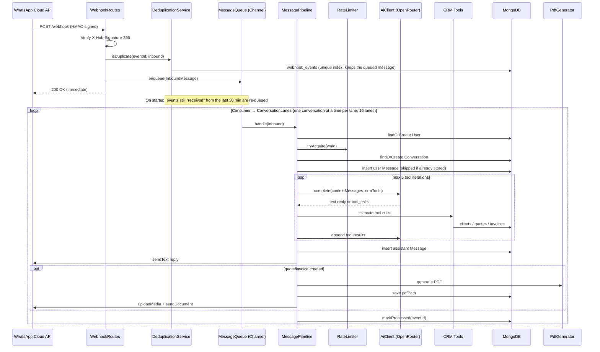
```mermaid
sequenceDiagram
    participant WA as WhatsApp Cloud API
    participant W as WebhookRoutes
    participant D as DeduplicationService
    participant Q as MessageQueue (Channel)
    participant P as MessagePipeline
    participant R as RateLimiter
    participant AI as AiClient (OpenRouter)
    participant CRM as CRM Tools
    participant DB as MongoDB
    participant PDF as PdfGenerator

    WA->>W: POST /webhook (HMAC-signed)
    W->>W: Verify X-Hub-Signature-256
    W->>D: isDuplicate(eventId, inbound)
    D->>DB: webhook_events (unique index, keeps the queued message)
    W->>Q: enqueue(InboundMessage)
    W-->>WA: 200 OK (immediate)
    Note over D,Q: On startup, events still "received" from the last 30 min are re-queued

    loop Consumer → ConversationLanes (one conversation at a time per lane, 16 lanes)
        Q->>P: handle(inbound)
        P->>DB: findOrCreate User
        P->>R: tryAcquire(waId)
        P->>DB: findOrCreate Conversation
        P->>DB: insert user Message (skipped if already stored)
        loop max 5 tool iterations
            P->>AI: complete(contextMessages, crmTools)
            AI-->>P: text reply or tool_calls
            P->>CRM: execute tool calls
            CRM->>DB: clients / quotes / invoices
            P->>AI: append tool results
        end
        P->>DB: insert assistant Message
        P->>WA: sendText reply
        opt quote/invoice created
            P->>PDF: generate PDF
            P->>DB: save pdfPath
            P->>WA: uploadMedia + sendDocument
        end
        P->>DB: markProcessed(eventId)
    end
```

## Component Map

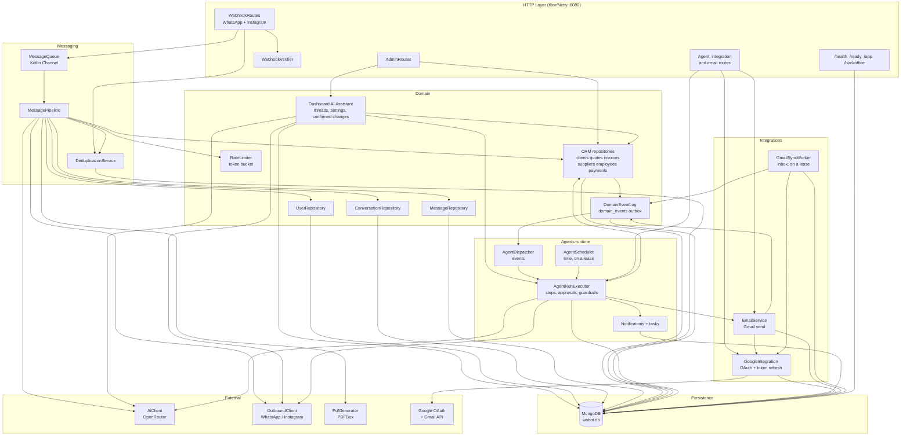
```mermaid
graph TD
    subgraph HTTP["HTTP Layer (Ktor/Netty :8080)"]
        WR[WebhookRoutes<br/>WhatsApp + Instagram]
        AR[AdminRoutes]
        WV[WebhookVerifier]
        Health["/health  /ready  /app  /backoffice"]
        AGR[Agent, integration<br/>and email routes]
    end

    subgraph Messaging
        MQ[MessageQueue<br/>Kotlin Channel]
        MP[MessagePipeline]
        DS[DeduplicationService]
    end

    subgraph Domain
        UR[UserRepository]
        CR[ConversationRepository]
        MR[MessageRepository]
        CRM[CRM repositories<br/>clients quotes invoices<br/>suppliers employees payments]
        RL[RateLimiter<br/>token bucket]
        DA[Dashboard AI Assistant<br/>threads, settings, confirmed changes]
        EV[DomainEventLog<br/>domain_events outbox]
    end

    subgraph Automations["Agents runtime"]
        ADP[AgentDispatcher<br/>events]
        ASC[AgentScheduler<br/>time, on a lease]
        AEX[AgentRunExecutor<br/>steps, approvals, guardrails]
        NT[Notifications + tasks]
    end

    subgraph Integrations
        GI[GoogleIntegration<br/>OAuth + token refresh]
        ES[EmailService<br/>Gmail send]
        GS[GmailSyncWorker<br/>inbox, on a lease]
    end

    subgraph External
        AI[AiClient<br/>OpenRouter]
        OC[OutboundClient<br/>WhatsApp / Instagram]
        PDF[PdfGenerator<br/>PDFBox]
        GAPI[Google OAuth<br/>+ Gmail API]
    end

    subgraph Persistence
        Mongo[(MongoDB<br/>wabot db)]
    end

    WR --> WV
    WR --> DS
    WR --> MQ
    MQ --> MP
    MP --> UR & CR & MR & CRM & RL & DS
    MP --> AI
    MP --> OC
    MP --> PDF
    AR --> CRM
    AR --> DA
    DA --> AI & CRM & Mongo
    DA --> OC
    DA --> AEX
    CRM --> EV
    EV --> ADP
    ADP & ASC --> AEX
    AEX --> CRM & AI & OC & ES & NT
    AGR --> AEX & GI & ES
    ES & GS --> GI
    GI --> GAPI
    ES & GS --> EV
    UR & CR & MR & CRM & DS --> Mongo
    EV & AEX & NT & GI & ES & GS --> Mongo
    Health --> Mongo
```

## Package Boundaries

| Package | Responsibility |
|---|---|
| `webhook/` | HTTP edge: HMAC signature verification, GET challenge + POST routing |
| `messaging/` | `MessageQueue` (Channel), `MessagePipeline` orchestrator, `DeduplicationService` |
| `conversation/` | `User`, `Conversation`, `Message` repositories + domain models |
| `crm/` | Client, quote, invoice, supplier, payment models/repositories, CRM tool executor, PDF generation (`PdfGenerator` branded via per-tenant `DocumentTemplate`, including optional A4 `layout` blocks from the dashboard studio) |
| `bookings/` | Appointments on catalog services, opening hours, slot engine, CRM links (clients, Serviços billing), booking tools, legacy `bookings.services` migration |
| `admin/` | Internal admin REST endpoints and static admin panel routing |
| `ai/` | OpenRouter client — retry + primary/fallback model + tool-call parsing |
| `channel/` | `OutboundClient` interface and per-channel capability flags used by the pipeline |
| `instagram/` | Instagram DM Graph API outbound adapter plus post/comment inbox (webhook ingest, Graph list/reply) |
| `whatsapp/` | Outbound Graph API client for text, media upload, and document send |
| `ratelimit/` | In-memory token bucket (per-hour + per-day per user) |
| `events/` | Domain event outbox (`DomainEventLog`): repositories append after their own write, the agent dispatcher claims events, record drawers read them as an activity timeline |
| `agents/` | Agents module: models and stores, registry (triggers, actions, validator, catalog), runtime (dispatcher, scheduler, starter, executor, guardrails, context builder), actions, templates, AI drafting and assistant tools, dashboard and backoffice routes |
| `integrations/` | Connected accounts (`integration_connections`, `TokenCipher`), Google OAuth and token refresh, Gmail client and inbox sync, `EmailService`, email retention, integration and email routes |
| `notifications/` | The dashboard bell: notifications per audience with read state, and their routes |
| `persistence/` | MongoDB wiring, index creation at startup |
| `config/` | `AppConfig` (env/HOCON), `RuntimeConfig` + Mongo `platform_settings` overrides |
| `shared/` | `Clock`, `Ids`, `Result`/`AppError` sealed classes; `jobs/` has `PeriodicJob` and `SchedulerLease` (a Mongo lease, so one instance runs each background job) |
| `plugins/` | Ktor plugins: Monitoring, Serialization, StatusPages |

## Tenant Module Access

`Tenant.enabledModules` is the only tenant-level dashboard capability control. The canonical
catalog lives in `DashboardModules`:

- Always enabled and not admin-disableable: `overview` (the dashboard landing page, and the
  fallback view when nothing else is enabled).
- Admin-selectable: `conversations`, `contacts`, `settings`, `persona`, `clients`, `services`,
  `quotes`, `invoices`, `suppliers`, `employees`, `payments`, `catalog`, `ai-assistant`, `bookings`, `instagram`.
  Enabling `clients` also enables `services` so existing CRM tenants get the work ledger.
  Enabling `payments` also enables `suppliers` so outgoing bills always have a vendor directory.

The product is no longer WhatsApp-first: messaging, contacts and settings are opt-in like every
other module, so a tenant can be provisioned CRM-only.

The server sanitizes explicit selections against this catalog and force-adds the always-on
modules. A missing Mongo `enabledModules` field maps to `null`, which preserves legacy behavior by
enabling the full catalog. Legacy Mongo `agentType` fields are ignored by the tenant mapper and do
not require a data migration.

`GET /app/api/me` returns the effective module list for navigation, but navigation is not the
security boundary. Every dashboard module route and tenant-scoped admin CRM route checks the same
effective module list and returns `403 Forbidden` when its module is disabled.

Before any module check, the `dashboard` JWT validator (`dashboard/DashboardAccess.kt`) loads the
token's tenant and user and returns `401` unless the tenant is `ACTIVE` and the user exists, belongs
to that tenant's first company (see Companies below), and is `ACTIVE`. Operator impersonation tokens also open `SUSPENDED` tenants (for
support) but never `DELETED` ones. This covers every route under `authenticate("dashboard")`, so
suspending a tenant or disabling a user takes effect on the next request rather than at token expiry.
Login refuses inactive accounts with `403`.

### Tenant sign-in

Dashboard users (`dashboard_users`) sign in with a password, with Google, or with Google only
(`dashboard/DashboardAccountRoutes.kt`). Google uses the backoffice's Firebase project and
`FirebaseIdTokenVerifier`, without the operator allowlist: `identify` accepts any verified Google
account, and the server decides which user it is. A linked account is found by its Firebase uid
(`googleUid`, partial unique index, so a Google account belongs to one user at most). The first time,
the user whose email equals the verified Google email is chosen and linked automatically. A user
already linked to another Google account is refused (`other_google_account`), so an email match can't
take it over. `POST /app/auth/login` answers a Google-only user exactly like a wrong password.

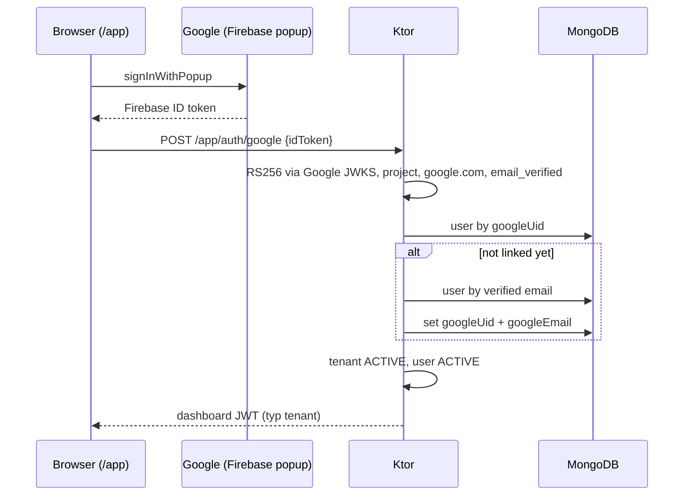
```mermaid
sequenceDiagram
    participant B as Browser (/app)
    participant G as Google (Firebase popup)
    participant S as Ktor
    participant M as MongoDB
    B->>G: signInWithPopup
    G-->>B: Firebase ID token
    B->>S: POST /app/auth/google {idToken}
    S->>S: RS256 via Google JWKS, project, google.com, email_verified
    S->>M: user by googleUid
    alt not linked yet
        S->>M: user by verified email
        S->>M: set googleUid + googleEmail
    end
    S->>S: tenant ACTIVE, user ACTIVE
    S-->>B: dashboard JWT (typ tenant)
```

An employee's own sign-in (role `TENANT_EMPLOYEE`, see [Employee sign-in and registered services](#employee-sign-in-and-registered-services))
uses the same password and Google sign-in, but opens the company of its employee record instead of the first company.

Each user manages their own sign-in from the account drawer (`/app/api/account`, tenant users only;
an operator opening the dashboard gets `403 no_user_account`). Linking, unlinking and changing the
password need the current password. Turning the password off (`password/disable`) or setting one
again from Google-only needs a Google sign-in to the linked account from the last 5 minutes: that
proves the Google account works before it becomes the only way in. New passwords need 8 characters
and at most 72 bytes (BCrypt). The mobile app still signs in with a password only.

### Companies

A tenant can hold several companies with separate data. Each company is its own `Tenant` document,
so every existing `tenantId` scope (clients, invoices, conversations, channels, persona, modules,
document template, token budget) is per company, with no change to the data layer. The tenant's
first company is the one without `parentTenantId`; the others point at it. `Tenant.primaryTenantId`
is the first company's id for all of them.

- **Limit.** Only the backoffice sets `maxCompanies` (1 to 20, first company included) on the first
  company. Administrators (and operators opening the dashboard) add companies from Settings →
  Companies (`POST /app/api/companies`, `409 company_limit` past the limit, `403 not_allowed` for
  members, gated by the `settings` module). A new company starts empty, without channels, and
  copies the first company's modules, rate limits, token budget, model, locale and timezone. The
  limit check runs under an in-process per-tenant lock (single app instance, like bookings).
- **Users.** `dashboard_users.tenantId` always points at the first company, and the access policy
  lets a user open every company whose `primaryTenantId` equals it. The backoffice's user endpoints
  resolve any company's slug to its first company.
- **Sign-in and switching.** Sign-in (password or Google) always opens the first company. The sidebar
  company name opens a switcher when `/app/api/me` lists more than one company;
  `POST /app/api/companies/{id}/switch` answers a token for the other company with the same subject,
  role, type and expiry, so switching never extends a session. The browser stores it and reloads,
  so nothing the previous company loaded stays in memory.
- **Lifecycle.** Suspending, activating or deleting the first company in the backoffice does the
  same to its other (non-deleted) companies; changing an extra company changes only that one.
  Deleting any tenant is a soft delete that stamps `deletedAt`, one instant for a first company and
  the companies deleted with it (deleting again changes nothing). `POST /admin/api/tenants/{slug}/restore`
  brings a deleted tenant back as active, and a first company brings back only the companies that
  share its `deletedAt`, so one deleted on its own earlier stays deleted. A company can't come back
  while its first company is deleted (`409 parent_deleted`) or has no free slot (`409 company_limit`).
  Suspend and activate refuse deleted tenants (`409 tenant_deleted`), and creating a tenant with a
  slug another tenant holds, deleted ones included, answers `409 slug_taken` with that tenant's
  status. The backoffice lists deleted tenants only under its Deleted chip.

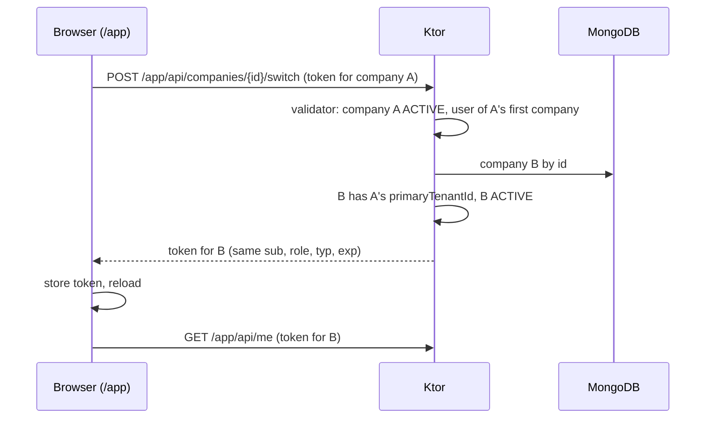
```mermaid
sequenceDiagram
    participant B as Browser (/app)
    participant S as Ktor
    participant M as MongoDB
    B->>S: POST /app/api/companies/{id}/switch (token for company A)
    S->>S: validator: company A ACTIVE, user of A's first company
    S->>M: company B by id
    S->>S: B has A's primaryTenantId, B ACTIVE
    S-->>B: token for B (same sub, role, typ, exp)
    B->>B: store token, reload
    B->>S: GET /app/api/me (token for B)
```

### Services

Optional `services` module (also on whenever `clients` is on): client-attached work in
`crm.client_services`. Managers record priced rows on a client, cancel or delete rows that are not yet invoiced, and group open rows into one
invoice via `POST /app/api/crm/services/invoice`. Invoiced rows stay attached to that invoice. Delete is `DELETE /app/api/crm/services/{id}` (409 when the row is invoiced). Cancel is `PATCH /app/api/crm/services/{id}` with `status: CANCELLED`. The Services table filters by client
(client-side; `GET /app/api/crm/services?clientId=` is also available). Completing a booking adds an
open row here (see Bookings); such rows carry `bookingId`.

A row can hold several lines (`items`, picked from the catalog or typed in the `/app` form) and totals
their sum; invoicing it puts each line on the invoice. Its own `quantity`, `unit` and `unitPriceCents`
then summarize the lines (a single line's values, or 1 × the sum of several), so readers that predate
lines still add up, and a `PATCH` without `items` keeps the stored lines and ignores those three fields.
Rows without lines (older rows, bookings) are one line made of `name` and those fields. The API always
returns `items` (an older row as its one line). The form names an unnamed service after its lines
("Corte + Massagem"). A row approved from an employee's registered service carries `employeeId`, the
employee who did the work; its detail shows "Done by" and links to the employee.

### Invoices: tax office code, installments, cancel and delete

An invoice can carry `taxOfficeCode`, the code the tax office gave it (the ATCUD in Portugal), at most
80 characters: set on `POST /app/api/crm/invoices`, changed or cleared (empty string) with
`PATCH /app/api/crm/invoices/{id}/tax-office-code`. The PDF prints it on the number line as `ATCUD:<code>`.

An unpaid invoice can be paid in installments (`installments`: amount, due date, `paidAt` once received).
`PUT /app/api/crm/invoices/{id}/installments` replaces the parts still to receive with the ones sent; they
must add up to what is still owed, at most 24 in all, and the received ones stay as they are. A single
part with nothing received yet removes the plan (the invoice is paid in one go by that date).
`PATCH …/installments/{index}/paid` receives one part; the last one marks the invoice `PAID` and
appends `invoice.paid`. `PATCH …/paid` (mark paid) receives every open part. The rules live in
`InvoiceInstallments` (pure); `InvoiceRepository` applies them only while the stored status and parts are
still the ones they were decided on, retrying otherwise.

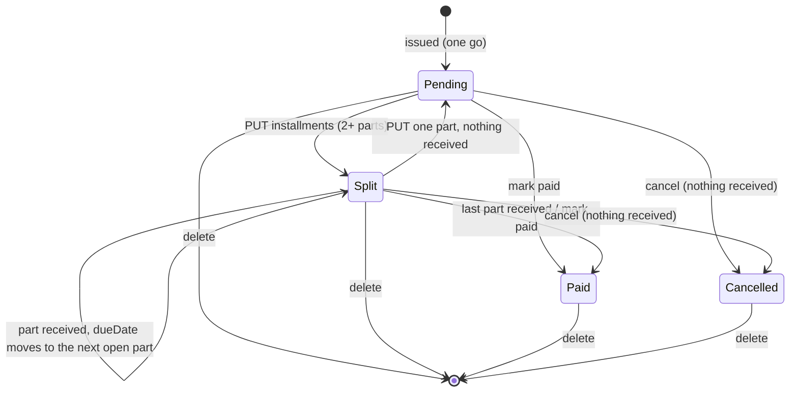
```mermaid
stateDiagram-v2
    [*] --> Pending: issued (one go)
    Pending --> Split: PUT installments (2+ parts)
    Split --> Split: part received, dueDate moves to the next open part
    Split --> Pending: PUT one part, nothing received
    Pending --> Paid: mark paid
    Split --> Paid: last part received / mark paid
    Pending --> Cancelled: cancel (nothing received)
    Split --> Cancelled: cancel (nothing received)
    Pending --> [*]: delete
    Split --> [*]: delete
    Paid --> [*]: delete
    Cancelled --> [*]: delete
```

With a plan, `dueDate` is the next open part's date (the last part's once all are received), so the
agents' due-date triggers, overdue flags, Home and the bot's tools follow the plan without knowing about
it. Money is counted part by part: the API sends `paidEur` and `outstandingEur`; Home's outstanding
subtracts received parts, overdue and aging count each open part by its own date, and collected and the
cash-flow chart count each part in the month it was received (`Invoice.receipts()` and its Document twin
in `OverviewService`). The agents get `invoice.amountDue` (the parts due by then, or all that is owed),
which the reminder templates now print instead of the total.

`POST /app/api/crm/invoices/{id}/cancel` keeps the invoice and its number as `CANCELLED`; only an invoice
with no money received can be cancelled (`409 invoice_paid` / `installments_paid`). `DELETE …/{id}`
removes it for good, whatever its state. Both reopen the Serviços rows it billed
(`ClientServiceRepository.reopenInvoiced`), and a cancelled invoice no longer blocks converting its quote
again. No domain event is written for either.

### Catalog

Optional `catalog` module (`crm.standard_items`): the services and materials that quotes, invoices,
payments, Serviços rows and bookings pick from. Each item has:

- an internal `id` (`srv-<slug>` / `mat-<slug>`, generated from the title on create) that Serviços
  rows and bookings point at; it never changes;
- a `code` the tenant sees and may change: left empty, it is numbered per type (`SRV-nnn`,
  `MAT-nnn`, counters in `crm.sequences`, skipping codes typed by hand); unique per tenant, a clash
  answers `409 code_taken`. A typed code must be three letters, a dash and digits (`TBL-8`; lowercase
  is saved in capitals), otherwise `400 code_invalid`;
- a `title` (the name in lists, pickers and bookings) and an optional `description`. An item without a
  description stores its title there, so readers that predate titles still get a name; the API and the
  dashboard treat a description equal to the title as none.

Adding an item to a document line writes the title, then the description after " - ", which the
classic PDF prints under the title. `CatalogItemBackfill` runs at startup and gives items saved before
titles and codes their description as title and the next free code, in creation order; a code typed
before the three-letters-dash-digits rule is replaced the same way (each replacement is logged). It
only writes those fields. `POST /app/api/crm/standard-items` (and the backoffice twin) still accepts
the older body without `title`, `code` or `id`.

### Suppliers and payments

Optional `suppliers` directory (`crm.suppliers`, numbers `FOR-nnn`) and optional `payments`
module (`crm.payments`, numbers `PAG-nnn`). Payments are outgoing bills attached to a supplier or an employee:
line items, due date, and PENDING/PAID/OVERDUE/CANCELLED — the inverse of client invoices, without
PDF in v1. Enabling `payments` also enables `suppliers`. Surfaces: `/app/api/crm/suppliers`,
`/app/api/crm/payments`, Home snapshots, and an attention queue for overdue / due-soon payables.
A supplier has an optional free-text `type` (materials, subcontractor…): the form suggests the types
already in use and the directory filters by it. `PATCH` keeps the type when omitted and clears it on
an empty string.

A supplier also has usual `services` (description, unit, and a usual price per unit, or none when it
varies; at most 50). `POST`/`PATCH /app/api/crm/suppliers` replace them when the body sends a list (an
empty one clears them) and keep them when it doesn't. Search matches them. The payment form offers the
picked supplier's services as ticks, each adding a line to the bill; nothing on the payment points back
at the service.

`POST /app/api/crm/payments/{id}/cancel` keeps a payment and its number as `CANCELLED`, only while it is
unpaid (`409 payment_paid` / `payment_cancelled`); `DELETE /app/api/crm/payments/{id}` removes one in any
state. Mark paid leaves a paid or cancelled payment as it is. No domain event is written for either.

A payment can also name the client it was spent on (`clientId`, optional): set it on
`POST /app/api/crm/payments`, change or clear it with `PATCH /app/api/crm/payments/{id}/client`,
and list a client's with `GET /app/api/crm/payments?clientId=`. The client record's Financeiro tab
weighs those payments against the client's invoices (received, spent, net), and the Financeiro page
filters by client the same way. Payments recorded before this link count for no client until someone
links them.

### Employees

Optional `employees` module (`crm.employees`, numbers `COL-nnn`): people on the team (name, phone, role, and an optional profile: `birthDate` as `yyyy-MM-dd`, `address`, `taxId`). `PATCH` keeps the profile fields when omitted and clears them on an empty string; a birth date in the future or before 1900 answers `400 invalid_birth_date`. No bot tool reads employees. It is not turned on with `payments`. A payment attaches to exactly one payee: `supplierId` or `employeeId`. Paying an employee requires the `employees` module. Surfaces: `/app/api/crm/employees`, `POST /app/api/crm/payments` with `employeeId`, and a Home snapshot.

### Employee sign-in and registered services

With the `employees` and `services` modules on, an employee can sign in to `/app` to register the work
they did, and the team approves it into an ordinary Serviços row (`dashboard/EmployeeWorkRoutes.kt`).

- **Sign-in.** Admins (and operators opening the dashboard) give an employee a sign-in from the
  employee's record: `POST`/`PATCH`/`DELETE /app/api/crm/employees/{id}/access` (email and password;
  `PATCH` also changes the email or turns it off with `active`). It is a `dashboard_users` row with the
  `TENANT_EMPLOYEE` role, `employeeId` (partial unique index: one sign-in per employee) and
  `employeeTenantId` (the record's company); `tenantId` stays the first company, as for every user.
  Members see it read-only. The backoffice's user endpoint refuses that role (`400 invalid_role`), since
  the sign-in belongs to an employee record. Deleting the employee deletes the sign-in.
- **Locked to its own pages.** `DashboardAccessPolicy` lets an employee's token open only
  `employeeTenantId`, and only while that company has `employees` and `services`; the `dashboard`
  validator also needs the employee record, not archived. Turning the sign-in off, archiving or
  deleting the employee, or turning a module off ends the session on the next request, and sign-in
  refuses it (`403`). `requireModule` is always false for an employee, so every module route answers
  `403`, and the validator refuses the token (`401`) on any path but `/app/api/me`, `/app/api/account…`
  and `/app/api/portal/…`. That last check also covers the routes that check no module (channel
  connects, email, notifications, company switch). `/me` answers `modules: ["my-services"]` and the
  `employee` (id, number, name). Agents don't offer employees' sign-ins as task assignees.
- **Registering.** `/app/api/portal/clients` lists the active clients (id, number, name only),
  `/catalog` the catalog (or only the bookable services when the catalog module is off), and
  `/services` the employee's own submissions in `crm.service_submissions` (client, `performedAt`,
  lines, optional name and notes; an unnamed one is named after its lines). `POST` registers one (not
  dated after today in the company's timezone, `400 date_in_future`) and notifies the team
  (`service_submitted`, audience all, `ref` `submission:ID`); `PATCH` and `DELETE` change or withdraw
  it while it is `PENDING`, else `409 not_pending`.
- **Approving.** The team (admins and members, with both modules) reads
  `/app/api/crm/service-submissions?employeeId=&status=`. `POST …/{id}/approve` takes optional
  `changes` (the same body, without the date limit). It first claims the submission (`PENDING` →
  `APPROVED` with a new `serviceId`, `reviewedBy`, `reviewedAt` and the approved content; `adjusted` when
  the content changed), so two approvals at once save one service (`409 not_pending`), then saves the
  Serviços row with that id and `employeeId`; if that fails, the claim is undone. `POST …/{id}/reject`
  takes an optional `reason` (500 characters) the employee reads. An employee with submissions or
  services done is archived instead of deleted.
- **Where the team sees it.** The employee record (to approve, needs attention, sign-in, registered
  services), the Employees list and nav count, Home's Needs you (the five waiting longest, kind
  `service_submission`, counted in the health line; `employees.pendingSubmissions` on the overview)
  and the bell.

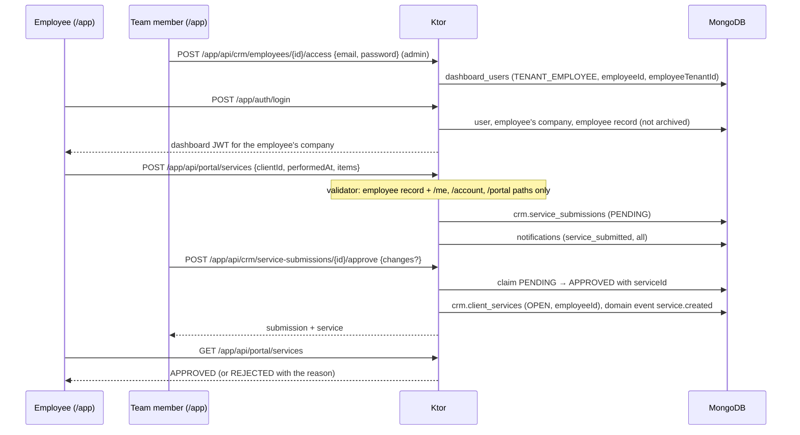
```mermaid
sequenceDiagram
    participant E as Employee (/app)
    participant T as Team member (/app)
    participant S as Ktor
    participant M as MongoDB
    T->>S: POST /app/api/crm/employees/{id}/access {email, password} (admin)
    S->>M: dashboard_users (TENANT_EMPLOYEE, employeeId, employeeTenantId)
    E->>S: POST /app/auth/login
    S->>M: user, employee's company, employee record (not archived)
    S-->>E: dashboard JWT for the employee's company
    E->>S: POST /app/api/portal/services {clientId, performedAt, items}
    Note over S: validator: employee record + /me, /account, /portal paths only
    S->>M: crm.service_submissions (PENDING)
    S->>M: notifications (service_submitted, all)
    T->>S: POST /app/api/crm/service-submissions/{id}/approve {changes?}
    S->>M: claim PENDING → APPROVED with serviceId
    S->>M: crm.client_services (OPEN, employeeId), domain event service.created
    S-->>T: submission + service
    E->>S: GET /app/api/portal/services
    S-->>E: APPROVED (or REJECTED with the reason)
```

### Removing clients, suppliers and employees

`DELETE /app/api/crm/{clients|suppliers|employees}/{id}` deletes the record only when no document
refers to it: quotes, invoices, Serviços rows, bookings or linked payments for a client, payments
for a supplier, payments, registered services or Serviços rows done for an employee. Otherwise it answers `409 in_use` and the record can only be archived
(`POST …/{id}/archive`, undone by `POST …/{id}/restore`), so those documents keep their name and
their PDFs keep generating (`crm/DirectoryRecords.kt`).

An archived record (`archivedAt`) is left out of the list endpoints (`?archived=1` lists only the
archived ones), and so out of every picker, the AI's `search_clients`, and the Home totals. It is
still found by id (documents, record drawer) and by phone: it keeps its phone number (unique per
tenant), the client form warns about it, and a booking or the AI's `create_client` with that phone
restores the client instead of failing on the duplicate.

### Client fields

Each company shapes its Clients directory: which standard fields staff must fill in, and fields of
its own. The settings live on the tenant (`Tenant.directoryFields`, stored as
`tenants.directoryFields.clients`); the values on the client (`crm.clients.customFields`).

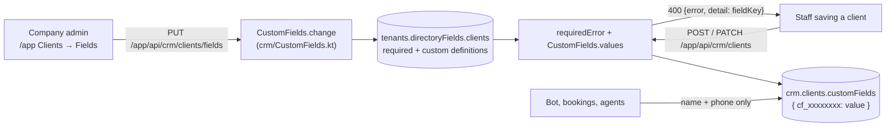
```mermaid
flowchart LR
    Admin["Company admin<br/>/app Clients → Fields"] -->|"PUT /app/api/crm/clients/fields"| Rules["CustomFields.change<br/>(crm/CustomFields.kt)"]
    Rules --> Tenant[("tenants.directoryFields.clients<br/>required + custom definitions")]
    Staff["Staff saving a client"] -->|"POST / PATCH /app/api/crm/clients"| Check["requiredError + CustomFields.values"]
    Tenant --> Check
    Check -->|"400 {error, detail: fieldKey}"| Staff
    Check --> Client[("crm.clients.customFields<br/>{ cf_xxxxxxxx: value }")]
    Bot["Bot, bookings, agents"] -->|"name + phone only"| Client
```

- **Standard fields**: name and phone are always required (lists show the name; bookings and the bot
  find a client by phone). NIF, email, contact person, address, postal code and city can be made
  required; a company that never chose keeps NIF and address (`ClientFields.DEFAULT`). Missing ones
  answer `400 tax_id_required`, `email_required`, `contact_person_required`, `address_required`,
  `postal_code_required` or `city_required`.
- **Own fields** (up to 20): text, number, date, choice (with options) or yes/no, each optionally
  required and shown as a list column. The server generates the key (`cf_` + 8 characters), so a rename
  keeps the values, and the type is fixed once created. Removing a field hides it but keeps the stored
  values. Values are stored typed: a string (text, `yyyy-MM-dd` date, choice), a number, or `true` (an
  unticked box clears the value).
- **Saving a client** (dashboard and backoffice): `customFields` maps keys to values; keys of no field
  are ignored, fields left out keep their value, null or blank clears one, and a value sent back as
  stored is kept even if it no longer fits (a choice since removed). Errors are
  `custom_field_required`, `custom_field_invalid` or `custom_field_too_long` with the field key as
  `detail`. The bot, bookings and agents create clients without custom values and skip these rules.
- **Reading**: everyone with the Clients module reads `GET /app/api/crm/clients/fields` (standard
  fields with `required`/`locked`, own fields, `canEdit`); only company admins and operators change
  it (`403 not_allowed`). `GET /app/api/crm/clients?q=` also matches text and choice values. Custom
  values are staff-only, like notes: not in the employee portal, the bot's CRM tools or event payloads.

### Bookings

Optional `bookings` module: weekly opening hours, conflict-checked appointments, and the CRM links
below. Instants are stored in UTC; wall times use `Tenant.timezone` (IANA, default `Europe/Lisbon`).
Surfaces: `/app/api/bookings/*`, admin mirror `/admin/api/tenants/{slug}/bookings/*`, WhatsApp
`BookingTools` (only when the module is enabled), and dashboard assistant tools mapped to `bookings`.

- **Services are catalog services.** A `crm.standard_items` row of type `service` is bookable when
  `bookable = true` and `durationMinutes >= 5`. `GET/POST /bookings/services` read and write those
  catalog rows (`BookableServiceRepository`); there is no separate booking-services list. The old
  `bookings.services` collection is legacy: `BookingCatalogMigration` runs at startup, moves each
  row into its tenant's catalog (onto a same-named service when one exists), repoints appointments
  and Serviços rows, and stamps the legacy row with `catalogItemId`. Nothing is deleted.
- **A booking snapshots** the catalog item id (`catalogItemId`), `serviceName` and `priceCents`,
  so history survives catalog edits. Rows written before the migration are read through a fallback.
- **Clients.** With `clients` on, every booking gets a `clientId`: a chosen client, a client whose
  phone matches (formatting ignored, last 9 digits), or a new client.
- **Billing.** Marking a booking `COMPLETED` creates (or reopens) one open `crm.client_services` row
  for its client at the booking price, linked both ways (`bookingId` / `clientServiceId`). Moving it
  away from `COMPLETED` cancels that row unless it was already invoiced.
- **Rules** (`BookingScheduler`, serialized per tenant by an in-process lock — single instance):
  `PENDING`/`CONFIRMED`/`COMPLETED` hold their slot, `CANCELLED`/`NO_SHOW` free it; reactivating a
  freed booking re-checks overlaps; rescheduling keeps the booking's own length. Customer sources
  (`WHATSAPP`, `INSTAGRAM`, `WEB`) must be in the future and inside the opening hours; staff sources
  (`DASHBOARD`, `ADMIN`, `ASSISTANT`) may override both. Errors return stable `{error}` codes
  (`conflict`, `outside_hours`, `in_past`, `service_not_bookable`, `contact_required`, …).
- **Conversations.** The pipeline passes the chat's customer to the tools (`BookingCallContext`):
  source = channel, and on WhatsApp the customer's phone, so `create_booking` needs no contact
  details for someone booking for themselves. `reschedule_booking` moves an appointment.

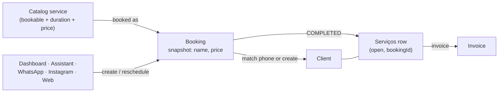
```mermaid
flowchart LR
    CAT["Catalog service\n(bookable + duration + price)"] -->|booked as| BK["Booking\nsnapshot: name, price"]
    CH["Dashboard · Assistant ·\nWhatsApp · Instagram · Web"] -->|create / reschedule| BK
    BK -->|match phone or create| CL["Client"]
    BK -->|COMPLETED| SV["Serviços row\n(open, bookingId)"]
    SV -->|invoice| INV["Invoice"]
    CL --- SV
```

### Instagram

Optional `instagram` module: a comment work queue for the connected Instagram professional account.
DMs stay in Conversations; this surface is public posts and comments. Incoming `comments` webhooks
are stored in Mongo (`instagram.media`, `instagram.comments`) and never enter `MessagePipeline`.
The dashboard lists unreplied comments, recent media, and can reply via
`POST /{comment-id}/replies` on `graph.instagram.com`. OAuth now requests
`instagram_business_manage_comments` in addition to basic + messages; existing bindings must
reconnect before comments work. App Review for that permission is a separate submission from DMs.

### Conversations inbox

`/app` → Conversations is where a person reads and answers customers (WhatsApp, Instagram DMs;
website chat is read-only). `InboxService` (`dashboard/`) holds the rules; the routes are thin.

- **Who wrote it.** Outbound messages carry `author` (`AI` from `MessagePipeline`, `AGENT` from the
  dashboard) plus the agent's user id and email. Rows stored before this have no author and show as AI.
- **Human takeover.** An agent reply (text or template) sets `autoReplyEnabled = false` with
  `autoReplyPausedBy`/`autoReplyPausedAt`, so the AI stops answering that customer until someone
  presses Resume. Paused conversations still store inbound messages (the pipeline's paused branch).
- **24-hour window.** WhatsApp allows free-form replies only for 24 hours after the customer's last
  message. The pipeline records `lastInboundAt` (and increments `unreadCount`) when it stores a new
  customer message; `InboxService` refuses free-form text after the window (`409 window_closed`, before
  calling Meta), and the list exposes `windowExpiresAt`. Conversations stored before `lastInboundAt`
  existed fall back to their newest customer message.
- **Templates.** `GET /app/api/whatsapp/templates` lists the WABA's approved templates (needs the
  binding's `wabaId` from Embedded Signup; cached 60 s). Templates whose send needs input the dashboard
  doesn't collect (media header, dynamic button, one-time code) are listed as not sendable. Templates
  work outside the window: `POST …/conversations/{id}/template`, and `POST /app/api/conversations/start`
  opens a conversation with a new number. That one sends first and only then creates the contact, using
  the WhatsApp id Meta resolved the number to (`contacts[0].wa_id`), so the customer's reply lands in
  the same conversation.
- **Delivery ticks.** Sends keep Meta's message id (`waMessageId`) and start as `SENT`. WhatsApp
  status webhooks (`delivered`, `read`, `failed` + error code) update the row through
  `DeliveryStatusRecorder`; a status only moves forward and `FAILED` sticks, because webhooks arrive late,
  twice or out of order. Meta often accepts an out-of-window text and fails it later with `131047`, so
  the tick, not the send call, is the truth. AI replies keep no id and show no ticks, except that a
  reply the send call refuses is stored as `FAILED` with Meta's error and shows as not delivered.
- **Errors.** Meta's error codes map to dashboard keys in `WhatsAppErrors.key` (`inboxErr_<key>` in the
  catalogs); the API answers `{ error, detail }`, where `detail` is Meta's own text for unknown codes.
- **Template management.** Settings → WhatsApp templates lists every template with Meta's review status
  (`GET /app/api/whatsapp/templates?all=1`; the send picker only gets approved ones), creates them
  (`POST /app/api/whatsapp/templates`, validated by `TemplateDraft.problem()` before Meta sees it: name
  format, positional variables in order and not at the edges, one example per variable, header/footer
  ≤ 60 characters, ≤ 3 quick replies) and deletes one language version (`DELETE …/templates/{name}?id=`).
  Creating or deleting clears the 60 s template cache.
- **Customer media and replies.** `WhatsAppInbound.toInbound` turns quick-reply taps, list/button
  replies, shared locations (name, address, map link) and contacts into text the AI reads. Photos,
  voice notes, videos, documents and stickers carry an `InboundMedia` through the queue (and the replay
  document) and are stored as media messages without an automatic reply, so they show as waiting; the
  AI context marks them as "[The customer sent a photo you cannot open …]". The dashboard fetches them
  through `GET …/conversations/{id}/media/{messageId}`, which resolves Meta's 5-minute download URL with
  the tenant's token (20 MB cap; Meta keeps media 30 days). The page shows them from blob URLs because an
  `` can't send the bearer token, and only JPEG/PNG/WebP/GIF, audio and video render inline.
- **Live updates.** No socket: the open thread polls `GET …/conversations/{id}/updates?since=<cursor>`
  every 4 s (messages created or re-statused since the cursor, plus the conversation), the list every
  15 s; both pause while the browser tab is hidden. The cursor is server time taken before the query,
  minus 5 s, and the client merges by id.

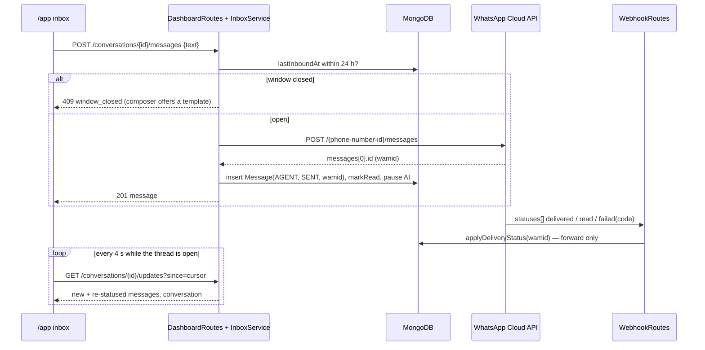
```mermaid
sequenceDiagram
    participant UI as /app inbox
    participant API as DashboardRoutes + InboxService
    participant DB as MongoDB
    participant WA as WhatsApp Cloud API
    participant W as WebhookRoutes

    UI->>API: POST /conversations/{id}/messages {text}
    API->>DB: lastInboundAt within 24 h?
    alt window closed
        API-->>UI: 409 window_closed (composer offers a template)
    else open
        API->>WA: POST /{phone-number-id}/messages
        WA-->>API: messages[0].id (wamid)
        API->>DB: insert Message(AGENT, SENT, wamid), markRead, pause AI
        API-->>UI: 201 message
    end
    WA->>W: statuses[] delivered / read / failed(code)
    W->>DB: applyDeliveryStatus(wamid) — forward only
    loop every 4 s while the thread is open
        UI->>API: GET /conversations/{id}/updates?since=cursor
        API-->>UI: new + re-statused messages, conversation
    end
```

## MongoDB Collections

| Collection | Purpose | Key Index |
|---|---|---|
| `users` | User profiles, status (ACTIVE/BLOCKED) | unique on `waId` |
| `conversations` | One conversation per user: summary, token totals, `autoReplyEnabled` (+ who paused it), `lastInboundAt`, `unreadCount` | unique on `userId` |
| `messages` | Full message history (user + assistant turns, text, templates and customer media by Meta media id); outbound rows carry `author`, `waMessageId`, delivery `status`/`statusAt` and Meta's error | `conversationId`, `createdAt`; unique partial `(tenantId, waMessageId)` |
| `webhook_events` | Deduplication log — eventId + status, plus the queued `InboundMessage` for text messages | unique on `eventId`; TTL 7 days on `receivedAt` |
| `crm.clients` | Client records created from WhatsApp/admin workflows; `customFields` holds the values of the company's own fields by key ([Client fields](#client-fields)) | unique on `phone` |
| `crm.quotes` | Quote records, line items, totals, PDF path | unique on `number` |
| `crm.invoices` | Invoice records, status/due dates, PDF path, tax office code and installments | unique on `number` |
| `crm.client_services` | Client-attached work, optionally several `items` lines summed into its total; open rows can be billed together; `bookingId` when made by completing a booking; `employeeId` when approved from an employee's registered service | `tenantId+clientId+status`; partial `tenantId+bookingId`; partial `tenantId+employeeId` |
| `crm.service_submissions` | Services employees registered from their own sign-in: client, day, lines, status (PENDING/APPROVED/REJECTED), the approved Serviços row (`serviceId`) or the rejection reason | `tenantId+employeeId+createdAt`; `tenantId+status+createdAt` |
| `crm.standard_items` | Catalog services and materials: internal `id`, tenant-facing `code`, `title`, `description`, unit, price, booking flags | unique `(tenantId, id)`; unique partial `(tenantId, code)`; `tenantId+type+category` |
| `crm.suppliers` | Vendor directory the tenant pays, with an optional free-text `type` and usual `services` | unique `(tenantId, phone)` and `(tenantId, number)` |
| `crm.employees` | Team directory (colaboradores): payments payees, and with a sign-in, the people registering their services | unique `(tenantId, phone)` and `(tenantId, number)` |
| `crm.payments` | Outgoing bills attached to a supplier or an employee | unique `(tenantId, number)`; `tenantId+supplierId`; `tenantId+employeeId`; `status+dueDate` |
| `crm.sequences` | Atomic quote/invoice/supplier/employee/payment numbering and catalog code counters | unique `(tenantId, name)` |
| `dashboard_assistant_threads` | Persistent AI Assistant conversations scoped to tenant and dashboard user; `renamed` once the person names one | `tenantId`, `ownerKey`, `updatedAt` |
| `dashboard_assistant_messages` | User/assistant turns, proposed changes with their arguments, preview, status and result, failed turns' `error`, and the modules an answer read (`sources`) | `tenantId`, `ownerKey`, `threadId`, `createdAt`; unique sparse `action.id` |
| `dashboard_assistant_settings` | A company's settings for its assistant: instructions, reply style, language, changes on or off, modules kept out | `_id` = tenant id |
| `bookings.services` | Legacy booking services, moved into `crm.standard_items` at startup (stamped `catalogItemId`) | `tenantId`, `active` |
| `bookings.availability` | Weekly availability windows in tenant local time | `tenantId`, `dayOfWeek` |
| `bookings.appointments` | Bookings: `catalogItemId`, service name/price snapshot, UTC start/end, status, `clientId`, `clientServiceId` | `tenantId`, `startAt` |
| `instagram.media` | Cached Instagram posts for the comments inbox | unique `(tenantId, mediaId)` |
| `instagram.comments` | Comments on connected-account media | unique `(tenantId, commentId)` |
| `platform_settings` | Global runtime config overrides (singleton `_id: "global"`) | `_id` |
| `domain_events` | Business event outbox: type, subject, related records, actor (dashboard user, operator, bot, agent, system), payload, depth, dispatch state | `dispatch.status+occurredAt`; `tenantId+subject+occurredAt`; `tenantId+actor.type+occurredAt`; TTL 365 days |
| `agents` | Agent definitions (triggers, steps, policy), status, run stats, next schedule | `tenantId+status+updatedAt`; `tenantId+eventTypes`; `status+nextFireAt` |
| `agent_runs` | One run per trigger firing: a copy of the definition, step results, status, `resumeAt` | unique `(tenantId, agentId, dedupeKey)`; `status+resumeAt`; `tenantId+clientId+createdAt`; TTL 180 days on `finishedAt` |
| `agent_approvals` | Actions waiting for a person, with the preview they approve | unique `(runId, stepId, seq)`; `status+expiresAt` |
| `agent_tasks` | Follow-ups for people, from agents or made by hand | `tenantId+status+dueAt`; `tenantId+assigneeUserId+status`; `tenantId+clientId+status` |
| `agent_settings` | A company's agent settings and the limits only the backoffice sets | `_id` = tenant id |
| `notifications` | Dashboard bell entries for all, admins or one user | `tenantId+audience+userId+createdAt`; TTL 90 days |
| `outbound_log` | Every message agents and email send outside the company, claimed before the provider call | unique `idempotencyKey`; `tenantId+recipient+at`; TTL 30 days |
| `integration_connections` | Connected Google accounts: sealed tokens, scopes, status, sender settings, daily sends, inbox cursor | unique `(tenantId, provider, accountEmail)` |
| `email_messages` | Emails sent and received (text kept 90 days, attachment metadata only), linked to a client and record | unique `(tenantId, connectionId, providerMessageId)`; `tenantId+clientId+date`; `tenantId+threadId` |
| `scheduler_leases` | Named leases, so one instance runs each periodic job | `_id` = job name |

## Dashboard AI Assistant

The optional `ai-assistant` module is the team's assistant, not the customers': it answers questions
about the company's data and proposes changes that a person confirms on a card in `/app`. Code:
`dashboard/DashboardAssistant.kt` (service, repository, history, tool policy), `AssistantPrompt.kt`,
`AssistantTools.kt`, `AssistantSettings.kt` and `DashboardAssistantRoutes.kt`; the page is `app/assistant.js`.

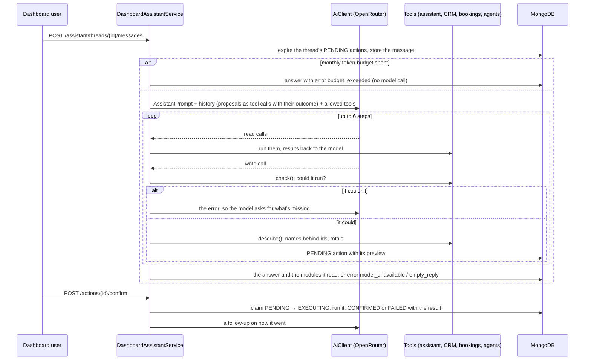
```mermaid
sequenceDiagram
    participant U as Dashboard user
    participant S as DashboardAssistantService
    participant AI as AiClient (OpenRouter)
    participant T as Tools (assistant, CRM, bookings, agents)
    participant DB as MongoDB
    U->>S: POST /assistant/threads/{id}/messages
    S->>DB: expire the thread's PENDING actions, store the message
    alt monthly token budget spent
        S->>DB: answer with error budget_exceeded (no model call)
    else
        S->>AI: AssistantPrompt + history (proposals as tool calls with their outcome) + allowed tools
        loop up to 6 steps
            AI-->>S: read calls
            S->>T: run them, results back to the model
            AI-->>S: write call
            S->>T: check(): could it run?
            alt it couldn't
                S->>AI: the error, so the model asks for what's missing
            else it could
                S->>T: describe(): names behind ids, totals
                S->>DB: PENDING action with its preview
            end
        end
        S->>DB: the answer and the modules it read, or error model_unavailable / empty_reply
    end
    U->>S: POST /actions/{id}/confirm
    S->>DB: claim PENDING → EXECUTING, run it, CONFIRMED or FAILED with the result
    S->>AI: a follow-up on how it went
```

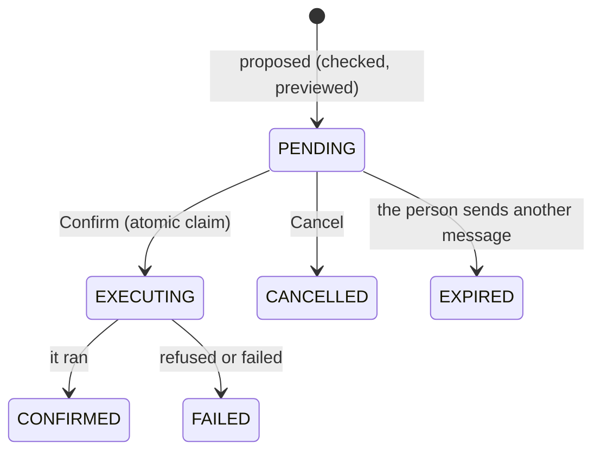
```mermaid
stateDiagram-v2
    [*] --> PENDING: proposed (checked, previewed)
    PENDING --> EXECUTING: Confirm (atomic claim)
    EXECUTING --> CONFIRMED: it ran
    EXECUTING --> FAILED: refused or failed
    PENDING --> CANCELLED: Cancel
    PENDING --> EXPIRED: the person sends another message
```

**Prompt.** `AssistantPrompt` builds the system messages: who it works for (company, admin or member),
the rules (base every figure on tool results, look records up before acting, call a write tool as soon
as it has what it needs instead of asking in text, never claim a change that no result confirms, how
earlier proposals ended), the date in the company's timezone, reply style and language, what it can use
and what is kept out, answers-only mode, business notes (the client fields the company requires, invoice
statuses, quote lines, catalog prices, the 24-hour WhatsApp window), the booking and agents notes, the
untrusted-content rule, and last the company's instructions inside `<company_instructions>` (the tags
are stripped from the text first). The customer bot's CRM prompt, with its "pode gerar" text
confirmations, is not used here.

**Settings.** One document per company in `dashboard_assistant_settings` (`GET`/`PUT
/app/api/assistant/settings`, admins only for `PUT`): instructions (4000 characters), reply style
(`CONCISE`, `BALANCED`, `DETAILED`), a fixed language or the message's, `allowChanges`, and
`disabledModules`. With changes off no write tool is offered and a confirmation answers 403
`changes_off`; a module kept out has no tools and the prompt says it isn't available.

**Tools.** The CRM and booking tools the bot has, the agents tools (`AgentAssistant`), and
`AssistantTools`, which only the dashboard gets: `get_business_overview` (Home's figures and attention
list), `get_client` (the whole record with the company's own fields, money owed, quotes, unbilled work,
next booking), `create_client` and `update_client` (checked like the client form: required fields,
email, custom fields, phone already taken), `list_invoices` and `list_quotes` (status, client, issue or
due dates, a summary of every match; a pending invoice past due counts as overdue, as on Home),
`convert_quote_to_invoice` (`crm/QuoteInvoicing`, shared with the Quotes page), `list_services`,
`list_payments` and `mark_payment_paid`, `list_suppliers`, `list_employees`, and `list_conversations`,
`get_conversation` and `reply_to_conversation`. What customers wrote reaches the model inside
`<untrusted_content>`. A reply goes out through `InboxService` from the person who confirmed it, so the
24-hour window, the website's read-only chats and pausing the bot apply as in the Inbox. The
assistant's `create_client`, `list_invoices` and `list_quotes` take the place of the bot's tools of the
same name. Tools follow the modules on for the company minus those kept out; reads run at once, writes
always wait for a card.

**History.** The last 30 messages go back to the model. A proposal becomes the tool call it was, followed
by its outcome (`waiting_for_confirmation`, the result once confirmed, the error once failed, `cancelled`,
`expired`, results cut at 2000 characters), so later turns know what happened and which record was made.
Failed turns are left out. Action ids are the assistant's own (`act_…`): providers don't promise unique
call ids, and `action.id` is unique across the collection.

**Errors, budget and threads.** A turn without an answer is stored with its reason (`model_unavailable`,
`budget_exceeded`, `empty_reply`) and `POST /threads/{id}/retry` answers again. The assistant stops at
the company's monthly token budget, like the bot, and records its tokens as `assistant`. Threads and
messages are scoped by `tenantId` and the person's owner key (`assistantOwnerKey`), so no one opens,
confirms or deletes another person's; every endpoint is behind the dashboard JWT and the module gate,
and Home counts only the viewer's waiting changes. Threads can be renamed (`PATCH`, which keeps the name
from then on), searched by title (`?q=`), deleted with their messages (`DELETE`) and paged backwards
(`?before=` with `hasMore`); each lists its waiting changes (`pending`).

Tests: `DashboardAssistantRoutesTest` (HTTP end to end with a scripted model), `AssistantToolsTest`,
`AssistantPromptTest`, `AssistantHistoryTest`. `scripts/assistant-e2e/walkthrough.mjs` runs the page in
Chrome against `fake-openrouter.py`.

## Agents and automations

The opt-in `agents` module (the backoffice turns it on per company) runs company-owned automations
on one engine. The design, data model and phases are in [plan-agents-automations.md](plan-agents-automations.md).
An agent is a definition in `agents`: triggers, steps (one action each, with an optional guard, an
autonomy and an error policy), exit rules, and a policy (daily cap, per-record cooldown, approvers,
quiet hours). The dashboard edits agents under **Agents** (list, builder, template gallery, inbox,
activity, settings); the same runtime serves the assistant's agent tools and the backoffice.

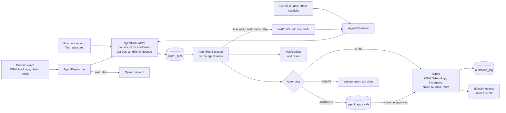
```mermaid
flowchart LR
    EVT["Domain event<br/>CRM, bookings, chats, email"] --> DSP[AgentDispatcher]
    TIME["Schedule, date offset,<br/>inactivity"] --> SCH[AgentScheduler]
    MAN["Run on a record,<br/>Test, assistant"] --> ST
    DSP -->|exit rules| EXIT[Open runs end]
    DSP & SCH --> ST["AgentRunStarter<br/>pauses, caps, cooldown,<br/>opt-out, conditions, dedupe"]
    ST --> RUNS[(agent_runs)]
    RUNS --> EX["AgentRunExecutor<br/>on the agent lanes"]
    EX --> STEP{Autonomy}
    STEP -->|AUTO| ACT["Action<br/>CRM, WhatsApp, Instagram,<br/>email, AI, data, team"]
    STEP -->|APPROVE| APR[(agent_approvals)]
    APR -->|a person approves| ACT
    STEP -->|DRAFT| NOTE[Written down, not done]
    ACT --> OUT[(outbound_log)]
    ACT --> EV2["domain_events<br/>actor AGENT"]
    EX -->|flow.wait, quiet hours, retry| WAIT[WAITING until resumeAt]
    WAIT --> SCH
    EX --> NT["Notifications<br/>and tasks"]
```

- **What wakes an agent.** Repositories append a domain event to `domain_events` after their own
  write. `AgentDispatcher` is woken after each append (with a 2-second poll as fallback) and claims
  events one at a time. Each event first ends open runs whose exit rules match (a paid invoice stops
  its reminders), then starts the agents whose event triggers match. An event an agent caused never
  triggers that agent again, and chains of reactions stop at depth 3. `AgentScheduler` runs every
  `AGENTS_TICK_SECONDS` on the `agents-scheduler` lease. It fires due schedules, sweeps date offsets
  (days before or after a record's date) and inactivity, resumes waiting runs, expires approvals and
  recovers runs a stopped instance left mid-step. People also start runs on a record. **Test** does
  a dry run that sends and changes nothing, on the record a person picks or else the newest one (for
  email agents, the newest email received).
- **Starting a run.** `AgentRunStarter` checks the company and platform pauses, the agent's and the
  company's daily caps, the per-record cooldown, the client's automation pause and the agent's
  "only if" conditions. It then stores the run under a dedupe key, unique per agent, so a trigger that fires
  twice starts one run. Runs execute on the agents' own lanes (`AGENTS_LANES`, separate from the
  chat lanes), at most `AGENTS_MAX_CONCURRENT_RUNS_PER_COMPANY` per company at a time.
- **Steps.** `AgentRunExecutor` rebuilds the run's variables from live data (`AgentContextBuilder`)
  before it continues after a wait, so a guard sees that the invoice was paid meanwhile. A step that
  changes something acts (`AUTO`), asks first (`APPROVE`), or only writes down what it would do
  (`DRAFT`). An approval shows the final text, recipients, attachments and warnings; people may edit
  the text before approving, and a decision happens once. Messages to people outside the company
  respect quiet hours, business days and per-recipient caps. They are claimed in `outbound_log`
  before the provider call, so a restart never sends twice, and a send cut off mid-call waits for a
  person's review instead of being repeated. Progress is saved after every step. Five failed runs in
  a row pause the agent and tell the admins.
- **Actions.** CRM: create or update a client, set a quote's status, invoice a quote or open
  services, add a service, a bill to pay or a booking. Messaging: `whatsapp.send` (free text inside
  WhatsApp's 24-hour window, an approved template outside it) and `instagram.reply`. Email:
  `email.send` and `email.reply` in the thread. AI: `ai.task` and `ai.compose`. Data:
  `data.summary` and `doc.pdf`. Flow: `flow.wait`, `flow.branch` and `flow.stop`. Team:
  `team.notify` and `team.task.create`. A WhatsApp step can fall back to email, then to a task for
  a person.
- **AI steps.** The model gets what customers and strangers wrote inside `<untrusted_content>`
  and is told it is data, so instructions hidden in an email can't steer the agent. Tokens count
  toward the company's monthly budget (`tenant_usage`, source `agents`); over budget, the step fails
  with `token_budget`.
- **Building agents.** The gallery builds agents from templates (`AgentTemplates`) in the company's
  language. **Describe it** (`POST /app/api/agents/draft`, `AgentDrafter`) gives the model the
  catalog of triggers, events, actions and variables, validates the definition it returns, sends the
  problems back once to fix, and saves a draft with no more autonomy than the company's default.
  Nothing is activated. The dashboard assistant gets the agents as tools (`AgentTools`): reads run
  at once, writes are confirmed one by one, and pausing, activating and drafting are for admins.
- **Where people see it.** Approvals and tasks in the Agents inbox, the bell (`notifications`, kept
  90 days), Home's agents card and attention list, an Automations block on each record (upcoming and
  recent runs, what agents changed, open tasks, and a pause switch on clients), and a badge on chat
  messages an automation sent.
- **Limits.** In Agents → Settings, a company sets its default autonomy, quiet hours, business days,
  per-recipient caps (2 a day, 5 a week) and approval expiry (3 days), and can pause all its agents.
  The backoffice has its own pause for a company's agents, and it alone sets the company's maximum
  active agents (25), runs per day (2,000) and email sends per day (300).

## Google and Gmail integration

A company admin connects the company's own Gmail or Google Workspace account in **Settings →
Channels → Email (Google)**, so quotes, invoices and automation emails go out from the company's
address. The scopes, Google's verification and its Limited Use rules are in
[google-oauth-verification.md](google-oauth-verification.md).

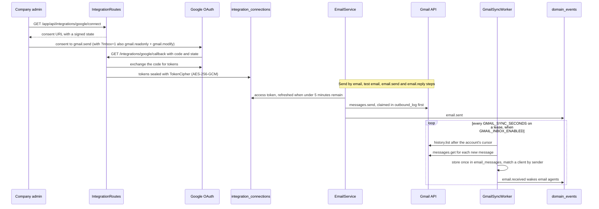
```mermaid
sequenceDiagram
    participant A as Company admin
    participant R as IntegrationRoutes
    participant G as Google OAuth
    participant C as integration_connections
    participant S as EmailService
    participant M as Gmail API
    participant W as GmailSyncWorker
    participant E as domain_events

    A->>R: GET /app/api/integrations/google/connect
    R-->>A: consent URL with a signed state
    A->>G: consent to gmail.send (with ?inbox=1 also gmail.readonly + gmail.modify)
    G->>R: GET /integrations/google/callback with code and state
    R->>G: exchange the code for tokens
    R->>C: tokens sealed with TokenCipher (AES-256-GCM)
    Note over S,M: Send by email, test email, email.send and email.reply steps
    S->>C: access token, refreshed when under 5 minutes remain
    S->>M: messages.send, claimed in outbound_log first
    S->>E: email.sent
    loop every GMAIL_SYNC_SECONDS on a lease, when GMAIL_INBOX_ENABLED
        W->>M: history.list after the account's cursor
        W->>M: messages.get for each new message
        W->>W: store once in email_messages, match a client by sender
        W->>E: email.received wakes email agents
    end
```

- **Connecting.** Only the company's own admins connect; an operator impersonating the company
  can't, because they would consent with their own Google account. The callback stores the tokens
  sealed with `TokenCipher` (keys in `INTEGRATIONS_ENCRYPTION_KEY`: the first seals, the others only
  open values sealed before a rotation). Tokens never reach the browser. Connecting asks for
  `gmail.send` only. Turning on **Use my inbox in automations** asks for `gmail.readonly` and
  `gmail.modify` with incremental consent, and is offered only when `GMAIL_INBOX_ENABLED` is on. The
  OAuth client comes from `GOOGLE_OAUTH_*` or the backoffice's platform settings. Without the client
  or the key, the Email row stays hidden.
- **Tokens.** `GoogleTokenProvider` refreshes an access token when under five minutes remain, one
  refresh per connection at a time (an in-memory lock, as the app runs as one instance). When Google
  refuses the grant, the connection needs a reconnect: its admins get one notification, Home lists
  it, and sending from it stops until someone reconnects.
- **Sending.** `EmailService` sends from the company's default account, in the branded layout with
  the account's sender name, reply-to and signature. Each send is claimed in `outbound_log` first,
  so one key never goes out twice, and each company has a daily allowance. Sent mail is kept in
  `email_messages`, shown on the client's Emails tab, and announced as `email.sent`. It serves
  **Send by email** on quotes and invoices, the test email in Settings, and the `email.send` and
  `email.reply` steps.
- **Reading the inbox.** With `GMAIL_INBOX_ENABLED`, `GmailSyncWorker` runs every
  `GMAIL_SYNC_SECONDS` on a lease. For each account with inbox sync on, it reads Gmail's history
  after the account's cursor (the first time, the mail since inbox sync was turned on). It stores each
  new message once, links it to a client by the sender's address and announces `email.received`.
  The `email.received` trigger narrows that by sender (any, a known client, unknown), words in the
  sender, subject or text, and PDF attachments. The company's own mail, spam and newsletters from
  strangers are skipped. Automatic replies are kept but announce nothing, so two mailboxes can't
  answer each other forever. When Google refuses a read for missing permission, only that inbox
  pauses and Settings offers to allow reading again; sending carries on. Gmail push through Pub/Sub
  (`GMAIL_PUBSUB_TOPIC`) is reserved for later, so the inbox is polled.
- **Keeping little.** Email text is kept for 90 days after its date (`EmailRetention`, every 6
  hours), and so is what automation runs and approvals were given and produced from it. Run
  variables and event payloads never store the text itself. Attachment contents are never stored,
  only their name, type and size, and a PDF's text isn't read. Disconnecting deletes the tokens and
  the account's mail, removes it from events, runs and approvals, and revokes the grant when no other
  company uses the account. Tasks and notifications an automation made from an email keep what its
  steps wrote into them, like an AI summary: notifications expire after 90 days, tasks stay.

## Context Building

`MessagePipeline.buildContext()` assembles the LLM prompt in order:
1. System prompt (`SystemPrompts.CRM_V1`)
2. Conversation summary (if any) wrapped in `<previous_context>`
3. Last 10 persisted messages (user + assistant)
4. Current user message

When CRM tools are enabled, the pipeline passes JSON Schema tool definitions to OpenRouter. Tool results are appended as `tool` messages until the model returns a final text response or the five-iteration cap is reached.

## Key Design Decisions

- **Async decoupling** — webhook POST returns 200 immediately; processing happens in a `SupervisorJob` coroutine scope consuming the `Channel`. Backpressure is handled by `Channel.UNLIMITED` (bounded capacity can be set via `MessageQueue(capacity=N)`).
- **Per-conversation ordering** — the consumer hands each message to `ConversationLanes`, keyed by tenant + channel + participant. One participant's messages run one at a time in arrival order, and at most 16 messages (and LLM calls) run at once. Unrelated conversations that hash to the same lane wait on each other.
- **Channel adapters at the edges** — webhook ingress normalizes WhatsApp and Instagram payloads into `InboundMessage`; the consumer selects an `OutboundClient` from the tenant's channel binding before calling the shared `MessagePipeline`.
- **Per-channel participant identity** — `users`, `conversations`, and `messages` store `channel` plus the existing `waId` external participant id. Uniqueness is `(tenantId, channel, waId)`, so WhatsApp and Instagram sender ids cannot collide.
- **Shared web design system** — `/app` (tenant dashboard) and `/backoffice` (operator) load the same stylesheet from `src/main/resources/admin/style.css` (`/admin/style.css`). `/admin` and `/admin/` redirect to `/backoffice/`; the `/admin/{asset}` route still serves the shared CSS, theme, catalogs, and i18n. Agents must follow [`design-system/`](../design-system/README.md) when changing these UIs. The website widget (`widget.css`, `tbl-` prefix) and legal pages are separate and must not share that stylesheet.
- **Tenant dashboard home** — `/app` Home is a module-aware manager snapshot from `GET /app/api/overview` (processed cash, pipeline, inbox, calendar, plus an attention queue). Tenants hide cards with `GET`/`PUT /app/api/settings/overview` (`overviewHiddenCards` on the tenant); Home omits those cards in the UI while overview counts stay available for the sidebar. `/app` always runs the **minimal skin** (`html[data-layout="minimal"]`, fixed in `app/index.html`; the classic/minimal switch was removed on 2026-09-29): a light-gray, white and yellow "Clean Ops" look with a "Powered by The Bots Lab" credit in the sidebar. The backoffice declares the same skin in `backoffice/index.html` (since 2026-10-04, without the credit). Its Home is a dense CRM view that calls `GET /app/api/overview?extended=1` — the same payload plus `cashFlow` (6 months in/out), `activity` (14 days of messages), `agenda` (today's bookings), `recent` (latest business events) and `topClients` (12 months billed); blocks for hidden cards are skipped. The older classic Home code in `app.js` is no longer reachable. Conversations is a split inbox with delivery ticks, the WhatsApp 24-hour window and templates ([Conversations inbox](#conversations-inbox)). Quotes can be marked sent/accepted or converted with `POST /app/api/crm/quotes/{id}/invoice`. Clients update via `PATCH /app/api/crm/clients/{id}`.
- **Client record** — a client opens as a record drawer in `/app` (profile and contact actions, money strip, needs-attention list, activity and per-module tabs), assembled in the browser from the per-client list endpoints (`?clientId=` on quotes, invoices, services and bookings) plus the conversations list, matched by phone on its last 9 digits. Clients carry `email`, `taxId` (NIF, printed on quotes and invoices beside the client number), `postalCode`, `city`, `contactPerson` and staff-only `notes`; `CrmTools` never returns any of them to the bot except the address it always had. `PATCH` keeps those fields when omitted and clears them on an empty string. A client saved by staff (`POST`/`PATCH /app/api/crm/clients` and the backoffice create) needs the standard fields its company requires, NIF and address unless the company chose otherwise, plus its required own fields ([Client fields](#client-fields)); a `PATCH` that omits a detail keeps the stored one. Bookings and the bot's `create_client` still create clients from a name and phone. PDFs print street, postal code and city as one text, because compact client blocks fit only one address line. `GET /app/api/crm/clients` lists up to 2000 clients when unfiltered (it used to stop at 20), and `GET /app/api/crm/clients/by-phone?phone=` backs the duplicate-phone warning. Phone is unique per tenant for clients, suppliers and employees; a clash on create or update answers `409 phone_taken`. Suppliers and employees open as the same kind of record (`GET /app/api/crm/suppliers/{id}`, `/employees/{id}` plus their payments), and quote, invoice, payment and booking details link to each other and to those records through a drawer trail in `app.js`. Converting an already-invoiced quote answers `409 already_invoiced`.
- **At-least-once delivery guard** — `DeduplicationService` uses a MongoDB unique index on `eventId`; duplicate inserts throw and the event is skipped before enqueue. Text messages also store the queued `InboundMessage` on their event. On startup, before routes accept traffic, events still `received` from the previous 30 minutes are re-queued, and the pipeline's user-message insert is idempotent on `(tenantId, waMessageId)`. A message cut off by a deploy mid-LLM call therefore still gets its reply. A crash between sending a reply and marking the event processed can produce a duplicate reply.
- **LLM fallback** — `AiClient` tries `primaryModel` first; on error it retries with `fallbackModel`.
- **Tool execution boundary** — the LLM can request CRM operations, but `CrmTools` maps tool names to explicit repository calls and returns structured JSON results.
- **PDF storage** — generated quote/invoice PDFs are written under `app.pdf.storagePath` (production: `/data/pdfs` on the `pdf_data` volume), then uploaded to WhatsApp as documents and linked from the tenant dashboard and operator APIs. `GET …/pdf` regenerates a missing file from the stored invoice/quote so downloads survive container recreation.
- **Config via HOCON** — `application.conf` reads `${?ENV_VAR}` overrides; required keys are validated at startup with a clear error.
- **Backoffice sign-in with Google** — operators sign in to `/backoffice` with Google through Firebase Auth (project `thebotslab`). `POST /admin/auth/google` verifies the Firebase ID token itself (Google's JWKS, issuer/audience = project, `sign_in_provider = google.com`, verified email in `ADMIN_EMAILS`) with the Auth0 JWT libraries Ktor already ships, then issues the same HS256 admin JWT as the password login, so every `admin-jwt` route is unchanged. Password login only exists while `ADMIN_PASSWORD_HASH` is set; `GET /admin/auth/config` tells the login screen which methods are on. Tenant users sign in with Google through the same Firebase project, matched to their own accounts ([Tenant sign-in](#tenant-sign-in)).
- **Backoffice admins** — the Google allowlist is `ADMIN_EMAILS` plus emails added on the backoffice's Admins page (`admin_emails`, unique `email`). `AdminAccess` loads them at startup and after each change into `RuntimeConfig`, whose live `allowedEmails` is the union, so the Google sign-in needs no other change. Env emails can't be removed from the page and nobody can remove themselves, so the list can't lock everyone out. The `admin-jwt` validator re-checks a Google session's `email` claim against the live list on every request, so removing someone ends their session at once; password sessions carry no email and are unaffected.
- **Manual backups from the backoffice** — the internet-facing app never runs host commands. `POST /admin/api/backups` only writes `request.json` into a mounted control folder; the host's `backup-runner.sh` (cron, every minute) claims it by renaming it, runs `backup-mongo.sh` (which now takes a `flock` so it never overlaps the nightly run) and writes `last.json`/`last.log` back. The app lists archives from the read-only backups mount, and `<archive>.uploaded` markers left after a successful `rclone copy` show which ones were copied off the server. A stale `heartbeat` (over three minutes) shows the runner as stopped. See `DEPLOYMENT_RUNBOOK.md` → Backups.
- **Hot platform settings** — bootstrap-critical keys (Mongo URI, listen port) stay env-only. Operational and secret settings can be overridden in Mongo `platform_settings` and applied through `RuntimeConfig` without rebuild; operators manage them in `/backoffice` (secrets masked, reveal on demand).

## Infrastructure

```
GitHub Actions (merge to main) → GHCR image
                                      ↓
thebotslab.eu → websites-thebots Caddy (TLS) → whatsapp-bot app :8080
                                                    ↓
                                               MongoDB :27017
```

- **Dev**: `docker compose up` starts app + mongo:7 + mongo-express (:8081)
- **Prod**: `docker-compose.prod.yml` — app + mongo on the VPS. Public TLS stays on the existing `websites-thebots` Caddy container (`web_proxy` network). `/admin`, `/app`, and `/backoffice` are static resources inside the app image, not separate services.
- **CI/CD**: [`.github/workflows/deploy.yml`](../.github/workflows/deploy.yml) tests, publishes `ghcr.io/rfm-9300/whatsapp-bot`, and SSHs `scripts/remote-deploy.sh`. Mobile stays on [`.github/workflows/mobile-ci.yml`](../.github/workflows/mobile-ci.yml) (no store deploy). See [DEPLOYMENT_RUNBOOK.md](../DEPLOYMENT_RUNBOOK.md).
- **Image**: multi-stage Dockerfile → fat JAR at `build/libs/app.jar`, distroless-style runtime

## Mobile Frontend

The `mobile/` directory is an independent Kotlin Multiplatform build that consumes the tenant
dashboard HTTP API. It deliberately remains separate from the server's Gradle build so the mobile
toolchain can evolve independently of the Ktor runtime.

Dependency direction: `androidApp`/`iosApp` → `shared` → `feature:*` → `core:*`. Features never
depend on each other; `core` modules only point downward. Features depend on `core:data`, **not**
on `core:network` — that boundary is what keeps HTTP and bearer tokens out of the UI.

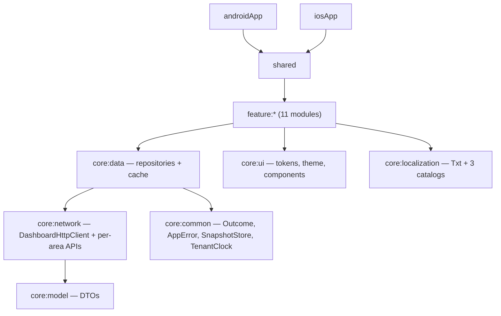
```mermaid
flowchart TD
  android[androidApp] --> shared
  ios[iosApp] --> shared
  shared --> features["feature:* (11 modules)"]
  features --> data["core:data — repositories + cache"]
  features --> ui["core:ui — tokens, theme, components"]
  features --> l10n["core:localization — Txt + 3 catalogs"]
  data --> network["core:network — DashboardHttpClient + per-area APIs"]
  network --> model["core:model — DTOs"]
  data --> common["core:common — Outcome, AppError, SnapshotStore, TenantClock"]
```

### Modules

- `mobile/build-logic` hosts the Gradle convention plugins. `edubot.kmp.library` adds a **JVM
  target** alongside Android and iOS so the pure-Kotlin modules test without the Android SDK or a
  simulator; `edubot.kmp.compose.library` is the Compose variant (no JVM target — nothing ships a
  desktop app); `edubot.kmp.feature` adds the four core modules every screen needs.
- `mobile/core/common` — `Outcome<T>`, `AppError`, `TokenStore`, `SnapshotStore`, `VoiceInput`, and
  `TenantClock` (renders instants in the tenant's own timezone) plus euro formatting.
- `mobile/core/model` — the dashboard DTOs, field-for-field with the server's.
- `mobile/core/network` — `DashboardHttpClient` and one API interface per dashboard area
  (`SessionApi`, `InboxApi`, `CrmApi`, `BookingsApi`, `AgentsApi`, …). **No method takes a token.**
- `mobile/core/data` — the repositories, plus `CachedResource` and `SnapshotCache`.
- `mobile/core/localization` — compile-checked keys in `Txt` and three catalogs (en, pt-PT, es),
  with tests asserting the key sets match and placeholders are preserved.
- `mobile/core/ui` — the design tokens, light and dark themes, and the shared components.
- `mobile/core/testing` — `Samples` (representative records) and `FakeVoiceInput`.
- `mobile/feature/*` — one module per area: `auth`, `overview`, `inbox`, `contacts`, `crm`,
  `bookings`, `agents`, `notifications`, `assistant`, `persona`, `settings`. Each pairs a stateless
  composable with a KMP `ViewModel` exposing an immutable `StateFlow`.
- `mobile/shared` — the shell: `MobileGraph` (the object graph), `Navigator` (the back stack),
  `ModuleRegistry` (the nav model), `DashboardSessionViewModel`, and `DashboardApp`. It is also the
  iOS umbrella, exporting the core modules as the static `EduBotShared` framework.
- `mobile/androidApp` / `mobile/iosApp` — the entry points. Each supplies a `TokenStore` (encrypted
  on Android, user defaults on iOS), a `SnapshotStore`, a `VoiceInput`, and the device locale.

A debug build can be pointed at a backend other than production:

```bash
cd mobile && ./gradlew :androidApp:installDebug -PapiBaseUrl=http://10.0.2.2:8080
```

`10.0.2.2` is the host as an emulator sees it; use the machine's LAN address for a real device, or
the `cloudflared` tunnel URL from the local dev setup. The debug manifest already allows cleartext,
so a local HTTP backend works without further changes. Without the property the build points at
production, which is what a release build always does.

### Auth

`SessionTokens` is the only thing that knows the bearer token. `DashboardHttpClient` attaches it,
and on a 401 calls `SessionTokens.invalidate()`, which clears storage and emits on `expired`.
`DashboardSessionViewModel` observes that once and drops to the sign-in screen, so any screen's
rejected call ends the session everywhere rather than leaving one screen in an error state.

A 403 is kept distinct: it means the tenant lacks the module or the user lacks the role, and must
not sign anyone out. A 400 keeps the server's stable error code (`tax_id_required`,
`address_required`, `id_taken`, …) so a form can point at the field that is wrong.

### Offline

`CachedResource` serves the last good response from `SnapshotStore`, then refreshes. A failed
refresh keeps the cached value and reports the error beside it. `ResourceState.fromCache` is true
only while the backend has not confirmed what is on screen, which is what the "showing your last
snapshot" notice is keyed on. Signing in, switching company and signing out all clear the cache so
one account never sees another's data.

### Freshness

No websockets; the app polls on the same cadences as the web dashboard. The conversation thread
polls `GET /app/api/conversations/{id}/updates?since=` every 4s and merges by message id (the
server resends across a five-second overlap window); the conversation list every 15s; the
notification badge every 60s; persona every 3s while a prompt is compiling.

### Navigation

`ModuleRegistry` is the single source of truth for what is reachable. `MobileModule.supported`
marks whether the app has a screen for a module: `/app/api/me` lists every module the tenant pays
for, and modules the app cannot render are shown under a "on the web dashboard" heading rather than
as taps that go nowhere. `Navigator` holds the back stack; Android wires its `back()` to the
activity's `OnBackPressedDispatcher`.

### Not on mobile

The agent builder, the document-template studio, the website-widget customiser, WhatsApp template
CRUD, Instagram, the Google/Gmail integrations, and persona file uploads stay on the web dashboard.
The app names them rather than hiding them.
