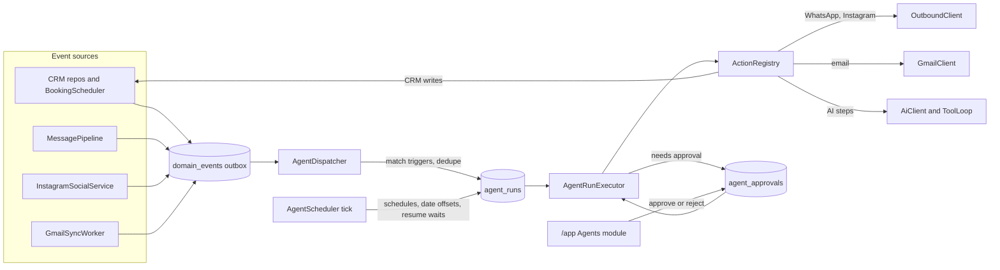
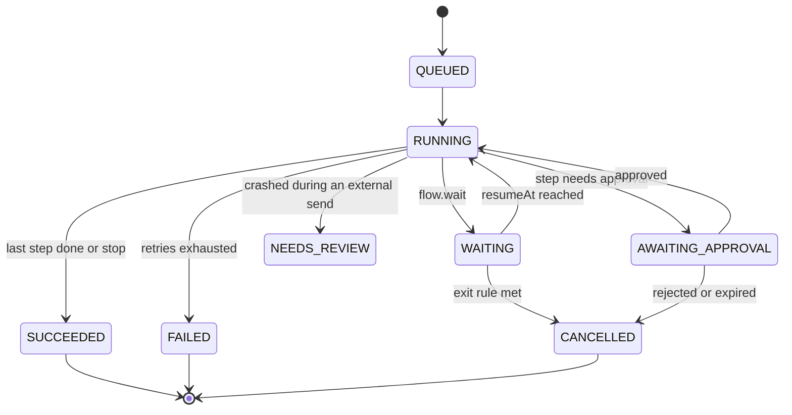
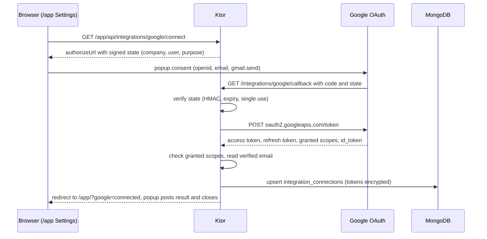
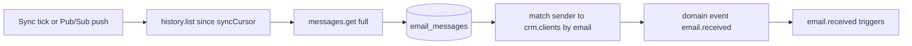

# Implementation Plan — Agents (Automations) and Google/Gmail Integration

Status: **Implemented** through Phase 5 (Gmail Pub/Sub push and Phase 6 not started; Google verification and CASA pending) · Owner: Rodrigo · Last updated: 2026-09-30

An **Agents** dashboard module built on one automation engine. Agents wake up on CRM events,
schedules, dates, inactivity, messages or emails; they run ordered steps that can be deterministic
actions or AI reasoning; approvals, tasks and notifications keep a person in the loop. The module
is wired into clients, quotes, invoices, bookings, Home and the assistant. A company can link a
Google account so automations can send email first and, later, read it.

This plan was written without access to Rodrigo's personal wiki or GitNexus (cloud VM), so it rests
on the repo docs alone. Since 2026-10-09 the repo's own `wiki/` (start at `wiki/index.md`) holds the
conventions it might conflict with.

---

## Context

**What we build on**

- **LLM tool calling.** `AiClient.complete(messages, tools, forceToolUse, modelOverride)` in
  `ai/AiClient.kt`. Two tool packs: `CrmTools` (12 tools) and `BookingTools` (8 tools), each with a
  tool → module map and separate read and write sets.
- **Confirm before write.** The dashboard assistant stores write tool calls as `PENDING` actions and
  runs them only after the user confirms, claiming the action atomically so it can't run twice
  (`dashboard/DashboardAssistant.kt`).
- **Concurrency.** `MessageQueue` plus `ConversationLanes` (16 lanes) inside `pipelineScope`
  (`Application.kt`).
- **Scoping.** Every row carries `tenantId`. A company is its own `Tenant` document, linked to the
  first company by `parentTenantId`. Repositories are built per request as `XRepository(mongo, tenant.id)`.
- **OAuth precedent.** `OAuthState` signs the state with HMAC, expires it and accepts it once. The
  Instagram connect popup and `ChannelBinding` storage follow from it.
- **WhatsApp messaging.** `WhatsAppClient.sendTextMessage` / `sendTemplate`, template sync from the
  WhatsApp Business Account and the 24-hour window check in `dashboard/InboxService.kt` (landed with
  the WhatsApp inbox).
- **Topology.** Production runs one app instance against a standalone Mongo: no change streams, no
  multi-document transactions.

**What is missing, and this plan adds**

- Domain events, a scheduler, and a background job runtime (`BookingScheduler` is the slot engine,
  not a cron).
- Staff notifications, tasks and an audit trail.
- Email of any kind. Google sign-in only returns a Firebase ID token and grants no API access.
- Automations that use WhatsApp templates to reach customers outside the 24-hour window.
- Token encryption at rest for new integration tokens (channel tokens are plaintext today, debt D2
  in [plan-instagram-oauth-onboarding.md](plan-instagram-oauth-onboarding.md)).

## Decisions

1. **One engine for every kind of agent.** Deterministic steps and AI steps share one runtime.
   Agent "kinds" are presets and gallery categories, not separate systems.
2. **Agents and Google connections belong to a company** (`tenantId`), like all CRM data. Per-user
   Google connections come later.
3. **Gmail sends first and reads later.** Sending needs `gmail.send` (*sensitive*). Reading the inbox
   needs `gmail.readonly` + `gmail.modify` (*restricted*: annual CASA security assessment), so it is
   opt-in per company and requested with incremental consent.
4. **Safe by default.** Every template step that messages a customer starts on "Ask me first". The UI
   suggests automatic once the user has approved several in a row without edits.
5. **Form-based builder.** A trigger, then conditions, then ordered steps with waits and guards. No
   drag-and-drop canvas in v1.
6. **`agents` is opt-in per tenant.** The backoffice enables it; it does not switch on for tenants
   whose `enabledModules` is null.
7. **Direct REST calls to Google** over Ktor CIO, like `WhatsAppClient` and `InstagramClient`. No
   Google Java SDK; a small hand-written MIME builder.
8. **Poll Gmail history first.** Pub/Sub push comes later.

## Product model

**An agent** is a saved, versioned definition owned by a company:

- **Triggers** — when it wakes up: a record event, a schedule, a date offset, inactivity, an inbound
  message or email, or a manual run.
- **Only if** — conditions on the trigger's data ("invoice total > 500", "client has an email").
- **Steps** — ordered actions (send WhatsApp, send email, draft an invoice, notify the team, wait 3
  days, run an AI task). Each step has an optional guard and its own autonomy level.
- **Exit rules** — events that end a running sequence ("invoice paid" stops the overdue reminders).
- **Policy** — default autonomy, quiet hours, business days, frequency caps, approvers, notify list.
- **Voice** — tone, language, signature, "use my Persona", custom instructions.

**Agent kinds** (presets over the same engine): Workflow (deterministic sequences), AI worker
(reasoning with tools under a policy), Digest (scheduled summaries for staff), Monitor (thresholds
and inactivity). Later: conversational specialists that take over a thread on handoff.

**Personalization layers**, lightest to deepest: template parameters → builder → voice → policy →
audience filters → AI setup → company defaults (Agents → Settings) → platform limits (backoffice).

## Architecture



**New packages**: `events/` (domain events, outbox, `ActorContext`), `agents/` (models, registries,
runtime, templates, routes, assistant tools), `integrations/` (Google OAuth, Gmail, email service,
token encryption), `notifications/` (in-app staff notifications), `ai/tools/` (`ToolPack`, `ToolLoop`).

### 1. Domain events

- **Outbox.** `domain_events` holds each event: `tenantId`, `type`, `subject`, `related`, a small
  `payload` snapshot, `actor`, `depth`, `occurredAt`, `dispatch.status`.
- **No constructor changes.** Repositories already receive `MongoModule`, so they append through
  `DomainEventLog(mongo)` themselves; none of the `XRepository(mongo, tenant.id)` call sites change.
- **Who caused it** comes from a coroutine context element: a route interceptor under
  `authenticate("dashboard")` sets the dashboard user, `MessagePipeline` the bot, the agent executor
  the agent and run (depth + 1). Anything else is `SYSTEM`.
- **Best effort.** A failed event write is logged; the business write still succeeds.

Emit points (lowest shared layer, so dashboard, backoffice, WhatsApp tools, assistant and agents all
produce the same events):

- `ClientRepository.create/update/setArchived` → `client.created|updated|archived|restored`
- `QuoteRepository.create/update` → `quote.created`, `quote.status_changed {from, to}` (+ stamps
  `Quote.sentAt` / `acceptedAt`)
- `InvoiceRepository.create/markPaid` → `invoice.created`, `invoice.paid`
- `PaymentRepository.create/markPaid` → `payment.created`, `payment.paid`
- `ClientServiceRepository.create/markInvoiced` → `service.created`, `service.invoiced`
- `BookingScheduler.create/update/setStatus` → `booking.created|rescheduled|status_changed`
- `UserRepository.findOrCreate` → `contact.created`; `MessagePipeline` → `message.received` (only
  when an active agent subscribes); pausing auto-reply → `conversation.handoff`
- `InstagramSocialService.ingestComment` → `instagram.comment.received`
- Gmail sync → `email.received`; `EmailService` → `email.sent`

The outbox doubles as an activity log (timeline per record); events are kept 365 days.

```kotlin
data class SubjectRef(val type: String, val id: ObjectId)

data class DomainEvent(
    val id: ObjectId = ObjectId(),
    val tenantId: ObjectId,
    val type: String,               // "invoice.paid", "quote.status_changed"
    val subject: SubjectRef,
    val related: List<SubjectRef>,  // e.g. the invoice's client
    val payload: JsonObject,        // number, status from/to, totals, dates
    val actor: Actor,               // USER | OPERATOR | BOT | AGENT | SYSTEM (+ id, runId)
    val depth: Int,                 // how many agent steps led here (loop protection)
    val occurredAt: Instant,
)
```

### 2. Agent definition model

```kotlin
data class Agent(
    val id: ObjectId, val tenantId: ObjectId,
    val name: String, val description: String?, val kind: AgentKind,  // WORKFLOW, AI_WORKER, DIGEST, MONITOR
    val templateKey: String?, val templateParams: JsonObject?,
    val status: AgentStatus,                                          // DRAFT, ACTIVE, PAUSED, ARCHIVED
    val triggers: List<TriggerSpec>,
    val conditions: ConditionGroup?,
    val steps: List<StepSpec>,
    val exitRules: List<ExitRule>,
    val policy: AgentPolicy,
    val voice: AgentVoice,
    val version: Int, val createdBy: ObjectId?, val createdAt: Instant, val updatedAt: Instant,
)

data class TriggerSpec(val id: String, val type: String, val config: JsonObject, val nextFireAt: Instant? = null)

data class StepSpec(
    val id: String,
    val action: String,              // registry key: "email.send", "flow.wait", "ai.task"
    val input: JsonObject,           // may hold {{variables}}; validated against the action schema
    val guard: ConditionGroup? = null,
    val autonomy: Autonomy? = null,  // AUTO | APPROVE | DRAFT; null = the agent's default
    val onError: ErrorPolicy = ErrorPolicy.RETRY_THEN_FAIL,
)
```

**Triggers**: `event` (any domain event, with filters), `schedule` (daily / weekly / monthly / every N
hours at a local time, DST-safe in `Tenant.timezone`), `date_offset` (offset from `invoice.dueDate`,
`payment.dueDate`, `quote.validUntil`, `booking.startAt`), `inactivity` (quote still SENT after N
days, chat waiting N minutes, client quiet N days), `manual` (run on a record), `email.received`,
`message.received`.

**Conditions**: all/any groups of `field op value` over the trigger's typed variables. Operators: eq,
neq, gt, gte, lt, lte, contains, in, exists, is_empty, days_since, days_until. No scripting.

**Templating**: a small logic-free renderer — `{{client.firstName}}`, `{{invoice.total | money}}`,
`{{invoice.dueDate | date}}`, `{{invoice.daysOverdue}}`, `{{company.name}}`,
`{{steps.classify.output.intent}}`, `{{params.depositPercent}}`. Money and dates follow the company's
locale and timezone. An unknown variable fails validation on save.

**Versioning**: each run keeps a snapshot of the definition it started with.

### 3. Registries

```kotlin
interface AgentAction {
    val key: String
    val category: ActionCategory               // MESSAGE, TEAM, CRM, DOCUMENT, FLOW, AI
    val requiredModules: Set<String>
    val requiredIntegration: IntegrationKind?  // GMAIL, WHATSAPP, INSTAGRAM
    val sideEffect: SideEffect                 // NONE, INTERNAL_WRITE, EXTERNAL_MESSAGE
    val inputSchema: JsonObject                // builder form + validation + LLM tool definition
    val outputSchema: JsonObject?
    suspend fun preview(input: JsonObject, ctx: RunContext): ActionPreview
    suspend fun execute(input: JsonObject, ctx: RunContext): ActionResult
}
```

- **One schema, three uses**: validation on save, the builder form, and the LLM tool definition when
  an AI step may call the action. A new trigger or action is one registered class.
- **Catalog**: `GET /app/api/agents/catalog` returns triggers, actions, variables, operators and
  templates filtered by the company's modules and integrations (`available: false` + a reason such as
  `needs_gmail`).
- **Validation**: `AgentDefinitionValidator` rejects unknown keys, schema violations, missing
  modules/integrations, broken variable references and unsafe combinations (an automatic external
  send whose recipient comes from AI output).

**Actions**: `whatsapp.send`, `instagram.reply`, `email.send`, `email.reply`, `team.notify`,
`team.task.create`, `crm.client.create|update`, `crm.quote.set_status`, `crm.invoice.from_quote`,
`crm.invoice.from_open_services`, `crm.payment.create`, `crm.service.create`,
`booking.create|confirm|cancel`, `doc.pdf`, `flow.wait`, `flow.branch`, `flow.stop`, `ai.task`,
`ai.compose`. Later: `http.webhook`.

### 4. Runtime

- **`AgentDispatcher`** — woken after each outbox write (2 s poll fallback); claims pending events
  atomically, matches them against a per-company trigger cache, checks filters and "only if", starts
  runs with a unique `dedupeKey` (`event:<eventId>:<triggerId>`), and applies exit rules to waiting
  runs on the same record.
- **`AgentScheduler`** — a tick guarded by a Mongo lease: fires due schedules (claim + advance
  `nextFireAt` in one update), sweeps date-offset and inactivity triggers (dedupe key includes the
  record's date; catch-up bounded), resumes waiting runs, retries failed steps with backoff, expires
  stale approvals.
- **`AgentRunExecutor`** — its own `ConversationLanes` keyed by `tenantId:subject` so agents never
  slow customer chats; checkpoints after every step; reloads the record after a wait so guards see
  live data.



- **No duplicate sends.** An external send writes an `outbound_log` row keyed `runId:stepId`
  (SENDING → SENT) before calling the provider. A run found mid-send after a restart moves to
  `NEEDS_REVIEW` instead of re-sending.
- **Shutdown and recovery.** `pipelineScope` is cancelled on `ApplicationStopped`; RUNNING runs are
  recovered at boot with the rule above.

### 5. AI layer

- **`ToolPack`** — one interface over `CrmTools`, `BookingTools` and an `ActionToolPack` that exposes
  registry actions as tools. **`ToolLoop`** — one tool-calling runner with a write policy (execute,
  propose, deny).
- **`ai.task`** — instructions + allowed tools (read-only by default) + output fields; structured
  output through a forced `submit_result` tool. Output available as `steps.<id>.output`.
- **`ai.compose`** — writes a message from the context and the agent's Voice (optionally the compiled
  Persona); approvals always show the final text.
- **Writes inside AI steps** follow the step's autonomy: AUTO executes allowed actions, APPROVE
  collects proposals, DRAFT only records them.
- **Cost control** — AI steps respect `Tenant.monthlyTokenBudget` and a per-agent `maxTokensPerRun`;
  usage is recorded in `tenant_usage` by source (pipeline, assistant, agents).
- **Prompt injection** — inbound emails and messages are wrapped as untrusted content; external sends
  only go to contacts on file unless a person approves.
- **Natural-language builder** — `POST /app/api/agents/draft` drafts a definition from a request,
  validated, opened as a DRAFT, never activated automatically.
- **Assistant** — an `AgentTools` pack (`list_agents`, `run_agent`, `pause_agent`, `activate_agent`,
  `list_agent_approvals`, `approve_agent_item`, `draft_agent`); writes go through the existing
  confirmation flow.

### 6. Guardrails

Autonomy per step (Auto / Ask first / Draft only); quiet hours and business days (company default
21:00–08:00; messages are delayed, never dropped); per-recipient frequency caps across all agents
(`outbound_log`); `Client.automationPaused`; loop protection (agents ignore their own events, depth
> 3 is dropped); a circuit breaker (N failed runs in a row pauses the agent and notifies admins);
kill switches (company "pause all", backoffice `agentsPaused`, module off); budgets (runs per agent
and company per day, email sends per day, token budget); dry run ("Test on a record").

### 7. Humans in the loop

- **Approvals** (`agent_approvals`) show the exact payload (final text, recipients, attachments, CRM
  changes); Approve, Edit and approve, Reject, bulk approve; expire after 3 days; atomic claim.
- **Tasks** (`agent_tasks`): title, detail, record link, assignee, due date, status.
- **Notifications** (`notifications`): a bell in the top bar, per user or for all admins.
- **Home**: an `agents` snapshot card and attention items `agent_approval`, `agent_failed`,
  `agent_task_due`, `integration_reconnect`.

### 8. Messaging channels

- **WhatsApp**: free text only within 24 hours of the customer's last message
  (`Conversation.lastInboundAt`); outside it the step sends its mapped approved template, else follows
  its channel strategy (email, then a task for a person).
- **Instagram**: replies only within 24 hours; no proactive DMs.
- **Proactive messages join the conversation** (`author = AUTOMATION`, `origin = agent:<id>`), so the
  receptionist bot has the reminder in context when the customer answers, and the inbox shows an
  "Automation" badge.

## Google / Gmail integration

### Google Cloud setup and verification (ops, external lead time)

- Reuse the Firebase Google Cloud project `thebotslab` (one brand on the consent screen). Add an OAuth
  client (Web application), enable the Gmail API, register
  `https://<host>/integrations/google/callback`.
- Scopes: `openid`, `email`, `gmail.send` (sensitive: brand verification + demo video). Inbox reading
  adds `gmail.readonly` + `gmail.modify` (restricted: verification + annual CASA assessment).
- Testing mode: at most 100 listed test users and refresh tokens expire after 7 days — don't onboard
  real tenants before verification.
- Limited Use: disclose Gmail data use on `/privacy`, never train models on it, delete it on request
  or disconnect.

### Connect flow



- Only tenant admins connect (operator impersonation is refused: the operator would consent with
  their own Google account). The authorize URL uses `access_type=offline`, `prompt=consent`,
  `include_granted_scopes=true`.
- `OAuthState` gains optional `purpose`, `tenantId` and `userId` fields; Instagram is unchanged.
- The public callback trusts only the signed state (like `/admin/api/instagram/callback`) and checks
  the granted scopes (`missing_scope` when the user unticked Gmail).

### Tokens

- `integration_connections`: one document per connected account — identity (`tenantId`, `provider`,
  `accountEmail`, `scopes`, `status` ACTIVE / NEEDS_RECONNECT / REVOKED), encrypted tokens, owner
  and settings (sender name, reply-to, signature, inbox sync), sync cursor and daily send counter.
  Unique `(tenantId, provider, accountEmail)`. Tokens never leave the server.
- `TokenCipher`: AES-256-GCM, random IV, versioned key id; key from `INTEGRATIONS_ENCRYPTION_KEY`
  (env-only).
- `GoogleTokenProvider`: refreshes when under 5 minutes remain, one refresh at a time per connection;
  `invalid_grant` → NEEDS_RECONNECT + notification; disconnect revokes and deletes the tokens.

### Sending email

- `GmailClient` (`users.messages.send`, `users.getProfile`; later `history.list`, `messages.get`,
  `messages.modify`, `attachments.get`).
- `MimeMessageBuilder`: text + HTML alternative, PDF attachments, UTF-8 encoded headers,
  `In-Reply-To` / `References` for threads.
- `EmailLayout`: a branded HTML email from `DocumentTemplate` + the connection's signature.
- `EmailService`: default sender, per-connection daily cap, `outbound_log` + `email_messages` row,
  `email.sent` event.
- `email.send`: to the client on file, a team member or a fixed address; cc/bcc; templated or AI
  subject and body; the quote/invoice PDF; reply-to.

### Receiving email



- Restricted scopes are requested only when a company turns on "Use my inbox in automations".
- `GmailSyncWorker` lists new inbox messages since the cursor, normalizes them (body capped), skips
  the company's own mail, matches the sender to a client, stores them and emits `email.received`;
  full resync when the cursor is too old. Later: Pub/Sub push (`users.watch`).
- Trigger filters: sender or domain, known client or not, subject/body contains, has a PDF.
- Actions: `email.reply` (in thread). Retention: bodies purged after 90 days; disconnect purges all.

### Email elsewhere in the CRM

Settings → Channels gets an "Email (Google)" row and an email settings drawer (sender name,
signature, inbox sync, test email). Quote and invoice details get "Send by email". The client record
gets an Emails tab.

## Frontend

Follows [design-system/AGENTS.md](../design-system/AGENTS.md) and the "New dashboard page" checklist
in [design-system/patterns.md](../design-system/patterns.md).

- `agents` in the `groupBot` nav group next to `persona` and `ai-assistant`; tabs Agents, Templates,
  Inbox, Activity, Settings.
- Agents list (hero + stats + table), agent record drawer (summary, KPIs, Overview / Configure / Runs
  tabs, Activate / Pause / Test / Duplicate / Copy / Archive), a builder (trigger, "only if" rows,
  step cards, exit rules, policy, voice) with a schema-driven form renderer, a template gallery with
  guided setup, an inbox (approvals and tasks) and an activity view (runs and step timelines).
- New CSS components `.flow`, `.flow__step`, `.recipe`, `.var-chip` (tokens only, light + dark).
- All strings in the three catalogs under `app.agents.*` and `app.integrations.google.*`; template
  message copy lives on the server per locale.

## Touchpoints

Home (agents card + attention), client record (Automations tab with upcoming steps, recent agent
actions, pause toggle, run an agent; Emails tab), quote / invoice / booking details (automations
block, Send by email), conversations (automation badge), assistant (`AgentTools`, drafting),
persona (voice toggle), settings (Gmail row, Home card), companies (copy agents), backoffice (module,
limits, kill switch, health, Google OAuth settings), mobile (module label).

## Built-in templates

- **Finance**: invoice due reminder; overdue sequence (friendly → firmer with PDF → call task);
  payment thank-you; payables digest; month-end billing drafts; weekly cash briefing.
- **Sales**: quote follow-up; quote expiring; quote accepted → invoice draft + notify; new lead intake.
- **Bookings**: confirmation; 24 h reminder; unconfirmed booking alert; post-service follow-up;
  no-show recovery; daily agenda.
- **Inbox and social**: waiting chat alert; Instagram comment triage; re-engagement.
- **Email**: email the quote when SENT; email lead capture; supplier bill intake.
- **Housekeeping**: weekly data check.

## Data model

- `domain_events` — `(dispatch.status, occurredAt)`, `(tenantId, subject.type, subject.id, occurredAt -1)`, TTL 365 d.
- `agents` — `(tenantId, status)`, `(tenantId, triggers.type)`, `(status, triggers.nextFireAt)`.
- `agent_runs` — unique `(tenantId, agentId, dedupeKey)`, `(status, resumeAt)`, `(tenantId, agentId, createdAt -1)`, `(tenantId, subject.type, subject.id, status)`, TTL on `finishedAt` (180 d).
- `agent_approvals` — `(tenantId, status, createdAt -1)`, unique `(runId, stepId)`.
- `agent_tasks` — `(tenantId, status, dueAt)`, `(tenantId, assigneeUserId, status)`.
- `notifications` — `(tenantId, userId, readAt, createdAt -1)`, TTL 90 d.
- `outbound_log` — unique `idempotencyKey`, `(tenantId, recipient, at)`, TTL 30 d.
- `scheduler_leases` — one document per worker.
- `integration_connections` — unique `(tenantId, provider, accountEmail)`, `(provider, status)`.
- `email_messages` — unique `(tenantId, connectionId, providerMessageId)`, `(tenantId, clientId, date -1)`, `(tenantId, threadId)`.
- Fields: `Client.automationPaused`, `Quote.sentAt` / `acceptedAt`, `Message.origin`, tenant
  limits (`agentsPaused`, `maxActiveAgents`, `agentRunsPerDay`, `emailSendsPerDay`) and company
  `agentSettings`. Indexes: partial `crm.clients (tenantId, email)`, `crm.quotes (tenantId, status, validUntil)`.

## API surface

Under `authenticate("dashboard")` + the `agents` module unless noted:

- `GET /app/api/agents/catalog`; `GET|POST /app/api/agents`; `GET|PUT|DELETE /app/api/agents/{id}`;
  `POST …/{id}/activate|pause|archive|duplicate|copy|test|run`; `POST /app/api/agents/draft`.
- `GET /app/api/agents/runs`, `GET …/runs/{id}`, `POST …/runs/{id}/cancel|retry`.
- `GET /app/api/agents/approvals`, `POST …/approvals/{id}/approve|reject`;
  `GET|POST /app/api/agents/tasks`, `PATCH …/tasks/{id}`.
- `GET /app/api/agents/subjects/{type}/{id}`; `GET|PUT /app/api/agents/settings`.
- Notifications (no module gate): `GET /app/api/notifications`, `POST …/{id}/read`, `POST …/read-all`.
- Integrations (`settings` module, tenant admin): `GET /app/api/integrations`,
  `GET /app/api/integrations/google/connect`, `PATCH|DELETE /app/api/integrations/{id}`,
  `POST …/{id}/test-email`; public `GET /integrations/google/callback`.
- Backoffice (`admin-jwt`): `GET /admin/api/tenants/{slug}/agents`, pause/resume, limits on the
  tenant PATCH.
- Roles: tenant admins and operators manage agents and company agent settings
  (`canManageAgents()`); members view, approve where allowed, and work their tasks.

## Config

- `app.google.oauth { clientId, clientSecret, redirectUri }` (`GOOGLE_OAUTH_CLIENT_ID`,
  `GOOGLE_OAUTH_CLIENT_SECRET`, `GOOGLE_OAUTH_REDIRECT`) with an `oauthEnabled` flag;
  `app.integrations.encryptionKey` (`INTEGRATIONS_ENCRYPTION_KEY`, env-only);
  `app.agents { tickSeconds, lanes, maxConcurrentRunsPerCompany }`.
- `PlatformSettingKey`: `GOOGLE_OAUTH_CLIENT_ID`, `GOOGLE_OAUTH_CLIENT_SECRET` (secret),
  `GOOGLE_OAUTH_REDIRECT` in a `google` category.
- Without Google config the connect route answers 503, the Gmail row is hidden, the app still boots.

## Rollout risks

- **A new module key would switch itself on for older tenants** (`effectiveFor` falls back to the
  whole catalog when `enabledModules` is null) — `agents` is in an opt-in set the fallback skips.
- **Event emission touches the most-used classes** (CRM repositories, `BookingScheduler`,
  conversation repositories, `MessagePipeline`, `InstagramSocialService`). Emission is best effort and
  never fails the business write.
- **Single-instance assumptions remain** (in-memory OAuth nonces, the booking lock); the agent
  scheduler uses a Mongo lease and atomic claims.
- **Google Testing mode** (7-day refresh tokens, 100 users) and **CASA** for restricted scopes.
- **Costs and limits**: WhatsApp templates are billed by Meta to the tenant's WABA; Gmail daily send
  limits (`daily_send_limit`); agents share `monthlyTokenBudget`.

## Testing

Unit (conditions, templating, schedules incl. Lisbon DST, date offsets, validator, guardrails, MIME,
token cipher, email parsing), Ktor MockEngine (Google OAuth, Gmail), in-memory runtime tests
(dispatcher dedupe and exit rules, executor wait / resume / approval / retry / cancel /
NEEDS_REVIEW), Testcontainers Mongo (event log, repositories, scheduler claims), routes (module gate,
role gate, company isolation, validation, OAuth state and scopes) and regressions
(`MessagePipelineTest`, `DashboardAssistantToolPolicyTest`, `CrmToolsTest`, `BookingFlowTest`).

## Phases

- **Phase 0 — foundations**: domain events, `ToolPack` / `ToolLoop`, worker infrastructure, opt-in
  module, `TokenCipher`.
- **Phase 1 — Agents MVP**: models, registries, runtime, guardrails, v1 actions, approvals, tasks,
  notifications, routes, UI, touchpoints, templates.
- **Phase 2 — Google + Gmail send**: OAuth, connections, `GmailClient`, MIME, `EmailService`,
  `email.send`, Gmail UI, privacy pages.
- **Phase 3 — AI steps**: `ai.task`, `ai.compose`, metering by source, drafting, assistant tools.
- **Phase 4 — inbound email**: restricted scopes, sync worker, `email.received`, `email.reply`;
  later Pub/Sub push.
- **Phase 5 — WhatsApp templates in automations**: template mapping in `whatsapp.send` on top of the
  inbox's `sendTemplate` and template sync.
- **Phase 6 — extensions**: if/else branches, webhooks, email as a Conversations channel, Google
  Calendar sync, per-user Google connections, mobile approvals + push, the receptionist as an agent.
  Received mail got its own Inbox page instead of a Conversations channel: the opt-in `email` module
  (Email page: threads, replies and the dashboard actions each email calls for), in
  [architecture.md](architecture.md) → "Email page".
