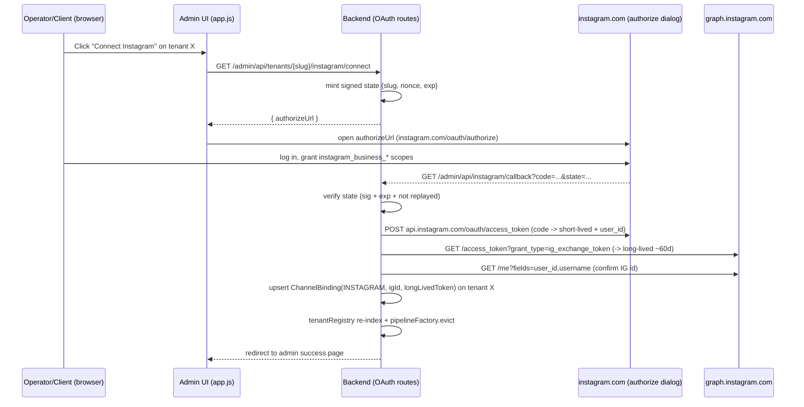

# Implementation Plan — Automatic Instagram Onboarding (OAuth / Instagram Login)

Status: **Proposed** · Owner: Rodrigo · Last updated: 2026-06-06

> Companion to `docs/plan-instagram-channel.md`. That plan added the channel abstraction and the
> **manual-paste** binding flow (operator copies an IG account id + token into the admin UI). This
> plan replaces the manual paste with a **self-serve OAuth flow**: a client clicks "Connect
> Instagram", authorizes *your* app against *their* account, and the backend writes the
> `ChannelBinding` automatically — no Graph Explorer, no token copy-paste, no redeploy.

## 0. Why "Instagram Login" and not "Facebook Login" (decided 2026-06-06)

We tried the Facebook-Login / Page-token path first and **hit a wall, confirmed firsthand**:

```
GET /me/accounts  →  {"data":[]}      # with pages_show_list GRANTED
GET /me/permissions → pages_show_list: granted, instagram_basic: granted,
                      instagram_manage_messages: granted
```

The permissions were all granted, but `me/accounts` was empty — meaning **the Instagram account is
not attached to any Facebook Page**. The Facebook-Login flow *requires* a linked Page to mint a Page
token, so it is a dead end for accounts (like ours, and likely most clients') that have no Page.

**Decision: use the "Instagram API with Instagram Login" flow.** It authorizes directly on
instagram.com, requires **no Facebook Page**, and yields an Instagram **user** token used against
`graph.instagram.com`. This is the path the rest of this plan implements. The Facebook-Login /
Page-token variant is documented in §11 as a fallback only.

> Trade-off accepted: egress moves from `graph.facebook.com` to `graph.instagram.com` and we manage
> a separate Instagram app id/secret. Both are small, contained changes (§5, §7).

## 1. Goal

A tenant operator (or the client) connects an Instagram professional account to a tenant by clicking
one button. The backend completes the Instagram OAuth handshake, exchanges the code for a long-lived
token (~60 days), reads the IG account id, and persists
`ChannelBinding(platform = INSTAGRAM, externalId = <igId>, accessToken = <token>)` on the tenant.
The next DM to that account is handled by the same agent — no redeploy.

Non-goals (this iteration):
- WhatsApp Embedded Signup (same pattern, later).
- Background token-refresh cron (we store expiry + re-auth on demand; see §9 D3).
- Facebook-Login / Page-token onboarding (kept only as the §11 fallback).

## 2. Why this over manual paste

| | Manual paste (shipped) | Instagram-Login OAuth (this plan) |
|---|---|---|
| Who can do it | Only you, via Graph Explorer | The client, self-serve |
| Needs a Facebook Page | Effectively yes (Page token) | **No** |
| Token lifetime | Easy to grab a 1h token by mistake | Long-lived (~60d) by construction, refreshable |
| Scales to N clients | No (you're the bottleneck) | Yes |
| Meta App Review | Required for advanced access | **Same requirement — unchanged** |

App Review for `instagram_business_manage_messages` gates production for **both** paths equally.
OAuth removes per-client manual labor *after* review; it does not remove review. For **dev/testing**
you do **not** need review — see §3.

## 3. Dev/test access without App Review (this unblocks you today)

In development mode, the Instagram-Login flow works against IG accounts that are registered as
**Instagram Testers** on your app — no App Review required:

1. Meta App Dashboard → your app → **App roles → Roles** (or Instagram product → **Roles**) → add the
   target IG account as an **Instagram Tester**.
2. In that account: Instagram app → **Settings → Apps and websites → Tester invites** → **accept**.
3. Now the OAuth flow + messaging API work for that account in dev mode.

This is the Instagram-Login equivalent of "be an admin/dev/tester of the app." Use it to validate the
whole pipeline before submitting for review.

## 4. Flow overview



No `/me/accounts`, no Page, no `subscribed_apps` call. Webhook subscription is configured once at the
app level in the Instagram product settings (§8).

## 5. Configuration changes

The Instagram-Login flow uses a **separate Instagram app id and Instagram app secret**, distinct from
the Facebook app id/secret behind `app.whatsapp.appSecret`. Both live in the **Instagram** product
settings of the Meta app. Add a dedicated block — do **not** reuse the WhatsApp app secret here.

`config/AppConfig.kt` + `application.conf` + `.env(.example)`:

```hocon
app {
  instagram {
    appId        = ${?IG_APP_ID}            # Instagram app ID (Instagram product settings)
    appSecret    = ${?IG_APP_SECRET}        # Instagram app secret (≠ whatsapp.appSecret)
    redirectUri  = ${?IG_OAUTH_REDIRECT}    # https://<host>/admin/api/instagram/callback
    graphVersion = "v21.0"
  }
}
```

```kotlin
data class InstagramConfig(
    val appId: String,
    val appSecret: String,
    val redirectUri: String,
    val graphVersion: String = "v21.0",
)
```

Wire it in `AppConfig.load()`, add keys to `logStartupKeys`, and make `appId`/`appSecret`/`redirectUri`
**optional** (blank ⇒ feature disabled, the connect route returns 503) so dev boxes without IG
credentials still boot.

> The redirect URI must be registered **exactly** under the Instagram product's *OAuth Redirect URIs*
> and Meta must be able to reach it. Localhost is not reachable — use the Cloudflare tunnel URL during
> dev (the run-local skill prints it) or test against the prod host.

## 6. Backend

New package `oauth/` (or `instagram/oauth/`):

```
oauth/InstagramOAuthRoutes.kt   // connect + callback endpoints
oauth/InstagramOAuthClient.kt   // code->token, exchange->long-lived, /me
oauth/OAuthState.kt             // sign/verify state {slug, nonce, exp}
```

### 6.1 Routes (mounted next to `tenantAdminRoutes(...)` in `Application.kt:173`)

- **`GET /admin/api/tenants/{slug}/instagram/connect`** — *inside* `authenticate("admin-jwt")`.
  Validates the tenant exists, mints a signed `state`, returns `{ "authorizeUrl": "<ig-url>" }`:
  ```
  https://www.instagram.com/oauth/authorize
    ?client_id={igAppId}
    &redirect_uri={redirectUri}
    &response_type=code
    &scope=instagram_business_basic,instagram_business_manage_messages
    &state={signedState}
  ```

- **`GET /admin/api/instagram/callback`** — **outside** `authenticate("admin-jwt")` (Instagram calls
  it via browser redirect with no JWT; auth is the signed `state`, §6.3). Handles `?code=&state=`
  (success) and `?error=&error_reason=&error_description=&state=` (denied/error). On success: run the
  exchange (§6.2), write the binding (§6.4), then 302 to `/admin/?ig=connected&tenant={slug}` (or
  `?ig=error&reason=...`). Read the tenant slug **only** from the verified state.

> The unauthenticated callback in an otherwise JWT-gated `/admin/api` surface is the one sharp edge.
> The signed-state check **is** the auth — treat it with the same rigor as the JWT.

### 6.2 Token exchange (`InstagramOAuthClient`)

Use a shared Ktor `HttpClient(CIO)` (mirror `Application.kt:80`). Each step aborts on non-2xx (log,
redirect to error page, never persist a partial binding):

1. **code → short-lived token + user id** (note: form-encoded POST to `api.instagram.com`, not graph)
   ```
   POST https://api.instagram.com/oauth/access_token
   (form) client_id={igAppId} client_secret={igAppSecret}
          grant_type=authorization_code redirect_uri={redirectUri} code={code}
   → { access_token, user_id, permissions }      # short-lived (~1h)
   ```
2. **short-lived → long-lived token (~60d)**
   ```
   GET https://graph.instagram.com/access_token
       ?grant_type=ig_exchange_token&client_secret={igAppSecret}&access_token={shortLived}
   → { access_token, token_type, expires_in }
   ```
3. **confirm IG account id / username**
   ```
   GET https://graph.instagram.com/{ver}/me?fields=user_id,username&access_token={longLived}
   ```

Result: `(igId, longLivedToken, username)`. **Verify during integration** that the id used as the
binding `externalId` is the same id Meta sends as `entry.id` on the `instagram` webhook (§8) — the
token endpoint's `user_id` and `/me?fields=user_id` should match it; reconcile if not.

> **Token refresh:** long-lived IG tokens expire in ~60d and can be refreshed with
> `GET https://graph.instagram.com/refresh_access_token?grant_type=ig_refresh_token&access_token={token}`
> (token must be ≥24h old and unexpired). See D3.

### 6.3 State / CSRF (`OAuthState`)

Callback is unauthenticated → `state` is the trust anchor. HMAC-sign a compact payload (key = admin
JWT secret or `app.instagram.appSecret`):

```
state = base64url({slug, nonce, exp}) + "." + HMAC_SHA256(payload)
```

Verify: signature valid, `exp` not passed (TTL ~10 min), `nonce` single-use (in-memory TTL cache of
consumed nonces to block replay). Any failure → 400, no exchange. Slug comes only from verified state.

### 6.4 Writing the binding (reuse, don't reinvent)

The binding write + registry re-index + pipeline eviction already exist in
`admin/TenantAdminRoutes.kt:160` (`POST /tenants/{slug}/channels`). Extract that body into a shared
helper:

```kotlin
suspend fun upsertChannelBinding(
    slug: String, binding: ChannelBinding,
    repo: TenantRepository, registry: TenantRegistry, factory: TenantPipelineFactory,
): Tenant?
```

Both the existing `/channels` POST and the OAuth callback call it: load tenant → replace any binding
with the same `(platform, externalId)` → `update("channels", ...)` + `phoneNumberIdUpdate` →
`registry.remove(old); registry.put(updated)` → `factory.evict(id)`. Guarantees manual paste and OAuth
converge on identical behavior, and re-connecting an account just overwrites the token (rotation, D3).

### 6.5 Token storage

`ChannelBinding.accessToken` is stored **plaintext** today (`TenantRepository.toDocument()`), masked to
`hasAccessToken: Boolean` in GET responses (`TenantAdminRoutes.kt:448`). For OAuth:
- **Minimum (now):** keep masking; never log token bodies (the exchange client logs ids/usernames only).
- **Follow-up (D2):** envelope-encrypt `accessToken` at rest via a `BindingCrypto` wrapper around the
  `toDocument`/`getChannels` boundary in `TenantRepository`. Out of scope to block this plan.

## 7. Egress change — `InstagramClient` must target `graph.instagram.com`

This is the one code change Path 2 forces beyond the OAuth ingress. Today
`instagram/InstagramClient.kt:36` hardcodes:

```kotlin
private val baseUrl = "https://graph.facebook.com/$apiVersion/$instagramAccountId"
```

Instagram-Login tokens are **not** valid against `graph.facebook.com`. Change egress to:

```kotlin
private val baseUrl = "https://graph.instagram.com/$apiVersion/$instagramAccountId"
// send: POST $baseUrl/messages  with  {"recipient":{"id":<IGSID>},"message":{"text":...}}
//       Authorization: Bearer <long-lived IG token>   (Bearer header already present)
```

Everything else in `InstagramClient` (the request/response shape, `capabilities.supportsDocuments =
false`, the blank-token guard) stays. `me/messages` also works in place of `{igId}/messages` if the id
ever mismatches.

> If you ever need to support **both** Facebook-Login Page tokens *and* Instagram-Login tokens at once,
> add an `api: InstagramApi` flag to `ChannelBinding` (GRAPH_FB vs GRAPH_IG) and pick the host from it.
> Not needed if we commit fully to Instagram-Login (recommended).

## 8. Webhooks — signature secret caveat ⚠️

`WebhookRoutes.kt:61` verifies **every** inbound webhook signature with `config.appSecret` (the
**Facebook/WhatsApp** app secret):

```kotlin
if (!WebhookVerifier.verifySignature(body, signature, config.appSecret)) { ... 401 }
```

Instagram-Login webhooks are signed with the **Instagram app secret** (`app.instagram.appSecret`),
which is a *different value*. As written, IG webhooks will **fail signature verification** and be
rejected with 401. Fix: choose the secret by `object` type before verifying.

- Parse `object` first (the route already extracts `objectType` at `WebhookRoutes.kt:67`, but *after*
  the signature check — reorder so the secret is chosen before verifying, or verify against whichever
  secret matches).
- `object == "instagram"` → verify with `app.instagram.appSecret`.
- `object == "whatsapp_business_account"` → verify with `app.whatsapp.appSecret` (unchanged).
- Pass `instagram.appSecret` into `webhookRoutes(...)` alongside the existing WhatsApp config.

**App-level webhook setup (ops, one-time):** Meta App Dashboard → **Instagram** product → **Webhooks**
→ set the same callback URL + verify token (`app.whatsapp.verifyToken` is reused for the GET handshake,
`WebhookRoutes.kt:43`) → subscribe the `instagram` object's **`messages`** field. With Instagram-Login
there is **no per-Page subscription** — the app-level subscription covers all authorized accounts.

## 9. Open decisions

- **D1 — Login product.** Decided: **Instagram Login** (no Page). §0.
- **D2 — Token encryption at rest.** Recommend envelope encryption as a fast follow (§6.5).
- **D3 — Token expiry/refresh.** ~60d lifetime. This iteration: store `tokenObtainedAt`, surface
  "expires soon" in admin, and let a re-click of Connect (idempotent upsert) refresh it. A background
  job calling `refresh_access_token` is deferred but easy to add later.
- **D4 — Who initiates.** Build (a) operator-driven from admin (JWT present). (b) client-driven via a
  tokenized public link is a thin later addition.
- **D5 — Account picker.** Instagram-Login authorizes a single IG account per consent, so there is
  **no multi-account picker to build** (a simplification vs. the Page flow). The callback binds the one
  authorized account.

## 10. Data model

**No schema migration required** — reuses `ChannelBinding` (`tenant/model/TenantModels.kt:29`) and the
existing channels persistence as-is. Optional additive, non-breaking metadata (default nulls keep old
docs valid; extend `toDocument()`/`getChannels()` in `TenantRepository.kt` and `ChannelBindingDto` if
added):

```kotlin
data class ChannelBinding(
    val platform: Platform,
    val externalId: String,
    val accessToken: String = "",
    val username: String? = null,        // IG @handle, for display
    val tokenObtainedAt: Instant? = null, // drives "expires in ~Nd" + refresh
    val source: String? = null,          // "manual" | "oauth"
)
```

## 11. Fallback — Facebook Login / Page token (NOT chosen)

Kept only for completeness. Requires the IG account to be linked to a Facebook Page the authorizing
user admins (the precondition we **failed** in §0). Flow: FB Login for Business → long-lived user token
→ `GET /me/accounts` (Page + Page token) → `GET /{pageId}?fields=instagram_business_account` →
`POST /{pageId}/subscribed_apps?subscribed_fields=messages`. Egress stays on `graph.facebook.com` with
the Page token (the original `InstagramClient`). Use only if a client genuinely needs the Page-based
setup; default everyone to Instagram-Login (§0).

## 12. Test plan

- **Unit:** `OAuthState` sign→verify round-trips; tampered/expired/replayed state all reject.
  `InstagramOAuthClient` parses sample responses for each step; non-2xx aborts without writing.
- **Unit:** `upsertChannelBinding` overwrites a same-`(platform,externalId)` binding (rotation) and
  triggers `registry.put` + `factory.evict`.
- **Unit:** webhook signature picks `instagram.appSecret` for `object=instagram`,
  `whatsapp.appSecret` for `object=whatsapp_business_account`.
- **Integration (local + tunnel, dev mode):** add the IG account as Instagram Tester (§3) → click
  Connect → authorize on instagram.com → callback writes the binding → `GET /tenants/{slug}` shows the
  IG channel → DM the IG account → reply returns on Instagram via `graph.instagram.com`.
- **Negative:** consent denied (`?error=access_denied`) → clean error redirect, no binding; bad/expired
  state → 400; feature disabled (no `IG_APP_ID`) → connect returns 503.
- **Regression:** manual "Add channel" paste still works (shared `upsertChannelBinding`); WhatsApp
  webhooks still verify with the WhatsApp app secret and are unaffected.

## 13. Phased steps

1. **Config** — `app.instagram.*` in `application.conf`, `.env.example`, `AppConfig` (+ optional/503
   gating). (½ day)
2. **Webhook secret fix** — per-`object` signature secret in `WebhookRoutes` + thread
   `instagram.appSecret` through. Unblocks receiving IG webhooks at all. (½ day)
3. **Egress fix** — `InstagramClient` base URL → `graph.instagram.com`. (¼ day)
4. **State** — `OAuthState` sign/verify + nonce replay cache + tests. (½ day)
5. **Refactor** — extract `upsertChannelBinding`; both callers use it. (½ day)
6. **OAuth client** — `InstagramOAuthClient` (3 steps) with error handling + tests. (½ day)
7. **Routes** — `connect` (authed) + `callback` (state-authed) wired in `Application.kt`. (½ day)
8. **Frontend** — "Connect Instagram" button + popup + success/error + tenant refresh
   (`src/main/resources/admin/`). (½ day)
9. **Meta dashboard** — register redirect URI, set Instagram webhook callback + `messages` field, add
   Instagram Tester. Verify against the Cloudflare tunnel. (ops)
10. **Build + run local + tunnel smoke test** end-to-end in dev mode. (½ day)

## 14. Effort estimate (rough)

- Core flow (steps 1–10, happy path): **~3–4 days** code + Meta setup.
- Token encryption (D2) +½–1 day; background refresh (D3) +½ day. App Review lead time is external,
  shared with the manual plan — start it regardless, but dev-mode testing (§3) needs no review.
```
