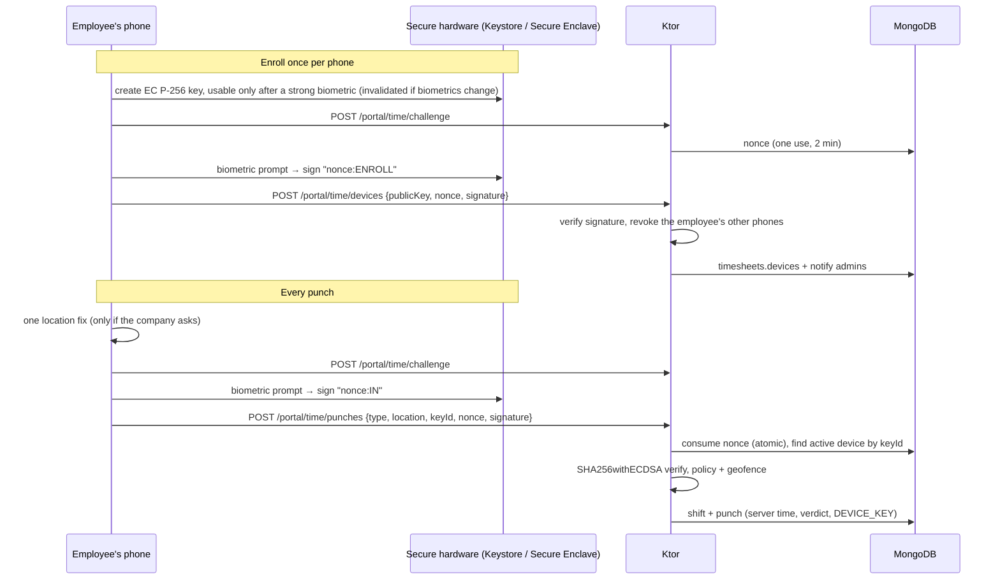

# Implementation Plan — Time Clock (employees logging their hours)

Status: **Phase 1 implemented** (server, `/app` employee page and team page, mobile time clock with
location and biometrics) · Owner: Rodrigo · Last updated: 2026-10-07

Employees (colaboradores) clock in and out, take breaks and see their hours, from the web or the
phone. The company sees who is working, reviews and approves the hours, fixes mistakes with a reason
that stays on record, and exports the hours for payroll or a labour inspection. On the phone, each
clock-in can carry where the employee was (checked against the company's work sites) and proof that
the phone's owner unlocked it with a fingerprint or their face.

This plan was written without access to Rodrigo's personal wiki or GitNexus (cloud VM), so it rests
on the repo docs alone. Check `wiki/entities/whatsapp-bot.md`, `wiki/entities/whatsapp-bot-mobile.md`
and `wiki/notes/kmp-engineering-guide.md` for conventions that might conflict.

---

## 1. What the best-known apps do

| App | Clock in/out | Location | Identity | Timesheets |
|---|---|---|---|---|
| [Connecteam](https://help.connecteam.com/en/articles/6489778-time-clock-gps-location-tracking-geolocation) | Phone, kiosk, web; switch jobs | GPS stamp at each punch, *off / optional / required*; [geofences](https://help.connecteam.com/en/articles/3597710-how-to-create-a-geofence) per job (75–1,524 m) that block or [auto clock out](https://help.connecteam.com/en/articles/10692218-auto-clock-out-employees-when-they-leave-a-worksite); optional live "breadcrumbs" | Kiosk PIN, selfie | Approve and lock per pay period, export |
| [Jibble](https://www.jibble.io/help/set-up-custom-time-tracking-rules) | Phone, kiosk, web; offline punches synced later | "Require location", geofences that restrict or automate punches | Server-side face recognition, PIN, NFC | Break and overtime rules, approvals, change history, CSV/XLS |
| [Homebase](https://support.joinhomebase.com/s/article/Labor-Control-Forecasting) | Phone, tablet, web | GPS snapshot at each punch, one geofence per location | Photo at clock-in, PIN | Prevent early clock-in, break enforcement, missed-punch reminders, approve and lock |
| [QuickBooks Time](https://quickbooks.intuit.com/learn-support/en-us/help-article/feature-preferences/set-use-geofencing-quickbooks-time/L3pZUXKzW_US_en_US) | Phone, web, kiosk | GPS points while on the clock (never off it); geofences per customer/job send *reminders*, punching outside asks for a note | — | Flags points outside the job's fence |
| [Factorial](https://help.factorialhr.com/es_ES/come-utilizzare-la-geolocalizzazione-nella-rilevazione-presenze) | Phone, web, QR | Coordinates **only at the punch**, never in between; fences of 50 m–1 km that alert or block; export with location issues | — | Legal "registro de jornada" reports |
| [Sesame HR](https://www.sesamehr.es/software-control-horario/) | Phone, web, WhatsApp, kiosk, offline | GPS zones detect office vs remote | Face recognition kiosk | Overtime approvals, auto check-out |

What everyone converges on, and what we take:

1. **One tap** to clock in, start/end a break, clock out; the current state and running time on top.
2. **A location stamp at the punch**, with a company setting *off / optional / required*, and
   **geofences** (work sites with a radius) that either **flag** or **block** punches outside them.
3. **Anti "buddy punching"**: something that proves the right person punched (photo, face, PIN).
4. **Timesheets** that add up days and weeks, highlight overtime, carry a **review/approval** step,
   and keep a **change history** when a manager corrects something.
5. **Missed punches** handled explicitly (forgot to clock out).
6. **Export** for payroll.

What we deliberately do differently:

- **No live tracking ("breadcrumbs") and no background location.** Only a snapshot at the moment of
  the punch, like Factorial. This is also what Portuguese law and the CNPD allow (§2).
- **No face recognition on our servers.** We use the phone's own biometrics (Face ID, Touch ID,
  Android fingerprint/face) through a hardware key: the fingerprint or face never leaves the phone and
  the company never holds biometric data (§2, §7). It still proves cryptographically that the
  enrolled phone was unlocked by its owner for that punch.
- **Geofences block only clock-in.** Break and clock-out punches outside a site are flagged, never
  refused, so nobody gets stuck clocked in after leaving.

## 2. Legal frame (Portugal first, then Spain/EU)

| Rule | What it requires | Design consequence |
|---|---|---|
| Código do Trabalho, [art. 202.º](https://www.pgdlisboa.pt/leis/lei_mostra_articulado.php?artigo_id=1047A0202&ficha=1&nid=1047&nversao=&pagina=1&so_miolo=&tabela=leis) | Record start and end of work and the breaks not counted as work, so hours **per worker, per day and per week** can be computed; accessible for immediate consultation; workers outside the premises sign off ("visar") their record within 15 days; **keep 5 years** | Shifts store start, end and every break; daily and weekly totals; the employee sees (and so acknowledges) every shift; no hard delete of real punches; CSV export on demand |
| ACT inspections (in practice) | Immutable server timestamp per punch; corrections with an **audit trail** (who, when, previous value) | Punch time is the server's clock; punches are append-only; team edits require a reason and keep before/after |
| Lei 58/2019, [art. 28.º n.º 6](https://diariodarepublica.pt/dr/detalhe/lei/58-2019-123815982) | Employee biometrics only for attendance or access control, only as non-reversible templates | We go further: no biometric data reaches the company at all (on-device check, §7) |
| CNPD [Deliberação 7680/2014](https://www.cnpd.pt/media/zvxmdfad/del_7680-2014_geo_laboral.pdf) (geolocation at work) | Proportional, least intrusive means; never outside working time; **never to assess performance** (CT art. 20.º); minimum data | Location only at the punch, only while the app is open, never in the background; coordinates purged after 90 days (the site verdict stays); location used only to check where a punch happened |
| GDPR art. 5, 13 | Minimisation, transparency | The employee sees exactly what was recorded about each of their punches; the apps explain why location is asked |
| Spain, RD-ley 8/2019 (registro de jornada) | Daily start/end record, kept 4 years | Same model covers it |
| Working-time limits (CT art. 203.º) | 8 h/day, 40 h/week normal limits | Defaults for the overtime highlight; each company can change them |

The product is not a legal opinion; companies still have to inform their workers (CT art. 21.º,
GDPR art. 13). The settings page says so in one line.

## 3. Product scope

### People

- **Employee** — an employee record with its own sign-in (`TENANT_EMPLOYEE`, already exists for
  "My services"). Clocks in/out and sees their own hours. Web or the mobile app.
- **Team** — admins and members of the company with the new `timesheets` module: see who's working,
  review, approve, correct, add missing shifts, export.
- **Admin** — also sets the rules and work sites, revokes phones.

### Stories (Phase 1)

1. As an employee I clock in with one tap and see "Working since 08:02 · 3 h 12 min".
2. I start and end breaks; clocking out during a break ends the break.
3. On the phone, the app checks where I am and, when my company asks for it, my fingerprint/face.
4. If I forgot to clock out yesterday, the app asks when I finished before I can clock in again.
5. I see my shifts this week with daily and weekly totals and whether they were approved.
6. As the team, I see who is working right now, on break, or where (site).
7. I review the week's shifts; problems are flagged (outside a site, no location, not verified on
   the phone, forgotten clock-out, edited, very long); I approve clean ones in one click.
8. I correct a shift (start, end, breaks) with a reason; the history shows who changed what.
9. I add a shift someone forgot to clock entirely, with a reason.
10. I export a period as CSV (employee, day, start, end, breaks, worked, site, flags, approval).
11. As an admin I set the rules (location off/optional/required; sites flag or block; biometrics
    off/optional/required; long-shift limit; daily/weekly hours) and the work sites (name, address,
    coordinates, radius, optionally the client the site belongs to).
12. As an admin I see each employee's registered phone and can revoke it.

## 4. Concepts and rules

- **Shift** (`timesheets.shifts`): one continuous period of work, `OPEN` while clocked in,
  `CLOSED` after. Holds the effective `startAt`, `endAt`, `breaks[]`, the tenant-local `day` of its
  start, the site it started at, and the computed `workedMinutes` / `breakMinutes`.
- **Punch**: the evidence, appended to the shift and never edited: type (`IN`, `BREAK_START`,
  `BREAK_END`, `OUT`), the **server** time, the channel (`APP`, `WEB`, `TEAM`, `CORRECTION`),
  the location snapshot (rounded to 5 decimals, ~1 m) and the site verdict (`inside`, the nearest
  site and its distance), how it was verified (`DEVICE_KEY` + the device, or `NONE`) and its flags.
- **One open shift per employee**, enforced by a partial unique index. Clock-in while open answers
  `409 already_clocked_in`; break/out without an open shift `409 not_clocked_in`; `on_break` /
  `not_on_break` for breaks out of order.
- **Worked time** = end − start − breaks (breaks are unpaid; exact minutes, no rounding). A shift that
  crosses midnight belongs to the day it started.
- **Policy** (`timesheets.settings`, per company):
  - `location`: `OFF` (never asked or stored) · `OPTIONAL` (asked; a punch without it is flagged
    `NO_LOCATION`) · `REQUIRED` (refused without it, `400 location_required`).
  - `geofence`: `FLAG` (outside every active site → `OUTSIDE_SITE`) · `BLOCK` (clock-in outside →
    `409 outside_sites` with the nearest site and distance; break/out are only flagged). With sites
    and `BLOCK`, clock-in needs a location. Inside = distance to the site's centre ≤ its radius.
  - `biometric`: `OFF` · `OPTIONAL` (punches without a device signature are flagged `UNVERIFIED`) ·
    `REQUIRED` (refused, `403 verification_required`; in practice only the app can clock in).
  - `maxShiftHours` (default 12): longer shifts are flagged `LONG_SHIFT`; an open shift older than
    this is "forgotten" and the employee has to say when they finished.
  - `dailyHours` / `weeklyHours` (default 8 / 40): the overtime highlight.
- **Punch flags**: `NO_LOCATION`, `LOW_ACCURACY` (fix worse than 150 m), `MOCK_LOCATION` (the
  phone says the location is simulated; refused at clock-in under `BLOCK`), `OUTSIDE_SITE`,
  `UNVERIFIED`. **Shift flags**: the punches' flags plus `LONG_SHIFT`, `MISSED_CLOCK_OUT` (the
  employee reported the end time), `EDITED`, `MANUAL`.
- **Review**: every closed shift starts `PENDING`; the team approves it (`APPROVED`, by, at). An edit
  sends it back to `PENDING`. Bulk approve takes a list of ids.
- **Edits**: only the team edits times, always with a reason (≤ 500 chars). Each edit appends
  `{at, by, reason, before, after}`. Real punches are never removed.
- **Forgotten clock-out**: the employee closes their own open shift with the time they stopped
  (between the last punch and now), flagged `MISSED_CLOCK_OUT`, and the team is notified.

## 5. Data model

| Collection | Purpose | Indexes |
|---|---|---|
| `timesheets.shifts` | Shifts with their punches, breaks, flags, review and edit history | unique partial `(tenantId, employeeId)` where `status = OPEN`; `tenantId+day`; `tenantId+employeeId+startAt`; `tenantId+review.status+day` |
| `timesheets.sites` | Work sites: name, address, latitude, longitude, radius (25–2,000 m, default 150), optional client, active | `tenantId+name` |
| `timesheets.devices` | Phones enrolled for verified punches: employee, key id (SHA-256 of the public key), public key, platform, name, status, last used | unique `(tenantId, employeeId, keyId)`; `tenantId+employeeId+status` |
| `timesheets.challenges` | One-time nonces for signing, 2-minute validity | TTL 5 min on `createdAt` |
| `timesheets.settings` | A company's rules (`_id` = tenant id) | `_id` |

## 6. API

Employee (`/app/api/portal/time…`, the employee's own sign-in only; needs `employees` +
`timesheets`):

| Method | Path | |
|---|---|---|
| `GET` | `/app/api/portal/time` | Status: policy, state (`OFF`/`WORKING`/`ON_BREAK`), open shift, `overdue`, today and week totals, active sites, the employee's enrolled phones, server time |
| `GET` | `/app/api/portal/time/shifts?from=&to=` | Own shifts (default: the last 31 days) |
| `POST` | `/app/api/portal/time/challenge` | `{nonce, expiresAt}` to sign |
| `POST` | `/app/api/portal/time/punches` | `{type, location?, locationError?, verification?{keyId, nonce, signature}, channel, note?}` → the shift and new status |
| `POST` | `/app/api/portal/time/shifts/{id}/close` | Forgotten clock-out `{endAt}` |
| `PATCH` | `/app/api/portal/time/shifts/{id}` | The employee's note on a pending shift |
| `POST` | `/app/api/portal/time/devices` | Enroll this phone `{name, platform, publicKey, nonce, signature}`; revokes the employee's other phones and tells the admins |
| `DELETE` | `/app/api/portal/time/devices/{keyId}` | Stop using this phone |

Team (`/app/api/timesheets…`, module `timesheets`; writes to rules, sites and phones are admin-only):

| Method | Path | |
|---|---|---|
| `GET` | `/app/api/timesheets/board` | Who's working now (open shifts, on break, overdue) |
| `GET` | `/app/api/timesheets?from=&to=&employeeId=` | The period's shifts plus per-employee totals (worked, days, over daily/weekly limits, to review, flagged); ≤ 93 days |
| `GET` | `/app/api/timesheets/shifts/{id}` | One shift with punches and history |
| `POST` | `/app/api/timesheets/shifts` | Add a missing shift `{employeeId, startAt, endAt, breaks, note, reason}` |
| `PATCH` | `/app/api/timesheets/shifts/{id}` | Correct a closed shift `{startAt, endAt, breaks, reason}` |
| `POST` | `/app/api/timesheets/shifts/{id}/close` | Close someone's open shift `{endAt, reason}` |
| `POST` | `/app/api/timesheets/shifts/approve` | `{ids}` → approves the closed, pending ones |
| `GET` | `/app/api/timesheets/export.csv?from=&to=&employeeId=` | CSV (`;`-separated, UTF-8 BOM, so Excel in pt/es opens it) |
| `GET`/`PUT` | `/app/api/timesheets/settings` | The rules |
| `GET`/`POST` | `/app/api/timesheets/sites` · `PATCH`/`DELETE …/{id}` | Work sites |
| `GET` | `/app/api/timesheets/devices?employeeId=` · `DELETE …/{id}` | Phones, revoke |

Errors keep the codebase's `{error}` shape with stable codes (listed in §4), so the web catalogs and
the mobile `error.code.*` keys translate them.

`EmployeePortal` changes from one page to a list: `my-services` (with `services`) and `my-hours`
(with `timesheets`). `/me` answers the pages the company has; the sign-in needs at least one. The
access routes that give an employee a sign-in follow the same rule, so a company with time clock but
no services can still give sign-ins.

## 7. Security: proving who punched, and from where

**Device-bound, biometric-gated key (Phase 1).** Like a passkey:

- The private key never leaves the secure hardware and can only sign right after a successful strong
  biometric (Android `BIOMETRIC_STRONG` with a `CryptoObject`; iOS `.biometryCurrentSet`). Adding a
  new fingerprint/face invalidates it, so a colleague can't add their finger to your phone.
- The server stores only the public key. It never receives biometric data, so the company does not
  process biometric data under GDPR art. 9.
- The nonce is single-use and expires in 2 minutes, so a captured signature can't be replayed.
- One active phone per employee; a new enrollment revokes the old one and notifies admins, who see
  the phone in the employee record and can revoke it.

| Threat | Mitigation | Left for later |
|---|---|---|
| Colleague clocks in for you with your password | Biometric key on *your* phone; web punches flagged `UNVERIFIED` or refused | Approve new phones before use |
| Colleague enrolls their phone as yours | Admins notified of every new phone, can revoke; the device name shows on each punch | Approval step; Play Integrity / App Attest attestation |
| Fake GPS app | `MOCK_LOCATION` flag (Android `isMock`, iOS `isSimulatedBySoftware`); refused at clock-in under `BLOCK` | Root/jailbreak signals |
| Replay of a captured punch | One-use nonce | — |
| Changed phone clock | Server time is authoritative | Offline punches would need device time (Phase 2) |
| Shared phone | Biometrics prove "the phone's owner"; the plan assumes one phone per person | Kiosk mode with PIN |

## 8. Privacy

- Location is read only when the employee taps a punch button, with the app in the foreground. No
  background permission is requested (Android `ACCESS_FINE_LOCATION`/`COARSE` only; iOS "When In
  Use").
- `location = OFF` stores nothing; coordinates sent anyway are dropped.
- Coordinates are kept 90 days (`TIME_LOCATION_RETENTION_DAYS`), then removed by a daily job; the
  site verdict and accuracy stay, which is what the attendance record needs.
- The employee sees, for each of their punches, the site verdict, accuracy and verification.
- The team sees punch locations as a verdict plus a map link; nothing else about the employee's
  movements exists to see.

## 9. Web (`/app`)

**Employee — My hours** (`my-hours`, next to My services in the employee's sidebar):

1. `.view__hero` with today, this week (with the weekly limit) and the state.
2. A clock `.panel` with the state line ("Working since 08:02 · 3 h 12 min", ticking), the last
   punch's site verdict, and the buttons that make sense now (Clock in · Start break + Clock out ·
   End break + Clock out). The browser's geolocation runs on click when the company asks for location.
   With `biometric = REQUIRED`, a `.notice--info` says to use the app and the buttons are disabled.
3. Forgotten clock-out: a `.notice--warn` with a time field and Save.
4. A table of the last weeks' shifts (day, start–end, breaks, worked, site, flags, status) with
   per-week totals; a row opens the shift detail (punches with their verdicts, the note).

**Team — Timesheets** (`timesheets`, in Business after Employees). Chip tabs: Shifts · Work sites ·
Rules (the last two for admins):

1. `.view__hero` + `.period-nav` (week): working now, to review, hours this week, over the limits.
2. "Working now" `.panel` with a `.worklist` (name, since, site, on-break pill, overdue in `warn`).
3. Shifts panel: status chips (To review / Flagged / Approved / All), an employee `.sel`, a ghost
   **Approve N clean** and **Export CSV**; table rows `.tbl--stack` (employee, day, start–end, breaks,
   worked, site, flag pills, status pill).
4. Totals panel: per employee, days, worked, over the daily limit, over the weekly limit.
5. Shift detail drawer: `.detail__head` (employee link, status, worked), `.detail__meta`, a punches
   table (type, time, site verdict + map link, verified on phone, flag pills), the history, and Approve ·
   Correct · Close (open shifts). Correct opens a form: start, end, breaks (`.lines`), reason.
6. Work sites: table + drawer form (name, address, latitude/longitude with **Use my current location**,
   radius, client); Rules: one form with the policy selects and numbers.

**Employee record** (team): an **Hours** panel (this week, last shifts) and the **Phone for the time
clock** row (device, enrolled, last used, Revoke for admins).

**Backoffice**: `timesheets` joins the module list as opt-in (like `agents`).

## 10. Mobile (KMP)

**Employee shell.** Today the app would sign an employee straight out: the bell polls
`/app/api/notifications` and Settings loads `/app/api/web-widget`, both `401` for employees, and
`SessionTokens` treats any 401 as an expired session. Phase 1 makes the shell employee-aware:
`DashboardIdentity.employee`, a registry that offers only the portal pages (My hours; My services is
listed as web-only) plus Settings, no bell, and Settings without the widget, channels or the
company-wide language call (an employee's language is a local choice, as on the web).

**Platform services**, as interfaces in `core:common`, implemented in `androidApp` and
`shared/iosMain` and passed into `MobileGraph` (the `VoiceInput` pattern):

- `LocationProvider.current(): LocationReading` — permission request when needed, one fresh fix with
  a timeout, accuracy and the mock flag. Android: `LocationManagerCompat.getCurrentLocation` (no Play
  services needed), `LocationCompat.isMock`. iOS: `CLLocationManager.requestLocation()`,
  `sourceInformation.isSimulatedBySoftware`.
- `DeviceSigner` — `availability()`, `publicKey(alias)`, `createKey(alias)`, `sign(alias, message,
  prompt)`, `deleteKey(alias)`. Android: Keystore EC key with `setUserAuthenticationRequired`,
  per-use strong biometric (`BiometricPrompt` + `CryptoObject`), `setInvalidatedByBiometricEnrollment`.
  iOS: Secure Enclave key with `.privateKeyUsage | .biometryCurrentSet`, signed with
  `SecKeyCreateSignature` (Face ID/Touch ID prompt). The alias carries the employee id, so two
  employees on one phone don't share a key.

**`feature:timeclock`**: `TimeClockViewModel` (status, punch flow: location → challenge → sign →
punch; enrollment; forgotten clock-out; errors as `AppError` or local reasons) and `TimeClockScreen`
(state card with the running time, the action buttons, the last verdict, setup panel for the phone,
this week's shifts and totals). Repository in `core:data`, API in `core:network`, DTOs in
`core:model`, strings in the three catalogs.

**Permissions**: Android `ACCESS_FINE_LOCATION`, `ACCESS_COARSE_LOCATION`, `USE_BIOMETRIC`;
`MainActivity` becomes a `FragmentActivity` (BiometricPrompt needs one). iOS
`NSLocationWhenInUseUsageDescription`, `NSFaceIDUsageDescription` in `project.yml`.

**Online only in Phase 1**: a punch needs the server (its time is the legal record). Offline punches
are Phase 2.

## 11. Phases

**Phase 1 (this change)**: everything above.

**Phase 2**:

- Offline punches from the app (queued with device time, signed, flagged `OFFLINE`, reconciled).
- Home: "working now" tile and a "shifts to review" Needs-you row; agents triggers (`shift.closed`,
  `shift.flagged`) so a company can automate reminders.
- Reminders: push notification for a forgotten clock-out, and before a scheduled shift (needs push,
  which the app doesn't have yet).
- Approve new phones before they count as verified; Play Integrity / App Attest attestation.
- Schedules (planned shifts), late/absent alerts, early clock-in prevention.
- Turn approved hours into payroll payments or into billable Serviços rows for the site's client.
- Kiosk mode (shared tablet with PIN) for teams without phones.
- PDF export signed off by the employee (art. 202.º n.º 3 "visar" for external workers).

## 12. Testing

- Pure: geofence distance and site matching, policy decisions, worked-time and overtime math,
  signature verification with Android-style (SPKI DER) and iOS-style (raw X9.63) public keys.
- Repository (Testcontainers Mongo): one open shift per employee, break/out transitions, edits with
  history, approval, retention.
- Routes (Ktor test host with the real auth plugin): the employee portal locked to its pages, punches
  with and without location/verification under each policy, enrollment and replay refusal, team
  board/approve/edit/export, admin-only writes, a company without the module.
- Mobile: catalogs keep parity (existing test), `TimeClockViewModel` flows with fakes (location
  denied, biometric cancelled, enrollment, server refusals), registry for employee sessions.
- Manual: the web pages in both themes and at 375 px.
